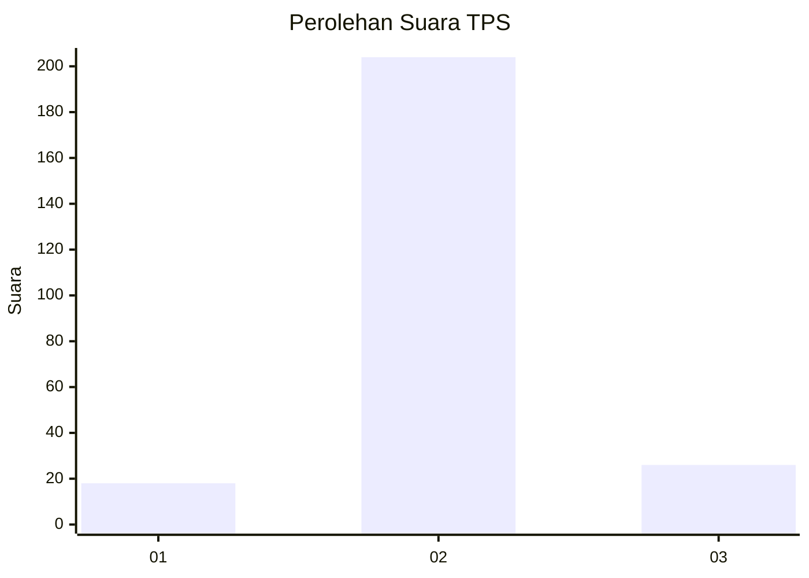
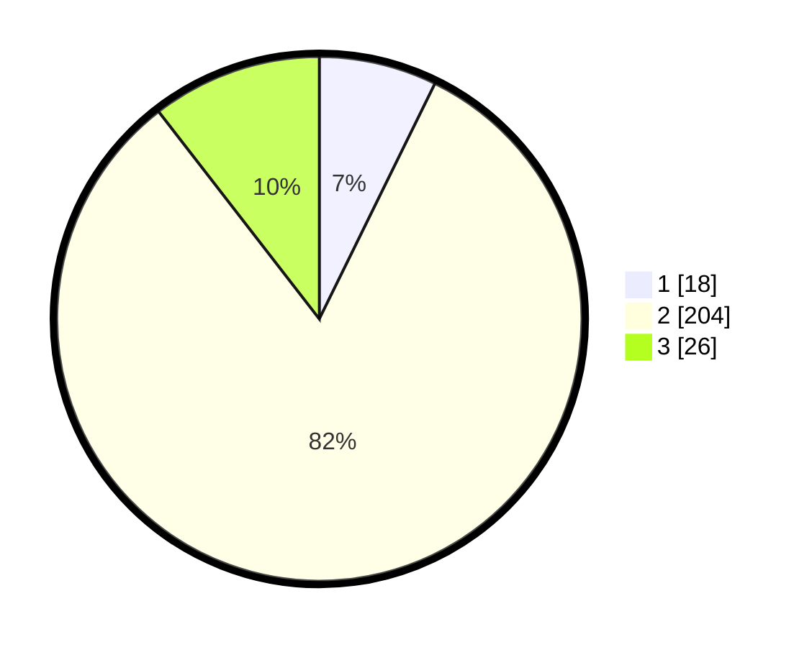

# Hasil

## Grafik

## Tabel

| No. | Nama Paslon    | Suara | Suara (raw) | Persentase |
|:--- |:-------------- | -----:| -----------:| ----------:|
| 1   | ANIES MUHAIMIN | 18    | [18][p-1]   | 7,26       |
| 2   | PRABOWO GIBRAN | 204   | [204][p-2]  | 82,26      |
| 3   | GANJAR MAHFUD  | 26    | [26][p-3]   | 10,48      |

[p-1]: https://github.com/gigit-pemilu/pemilu-2024-91-papua/blob/main/pilpres/hitung-suara/sub/91-papua/sub/10-sarmi/sub/05-bonggo/sub/2010-bebon-jaya/sub/002-tps/sub/paslon-1.txt
[p-2]: https://github.com/gigit-pemilu/pemilu-2024-91-papua/blob/main/pilpres/hitung-suara/sub/91-papua/sub/10-sarmi/sub/05-bonggo/sub/2010-bebon-jaya/sub/002-tps/sub/paslon-2.txt
[p-3]: https://github.com/gigit-pemilu/pemilu-2024-91-papua/blob/main/pilpres/hitung-suara/sub/91-papua/sub/10-sarmi/sub/05-bonggo/sub/2010-bebon-jaya/sub/002-tps/sub/paslon-3.txt

## Foto C Plano

https://sirekap-obj-formc.kpu.go.id/4c8a/pemilu/ppwp/91/10/05/20/10/9110052010002-20240214-185326--01101fc0-1a64-409c-9c86-070e92fa6e76.jpg

https://sirekap-obj-formc.kpu.go.id/4c8a/pemilu/ppwp/91/10/05/20/10/9110052010002-20240214-192647--96457b1f-43bd-45de-abac-f175d256355b.jpg

https://sirekap-obj-formc.kpu.go.id/4c8a/pemilu/ppwp/91/10/05/20/10/9110052010002-20240214-185058--4d5b210c-14e3-454c-aa96-c78454910b3a.jpg

## Metadata

| Key        | Value               |
| ---------- | ------------------- |
| Time Stamp | 2024-02-15 22:00:27 |

