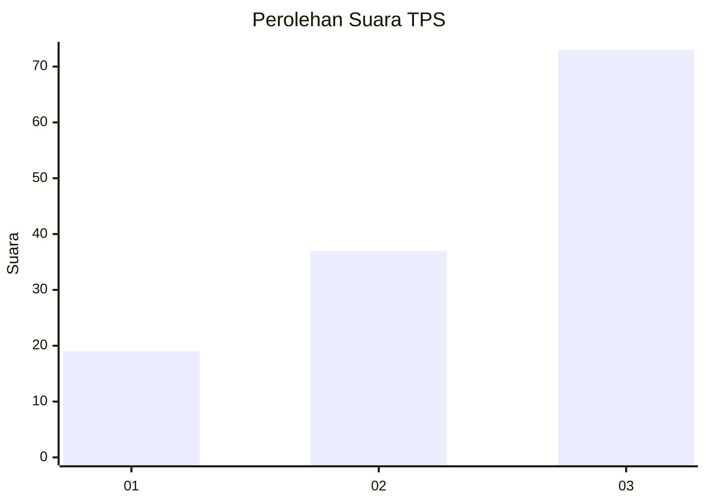
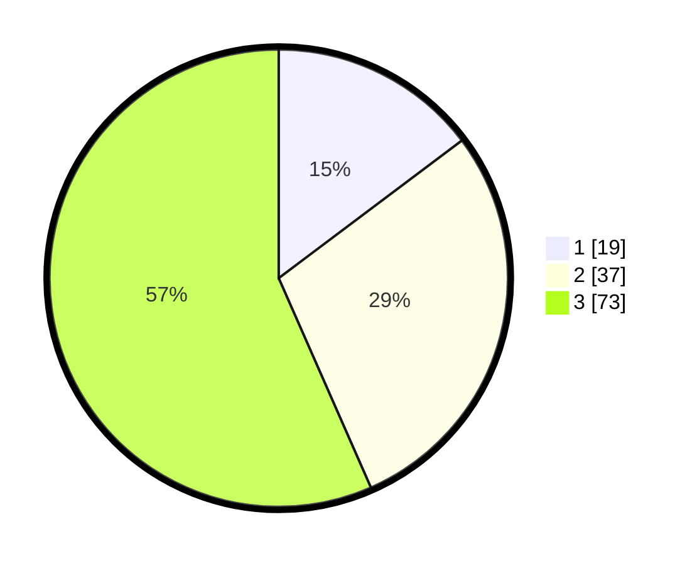

# Hasil

## Grafik

## Tabel

| No. | Nama Paslon    | Suara | Suara (raw) | Persentase |
|:--- |:-------------- | -----:| -----------:| ----------:|
| 1   | ANIES MUHAIMIN | 19    | [19][p-1]   | 14,73      |
| 2   | PRABOWO GIBRAN | 37    | [37][p-2]   | 28,68      |
| 3   | GANJAR MAHFUD  | 73    | [73][p-3]   | 56,59      |

[p-1]: https://github.com/gigit-pemilu/pemilu-2024-91-papua/blob/main/pilpres/hitung-suara/sub/91-papua/sub/10-sarmi/sub/05-bonggo/sub/2018-rotea/sub/001-tps/sub/paslon-1.txt
[p-2]: https://github.com/gigit-pemilu/pemilu-2024-91-papua/blob/main/pilpres/hitung-suara/sub/91-papua/sub/10-sarmi/sub/05-bonggo/sub/2018-rotea/sub/001-tps/sub/paslon-2.txt
[p-3]: https://github.com/gigit-pemilu/pemilu-2024-91-papua/blob/main/pilpres/hitung-suara/sub/91-papua/sub/10-sarmi/sub/05-bonggo/sub/2018-rotea/sub/001-tps/sub/paslon-3.txt

## Foto C Plano

https://sirekap-obj-formc.kpu.go.id/fd1c/pemilu/ppwp/91/10/05/20/18/9110052018001-20240215-213501--2bb89675-4510-4763-a1f3-b4643afb8e15.jpg

https://sirekap-obj-formc.kpu.go.id/fd1c/pemilu/ppwp/91/10/05/20/18/9110052018001-20240215-213644--7bdab90e-db3a-4b58-b935-70b4ffe04e9a.jpg

https://sirekap-obj-formc.kpu.go.id/fd1c/pemilu/ppwp/91/10/05/20/18/9110052018001-20240215-213859--93d781c4-aef9-4425-b90b-ddbe33e46c85.jpg

## Metadata

| Key        | Value               |
| ---------- | ------------------- |
| Time Stamp | 2024-02-16 09:30:28 |

