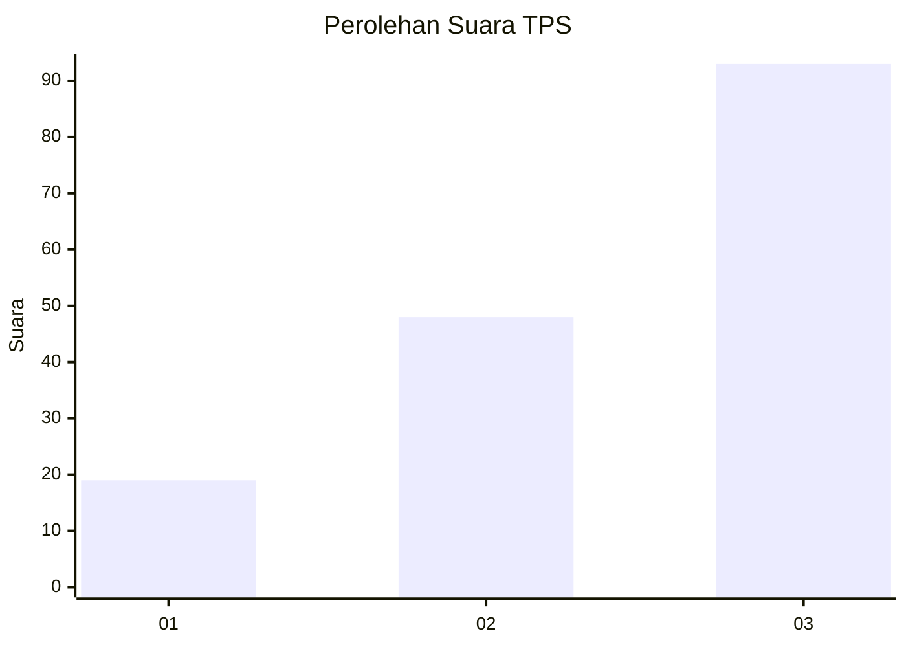
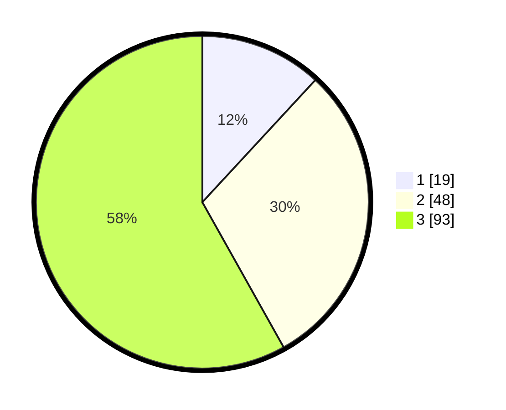

# Hasil

## Grafik

## Tabel

| No. | Nama Paslon    | Suara | Suara (raw) | Persentase |
|:--- |:-------------- | -----:| -----------:| ----------:|
| 1   | ANIES MUHAIMIN | 19    | [19][p-1]   | 11,88      |
| 2   | PRABOWO GIBRAN | 48    | [48][p-2]   | 30,00      |
| 3   | GANJAR MAHFUD  | 93    | [93][p-3]   | 58,13      |

[p-1]: https://github.com/gigit-pemilu/pemilu-2024-91-papua/blob/main/pilpres/hitung-suara/sub/91-papua/sub/10-sarmi/sub/14-pantai-timur-bagian-barat/sub/2001-arare/sub/001-tps/sub/paslon-1.txt
[p-2]: https://github.com/gigit-pemilu/pemilu-2024-91-papua/blob/main/pilpres/hitung-suara/sub/91-papua/sub/10-sarmi/sub/14-pantai-timur-bagian-barat/sub/2001-arare/sub/001-tps/sub/paslon-2.txt
[p-3]: https://github.com/gigit-pemilu/pemilu-2024-91-papua/blob/main/pilpres/hitung-suara/sub/91-papua/sub/10-sarmi/sub/14-pantai-timur-bagian-barat/sub/2001-arare/sub/001-tps/sub/paslon-3.txt

## Foto C Plano

https://sirekap-obj-formc.kpu.go.id/ceec/pemilu/ppwp/91/10/14/20/01/9110142001001-20240216-143132--3f1dc8e5-5a50-4922-9465-45d77857f5f7.jpg

https://sirekap-obj-formc.kpu.go.id/ceec/pemilu/ppwp/91/10/14/20/01/9110142001001-20240216-122840--94bb1d4b-bfd6-489a-813e-6e27b4f3ae04.jpg

https://sirekap-obj-formc.kpu.go.id/ceec/pemilu/ppwp/91/10/14/20/01/9110142001001-20240216-123018--bac713fd-3069-43d0-b35c-44f2630a5bb5.jpg

## Metadata

| Key        | Value               |
| ---------- | ------------------- |
| Time Stamp | 2024-02-16 16:25:10 |

## DATA PEMILIH TETAP

Jumlah pemilih dalam DPT: **176**.
 * L: **15**.
 * P: **881**.

## DATA PENGGUNA HAK PILIH

Jumlah pengguna hak pilih dalam DPT: **137**.
 * L: **70**.
 * P: **67**.

Jumlah pengguna hak pilih dalam DPTb: **26**.
 * L: **16**.
 * P: **10**.

Jumlah pengguna hak pilih dalam DPK: **0**.
 * L: **800**.
 * P: **0**.

Jumlah pengguna hak pilih: **163**.
 * L: **886**.
 * P: **77**.

## JUMLAH SUARA SAH DAN TIDAK SAH

JUMLAH SELURUH SUARA SAH: **160**.

JUMLAH SUARA TIDAK SAH: **3**.

JUMLAH SELURUH SUARA SAH DAN SUARA TIDAK SAH: **163**.

