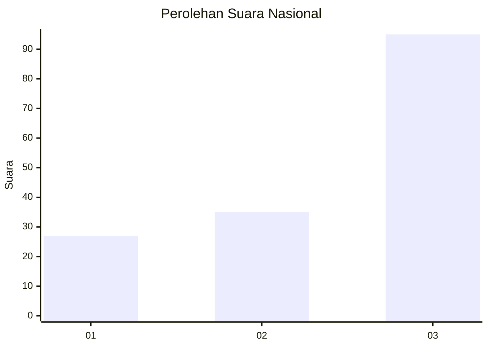
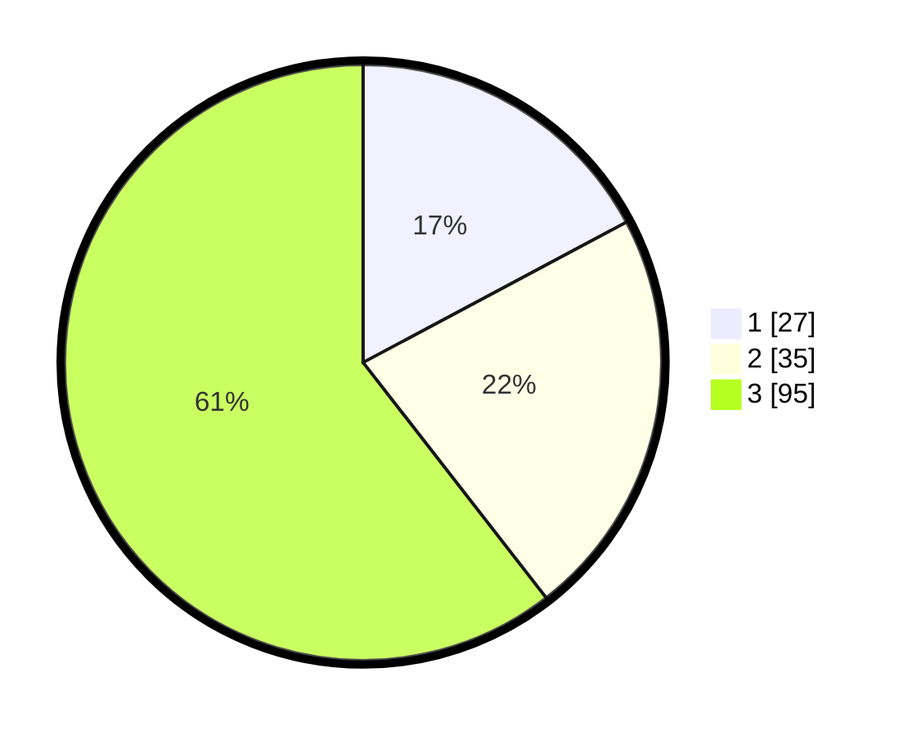

# Hasil

## Grafik

## Tabel

| No. | Nama Paslon    | Suara | Suara (raw) | Persentase |
|:--- |:-------------- | -----:| -----------:| ----------:|
| 1   | ANIES MUHAIMIN | 27    | [27][p-1]   | 17,20      |
| 2   | PRABOWO GIBRAN | 35    | [35][p-2]   | 22,29      |
| 3   | GANJAR MAHFUD  | 95    | [95][p-3]   | 60,51      |

[p-1]: https://github.com/gigit-pemilu/pemilu-2024/blob/main/pilpres/hitung-suara/sub/91-papua/sub/10-sarmi/sub/14-pantai-timur-bagian-barat/sub/2002-wakde/sub/001-tps/sub/paslon-1.txt
[p-2]: https://github.com/gigit-pemilu/pemilu-2024/blob/main/pilpres/hitung-suara/sub/91-papua/sub/10-sarmi/sub/14-pantai-timur-bagian-barat/sub/2002-wakde/sub/001-tps/sub/paslon-2.txt
[p-3]: https://github.com/gigit-pemilu/pemilu-2024/blob/main/pilpres/hitung-suara/sub/91-papua/sub/10-sarmi/sub/14-pantai-timur-bagian-barat/sub/2002-wakde/sub/001-tps/sub/paslon-3.txt

## Foto C Plano

https://sirekap-obj-formc.kpu.go.id/0ff1/pemilu/ppwp/91/10/14/20/02/9110142002001-20240216-173843--9d83736b-31d8-463f-aa5b-a5a376e63797.jpg

https://sirekap-obj-formc.kpu.go.id/0ff1/pemilu/ppwp/91/10/14/20/02/9110142002001-20240216-154725--203fba77-1fbe-4b03-9c3b-09452d1cb4a4.jpg

https://sirekap-obj-formc.kpu.go.id/0ff1/pemilu/ppwp/91/10/14/20/02/9110142002001-20240216-154832--84e23550-1357-49b2-b917-bea7cb058f07.jpg

## Metadata

| Key        | Value               |
| ---------- | ------------------- |
| Time Stamp | 2024-02-25 13:00:00 |

## DATA PEMILIH TETAP

Jumlah pemilih dalam DPT: **184**.
 * L: **94**.
 * P: **99**.

## DATA PENGGUNA HAK PILIH

Jumlah pengguna hak pilih dalam DPT: **136**.
 * L: **64**.
 * P: **72**.

Jumlah pengguna hak pilih dalam DPTb: **70**.
 * L: **0**.
 * P: **0**.

Jumlah pengguna hak pilih dalam DPK: **27**.
 * L: **13**.
 * P: **14**.

Jumlah pengguna hak pilih: **163**.
 * L: **77**.
 * P: **86**.

## JUMLAH SUARA SAH DAN TIDAK SAH

JUMLAH SELURUH SUARA SAH: **157**.

JUMLAH SUARA TIDAK SAH: **9**.

JUMLAH SELURUH SUARA SAH DAN SUARA TIDAK SAH: **166**.

