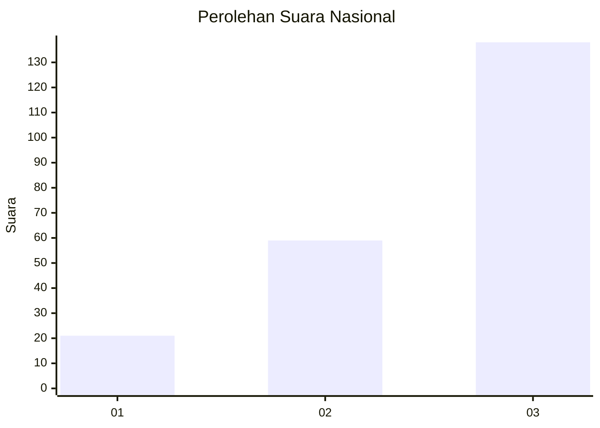
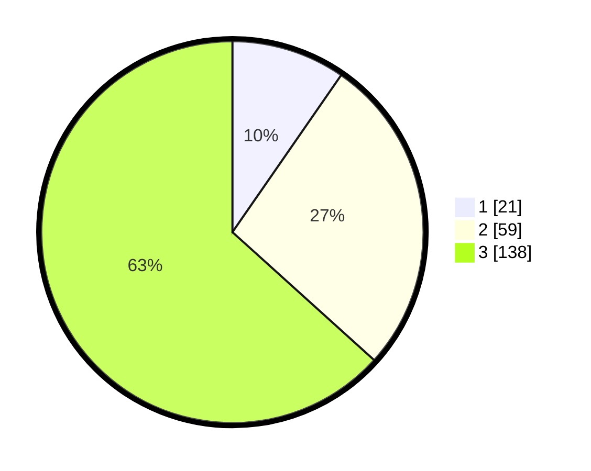

# Hasil

## Grafik

## Tabel

| No. | Nama Paslon    | Suara | Suara (raw) | Persentase |
|:--- |:-------------- | -----:| -----------:| ----------:|
| 1   | ANIES MUHAIMIN | 21    | [21][p-1]   | 9,63       |
| 2   | PRABOWO GIBRAN | 59    | [59][p-2]   | 27,06      |
| 3   | GANJAR MAHFUD  | 138   | [138][p-3]  | 63,30      |

[p-1]: https://github.com/gigit-pemilu/pemilu-2024/blob/main/pilpres/hitung-suara/sub/91-papua/sub/10-sarmi/sub/14-pantai-timur-bagian-barat/sub/2004-dabe/sub/001-tps/sub/paslon-1.txt
[p-2]: https://github.com/gigit-pemilu/pemilu-2024/blob/main/pilpres/hitung-suara/sub/91-papua/sub/10-sarmi/sub/14-pantai-timur-bagian-barat/sub/2004-dabe/sub/001-tps/sub/paslon-2.txt
[p-3]: https://github.com/gigit-pemilu/pemilu-2024/blob/main/pilpres/hitung-suara/sub/91-papua/sub/10-sarmi/sub/14-pantai-timur-bagian-barat/sub/2004-dabe/sub/001-tps/sub/paslon-3.txt

## Foto C Plano

https://sirekap-obj-formc.kpu.go.id/2957/pemilu/ppwp/91/10/14/20/04/9110142004001-20240215-163227--8b559833-ec7e-45e3-b588-2e32132d41b3.jpg

https://sirekap-obj-formc.kpu.go.id/2957/pemilu/ppwp/91/10/14/20/04/9110142004001-20240215-163938--daa02748-61aa-4422-9b26-ec3272c2ab98.jpg

https://sirekap-obj-formc.kpu.go.id/2957/pemilu/ppwp/91/10/14/20/04/9110142004001-20240215-164618--a323a608-3986-4f9d-9908-c10a47f4a409.jpg

## Metadata

| Key        | Value               |
| ---------- | ------------------- |
| Time Stamp | 2024-02-15 21:30:27 |

