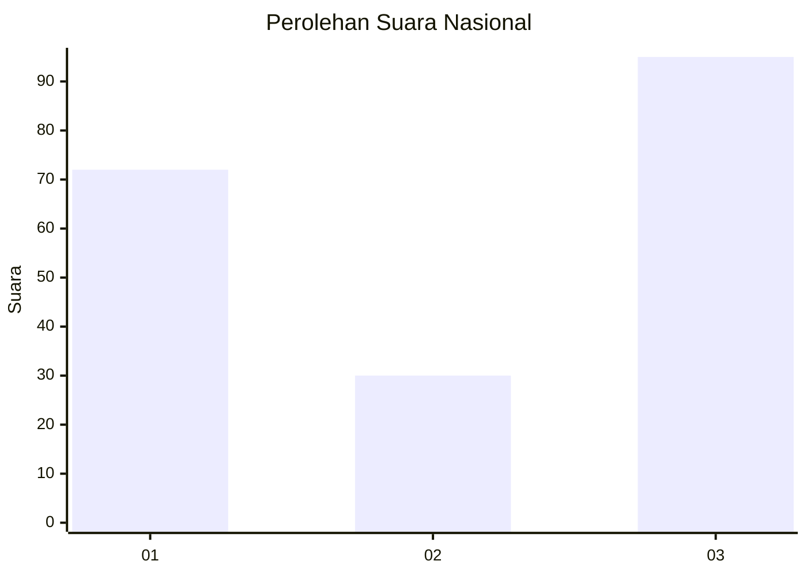
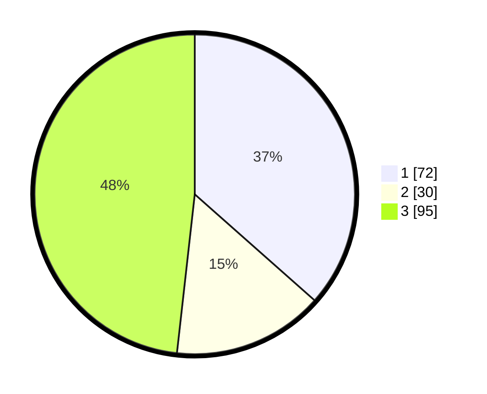

# Hasil

## Grafik

## Tabel

| No. | Nama Paslon    | Suara | Suara (raw) | Persentase |
|:--- |:-------------- | -----:| -----------:| ----------:|
| 1   | ANIES MUHAIMIN | 72    | [72][p-1]   | 36,55      |
| 2   | PRABOWO GIBRAN | 30    | [30][p-2]   | 15,23      |
| 3   | GANJAR MAHFUD  | 95    | [95][p-3]   | 48,22      |

[p-1]: https://github.com/gigit-pemilu/pemilu-2024/blob/main/pilpres/hitung-suara/sub/91-papua/sub/10-sarmi/sub/14-pantai-timur-bagian-barat/sub/2014-finyabor-dua/sub/001-tps/sub/paslon-1.txt
[p-2]: https://github.com/gigit-pemilu/pemilu-2024/blob/main/pilpres/hitung-suara/sub/91-papua/sub/10-sarmi/sub/14-pantai-timur-bagian-barat/sub/2014-finyabor-dua/sub/001-tps/sub/paslon-2.txt
[p-3]: https://github.com/gigit-pemilu/pemilu-2024/blob/main/pilpres/hitung-suara/sub/91-papua/sub/10-sarmi/sub/14-pantai-timur-bagian-barat/sub/2014-finyabor-dua/sub/001-tps/sub/paslon-3.txt

## Foto C Plano

https://sirekap-obj-formc.kpu.go.id/1448/pemilu/ppwp/91/10/14/20/14/9110142014001-20240216-145109--53374918-6df8-4810-8e02-4507cabfdfc7.jpg

https://sirekap-obj-formc.kpu.go.id/1448/pemilu/ppwp/91/10/14/20/14/9110142014001-20240216-145313--2573bc44-4886-4739-8447-075e7a9b63d0.jpg

https://sirekap-obj-formc.kpu.go.id/1448/pemilu/ppwp/91/10/14/20/14/9110142014001-20240216-145502--e872ed8e-be89-4068-8ca1-163620b7891b.jpg

## Metadata

| Key        | Value               |
| ---------- | ------------------- |
| Time Stamp | 2024-02-16 16:25:10 |

## DATA PEMILIH TETAP

Jumlah pemilih dalam DPT: **163**.
 * L: **90**.
 * P: **73**.

## DATA PENGGUNA HAK PILIH

Jumlah pengguna hak pilih dalam DPT: **249**.
 * L: **95**.
 * P: **54**.

Jumlah pengguna hak pilih dalam DPTb: **13**.
 * L: **2**.
 * P: **11**.

Jumlah pengguna hak pilih dalam DPK: **1**.
 * L: **0**.
 * P: **1**.

Jumlah pengguna hak pilih: **163**.
 * L: **97**.
 * P: **66**.

## JUMLAH SUARA SAH DAN TIDAK SAH

JUMLAH SELURUH SUARA SAH: **158**.

JUMLAH SUARA TIDAK SAH: **4**.

JUMLAH SELURUH SUARA SAH DAN SUARA TIDAK SAH: **162**.

