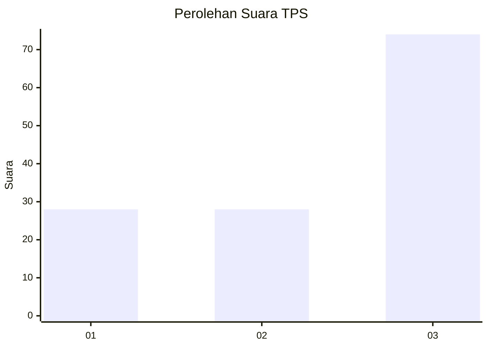
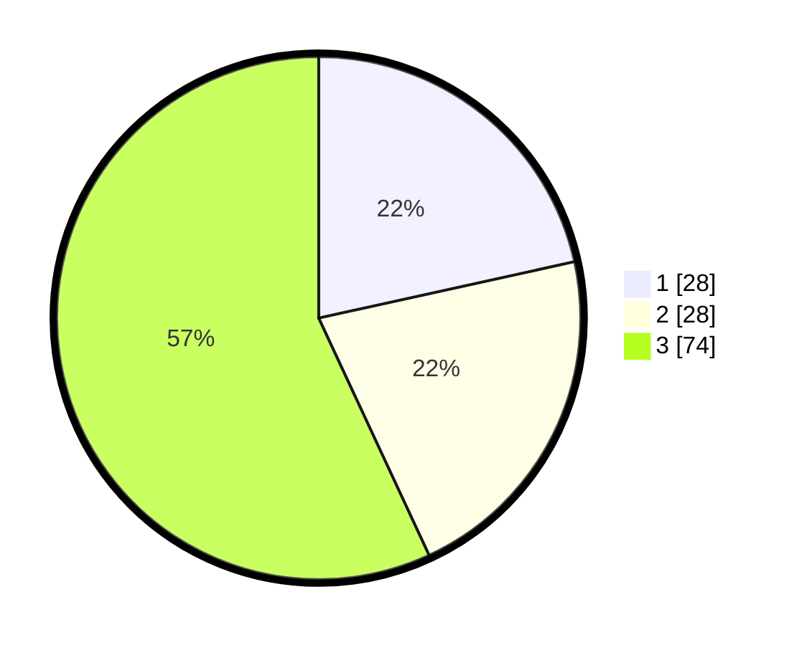

# Hasil

## Grafik

## Tabel

| No. | Nama Paslon    | Suara | Suara (raw) | Persentase |
|:--- |:-------------- | -----:| -----------:| ----------:|
| 1   | ANIES MUHAIMIN | 28    | [28][p-1]   | 21,54      |
| 2   | PRABOWO GIBRAN | 28    | [28][p-2]   | 21,54      |
| 3   | GANJAR MAHFUD  | 74    | [74][p-3]   | 56,92      |

[p-1]: https://github.com/gigit-pemilu/pemilu-2024-91-papua/blob/main/pilpres/hitung-suara/sub/91-papua/sub/10-sarmi/sub/14-pantai-timur-bagian-barat/sub/2014-finyabor-dua/sub/002-tps/sub/paslon-1.txt
[p-2]: https://github.com/gigit-pemilu/pemilu-2024-91-papua/blob/main/pilpres/hitung-suara/sub/91-papua/sub/10-sarmi/sub/14-pantai-timur-bagian-barat/sub/2014-finyabor-dua/sub/002-tps/sub/paslon-2.txt
[p-3]: https://github.com/gigit-pemilu/pemilu-2024-91-papua/blob/main/pilpres/hitung-suara/sub/91-papua/sub/10-sarmi/sub/14-pantai-timur-bagian-barat/sub/2014-finyabor-dua/sub/002-tps/sub/paslon-3.txt

## Foto C Plano

https://sirekap-obj-formc.kpu.go.id/556e/pemilu/ppwp/91/10/14/20/14/9110142014002-20240216-144457--4214d7e7-d3a5-4510-88d5-64c54f52941d.jpg

https://sirekap-obj-formc.kpu.go.id/556e/pemilu/ppwp/91/10/14/20/14/9110142014002-20240216-144245--153e047d-87e7-4304-b3ca-a0ce3db2fa41.jpg

https://sirekap-obj-formc.kpu.go.id/556e/pemilu/ppwp/91/10/14/20/14/9110142014002-20240216-121526--a1cba481-292a-4be9-adac-f17aa30e7427.jpg

## Metadata

| Key        | Value               |
| ---------- | ------------------- |
| Time Stamp | 2024-02-16 16:25:10 |

## DATA PEMILIH TETAP

Jumlah pemilih dalam DPT: **154**.
 * L: **78**.
 * P: **76**.

## DATA PENGGUNA HAK PILIH

Jumlah pengguna hak pilih dalam DPT: **116**.
 * L: **60**.
 * P: **56**.

Jumlah pengguna hak pilih dalam DPTb: **23**.
 * L: **12**.
 * P: **11**.

Jumlah pengguna hak pilih dalam DPK: **1**.
 * L: **0**.
 * P: **1**.

Jumlah pengguna hak pilih: **140**.
 * L: **0**.
 * P: **0**.

## JUMLAH SUARA SAH DAN TIDAK SAH

JUMLAH SELURUH SUARA SAH: **130**.

JUMLAH SUARA TIDAK SAH: **9**.

JUMLAH SELURUH SUARA SAH DAN SUARA TIDAK SAH: **739**.

