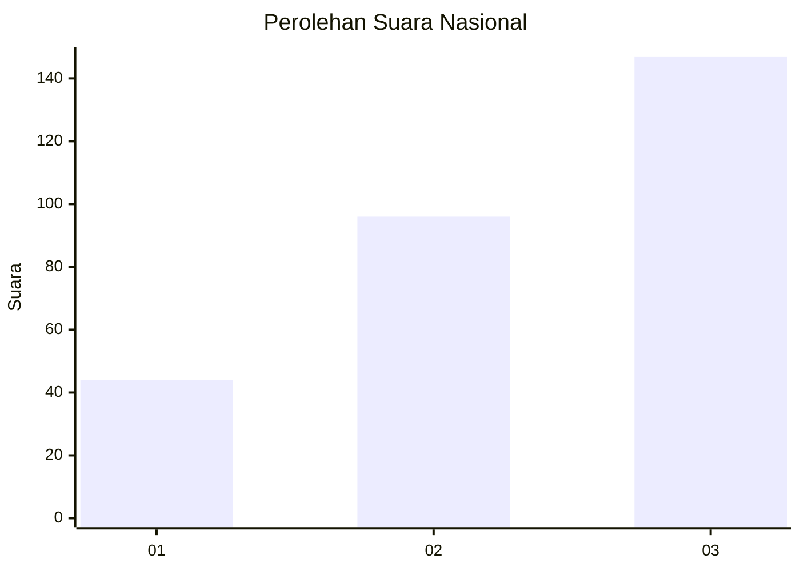
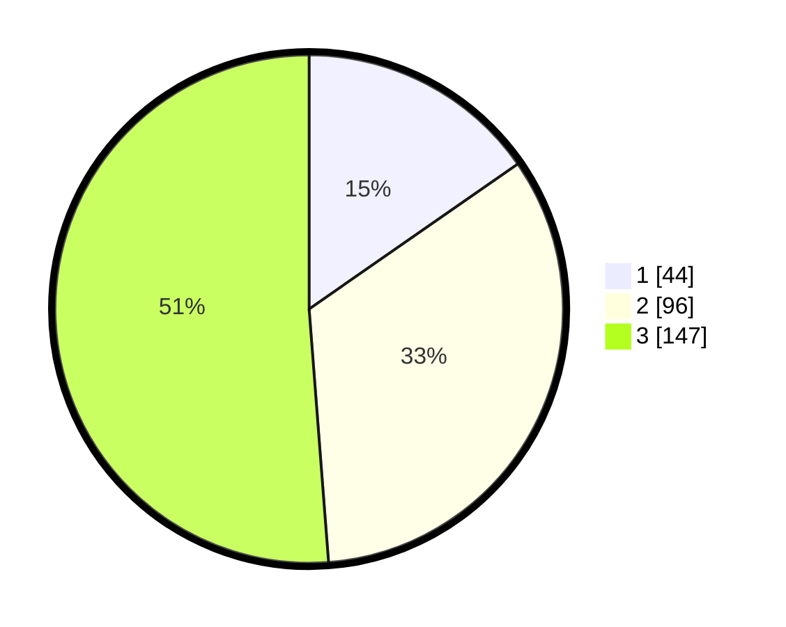

# Hasil

## Grafik

## Tabel

| No. | Nama Paslon    | Suara | Suara (raw) | Persentase |
|:--- |:-------------- | -----:| -----------:| ----------:|
| 1   | ANIES MUHAIMIN | 44    | [44][p-1]   | 15,33      |
| 2   | PRABOWO GIBRAN | 96    | [96][p-2]   | 33,45      |
| 3   | GANJAR MAHFUD  | 147   | [147][p-3]  | 51,22      |

[p-1]: https://github.com/gigit-pemilu/pemilu-2024/blob/main/pilpres/hitung-suara/sub/91-papua/sub/11-keerom/sub/02-arso/sub/2001-arso-kota/sub/003-tps/sub/paslon-1.txt
[p-2]: https://github.com/gigit-pemilu/pemilu-2024/blob/main/pilpres/hitung-suara/sub/91-papua/sub/11-keerom/sub/02-arso/sub/2001-arso-kota/sub/003-tps/sub/paslon-2.txt
[p-3]: https://github.com/gigit-pemilu/pemilu-2024/blob/main/pilpres/hitung-suara/sub/91-papua/sub/11-keerom/sub/02-arso/sub/2001-arso-kota/sub/003-tps/sub/paslon-3.txt

## Foto C Plano

https://sirekap-obj-formc.kpu.go.id/7202/pemilu/ppwp/91/11/02/20/01/9111022001003-20240214-193723--57e782fd-b10a-4b75-ade8-a1bc1180a6f7.jpg

https://sirekap-obj-formc.kpu.go.id/7202/pemilu/ppwp/91/11/02/20/01/9111022001003-20240214-193307--1fc70c3b-38d9-4e1a-96e5-d3c6dd8ea124.jpg

## Metadata

| Key        | Value               |
| ---------- | ------------------- |
| Time Stamp | 2024-02-25 12:00:00 |

