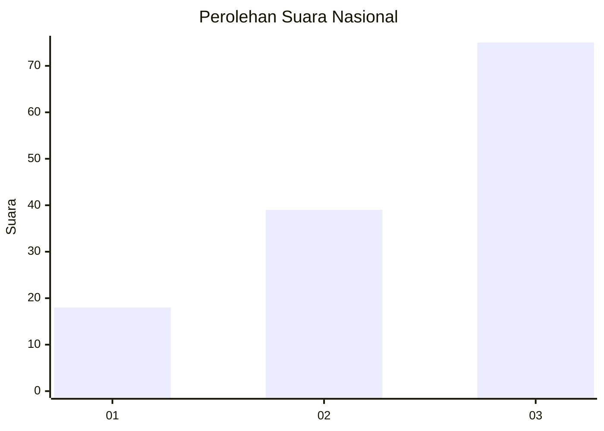
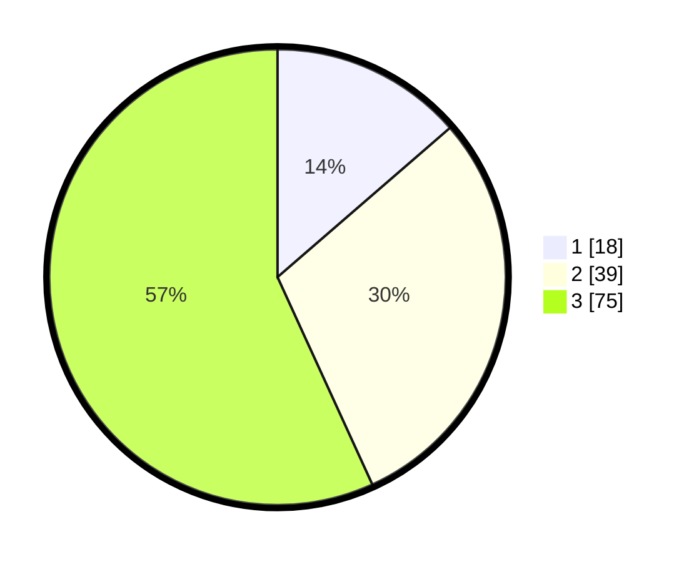

# Hasil

## Grafik

## Tabel

| No. | Nama Paslon    | Suara | Suara (raw) | Persentase |
|:--- |:-------------- | -----:| -----------:| ----------:|
| 1   | ANIES MUHAIMIN | 18    | [18][p-1]   | 13,64      |
| 2   | PRABOWO GIBRAN | 39    | [39][p-2]   | 29,55      |
| 3   | GANJAR MAHFUD  | 75    | [75][p-3]   | 56,82      |

[p-1]: https://github.com/gigit-pemilu/pemilu-2024/blob/main/pilpres/hitung-suara/sub/91-papua/sub/11-keerom/sub/02-arso/sub/2004-ubiyau/sub/001-tps/sub/paslon-1.txt
[p-2]: https://github.com/gigit-pemilu/pemilu-2024/blob/main/pilpres/hitung-suara/sub/91-papua/sub/11-keerom/sub/02-arso/sub/2004-ubiyau/sub/001-tps/sub/paslon-2.txt
[p-3]: https://github.com/gigit-pemilu/pemilu-2024/blob/main/pilpres/hitung-suara/sub/91-papua/sub/11-keerom/sub/02-arso/sub/2004-ubiyau/sub/001-tps/sub/paslon-3.txt

## Foto C Plano

https://sirekap-obj-formc.kpu.go.id/5e8f/pemilu/ppwp/91/11/02/20/04/9111022004001-20240215-051500--686e6814-7b82-4406-b49d-3732caf62b9b.jpg

https://sirekap-obj-formc.kpu.go.id/5e8f/pemilu/ppwp/91/11/02/20/04/9111022004001-20240215-051902--374cc714-6d1d-41f2-a647-99085009fd2b.jpg

## Metadata

| Key        | Value               |
| ---------- | ------------------- |
| Time Stamp | 2024-02-25 16:00:00 |

