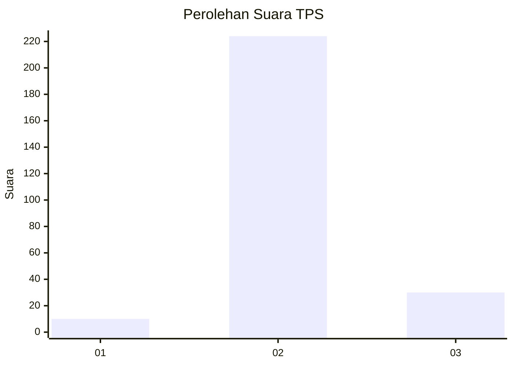
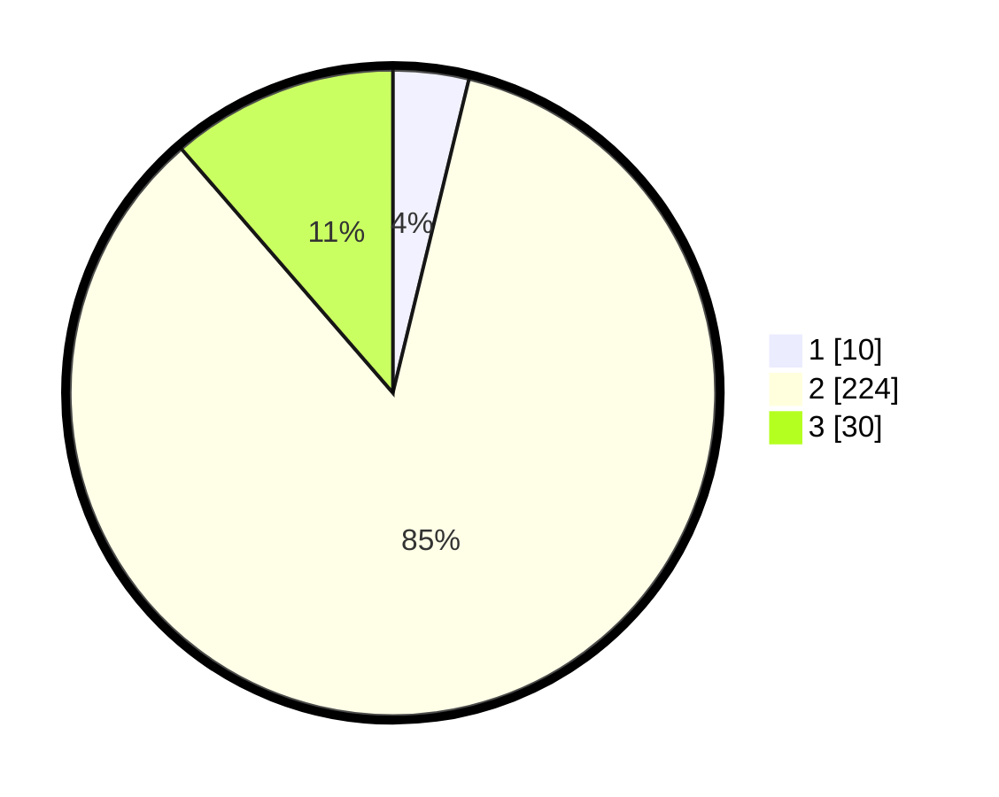

# Hasil

## Grafik

## Tabel

| No. | Nama Paslon    | Suara | Suara (raw) | Persentase |
|:--- |:-------------- | -----:| -----------:| ----------:|
| 1   | ANIES MUHAIMIN | 10    | [10][p-1]   | 3,79       |
| 2   | PRABOWO GIBRAN | 224   | [224][p-2]  | 84,85      |
| 3   | GANJAR MAHFUD  | 30    | [30][p-3]   | 11,36      |

[p-1]: https://github.com/gigit-pemilu/pemilu-2024-91-papua/blob/main/pilpres/hitung-suara/sub/91-papua/sub/11-keerom/sub/02-arso/sub/2009-yuwanain/sub/006-tps/sub/paslon-1.txt
[p-2]: https://github.com/gigit-pemilu/pemilu-2024-91-papua/blob/main/pilpres/hitung-suara/sub/91-papua/sub/11-keerom/sub/02-arso/sub/2009-yuwanain/sub/006-tps/sub/paslon-2.txt
[p-3]: https://github.com/gigit-pemilu/pemilu-2024-91-papua/blob/main/pilpres/hitung-suara/sub/91-papua/sub/11-keerom/sub/02-arso/sub/2009-yuwanain/sub/006-tps/sub/paslon-3.txt

## Foto C Plano

https://sirekap-obj-formc.kpu.go.id/10c3/pemilu/ppwp/91/11/02/20/09/9111022009006-20240214-205622--9daef9c2-d630-4c4c-b811-6beafb86a19b.jpg

https://sirekap-obj-formc.kpu.go.id/10c3/pemilu/ppwp/91/11/02/20/09/9111022009006-20240214-205726--d6a92fe0-1bb3-475f-b9ac-aed6dcd25c94.jpg

https://sirekap-obj-formc.kpu.go.id/10c3/pemilu/ppwp/91/11/02/20/09/9111022009006-20240214-205849--1d0b165f-30a5-45f7-b7bf-0bcd29e733b8.jpg

## Metadata

| Key        | Value               |
| ---------- | ------------------- |
| Time Stamp | 2024-02-15 19:00:26 |

## DATA PEMILIH TETAP

Jumlah pemilih dalam DPT: **282**.
 * L: **133**.
 * P: **149**.

## DATA PENGGUNA HAK PILIH

Jumlah pengguna hak pilih dalam DPT: **258**.
 * L: **124**.
 * P: **134**.

Jumlah pengguna hak pilih dalam DPTb: **6**.
 * L: **1**.
 * P: **5**.

Jumlah pengguna hak pilih dalam DPK: **0**.
 * L: **0**.
 * P: **0**.

Jumlah pengguna hak pilih: **264**.
 * L: **125**.
 * P: **139**.

## JUMLAH SUARA SAH DAN TIDAK SAH

JUMLAH SELURUH SUARA SAH: **264**.

JUMLAH SUARA TIDAK SAH: **0**.

JUMLAH SELURUH SUARA SAH DAN SUARA TIDAK SAH: **264**.

