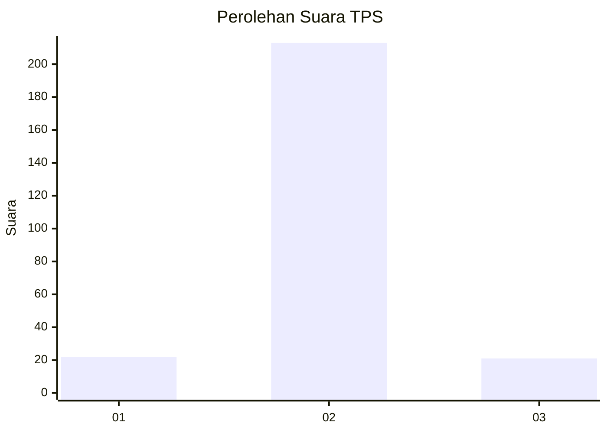
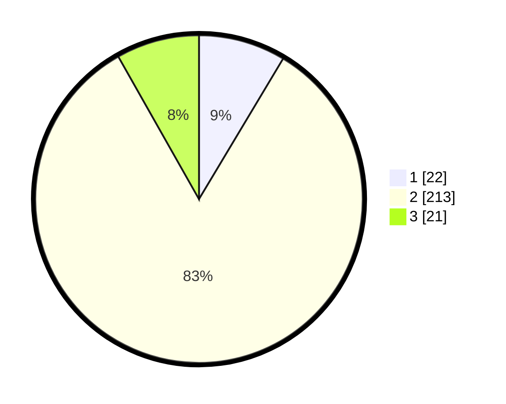

# Hasil

## Grafik

## Tabel

| No. | Nama Paslon    | Suara | Suara (raw) | Persentase |
|:--- |:-------------- | -----:| -----------:| ----------:|
| 1   | ANIES MUHAIMIN | 22    | [22][p-1]   | 8,59       |
| 2   | PRABOWO GIBRAN | 213   | [213][p-2]  | 83,20      |
| 3   | GANJAR MAHFUD  | 21    | [21][p-3]   | 8,20       |

[p-1]: https://github.com/gigit-pemilu/pemilu-2024-91-papua/blob/main/pilpres/hitung-suara/sub/91-papua/sub/11-keerom/sub/02-arso/sub/2009-yuwanain/sub/008-tps/sub/paslon-1.txt
[p-2]: https://github.com/gigit-pemilu/pemilu-2024-91-papua/blob/main/pilpres/hitung-suara/sub/91-papua/sub/11-keerom/sub/02-arso/sub/2009-yuwanain/sub/008-tps/sub/paslon-2.txt
[p-3]: https://github.com/gigit-pemilu/pemilu-2024-91-papua/blob/main/pilpres/hitung-suara/sub/91-papua/sub/11-keerom/sub/02-arso/sub/2009-yuwanain/sub/008-tps/sub/paslon-3.txt

## Foto C Plano

https://sirekap-obj-formc.kpu.go.id/f896/pemilu/ppwp/91/11/02/20/09/9111022009008-20240214-213523--6edcc765-3c8e-4e6c-8eb1-87e3be17d885.jpg

https://sirekap-obj-formc.kpu.go.id/f896/pemilu/ppwp/91/11/02/20/09/9111022009008-20240214-201740--cde768c8-f733-4cd1-8b66-ecfc882cbba2.jpg

https://sirekap-obj-formc.kpu.go.id/f896/pemilu/ppwp/91/11/02/20/09/9111022009008-20240214-200845--b6658c64-e9b0-4faf-b442-eec87733c3ae.jpg

## Metadata

| Key        | Value               |
| ---------- | ------------------- |
| Time Stamp | 2024-02-15 03:06:03 |

## DATA PEMILIH TETAP

Jumlah pemilih dalam DPT: **284**.
 * L: **140**.
 * P: **144**.

## DATA PENGGUNA HAK PILIH

Jumlah pengguna hak pilih dalam DPT: **251**.
 * L: **125**.
 * P: **126**.

Jumlah pengguna hak pilih dalam DPTb: **8**.
 * L: **4**.
 * P: **4**.

Jumlah pengguna hak pilih dalam DPK: **0**.
 * L: **0**.
 * P: **0**.

Jumlah pengguna hak pilih: **259**.
 * L: **129**.
 * P: **130**.

## JUMLAH SUARA SAH DAN TIDAK SAH

JUMLAH SELURUH SUARA SAH: **256**.

JUMLAH SUARA TIDAK SAH: **3**.

JUMLAH SELURUH SUARA SAH DAN SUARA TIDAK SAH: **259**.

