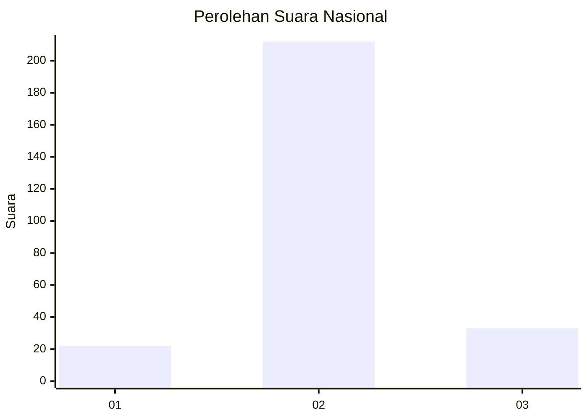
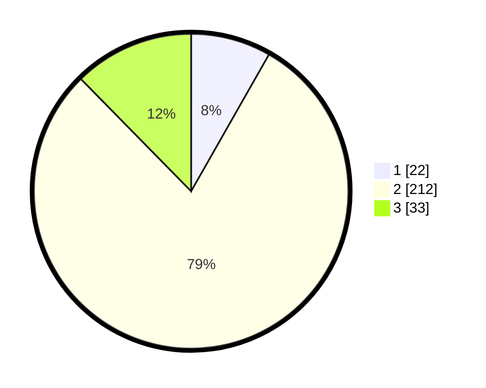

# Hasil

## Grafik

## Tabel

| No. | Nama Paslon    | Suara | Suara (raw) | Persentase |
|:--- |:-------------- | -----:| -----------:| ----------:|
| 1   | ANIES MUHAIMIN | 22    | [22][p-1]   | 8,24       |
| 2   | PRABOWO GIBRAN | 212   | [212][p-2]  | 79,40      |
| 3   | GANJAR MAHFUD  | 33    | [33][p-3]   | 12,36      |

[p-1]: https://github.com/gigit-pemilu/pemilu-2024/blob/main/pilpres/hitung-suara/sub/91-papua/sub/11-keerom/sub/02-arso/sub/2009-yuwanain/sub/010-tps/sub/paslon-1.txt
[p-2]: https://github.com/gigit-pemilu/pemilu-2024/blob/main/pilpres/hitung-suara/sub/91-papua/sub/11-keerom/sub/02-arso/sub/2009-yuwanain/sub/010-tps/sub/paslon-2.txt
[p-3]: https://github.com/gigit-pemilu/pemilu-2024/blob/main/pilpres/hitung-suara/sub/91-papua/sub/11-keerom/sub/02-arso/sub/2009-yuwanain/sub/010-tps/sub/paslon-3.txt

## Foto C Plano

https://sirekap-obj-formc.kpu.go.id/f710/pemilu/ppwp/91/11/02/20/09/9111022009010-20240215-002409--9e596b61-b728-4229-aa7e-4797f3effa89.jpg

https://sirekap-obj-formc.kpu.go.id/f710/pemilu/ppwp/91/11/02/20/09/9111022009010-20240215-003050--0d4f8832-74f5-4ed7-b8c1-95e6e76c96ed.jpg

https://sirekap-obj-formc.kpu.go.id/f710/pemilu/ppwp/91/11/02/20/09/9111022009010-20240215-053806--a4b77b0e-72e0-4cb5-897c-de83f2f84b8b.jpg

## Metadata

| Key        | Value               |
| ---------- | ------------------- |
| Time Stamp | 2024-02-15 19:30:26 |

