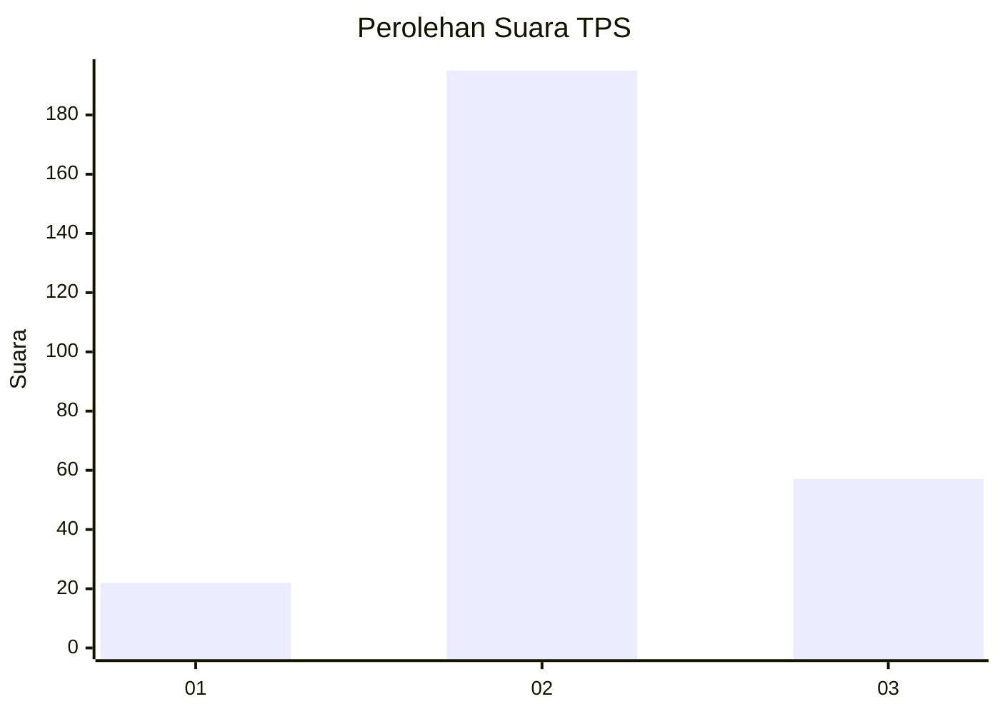
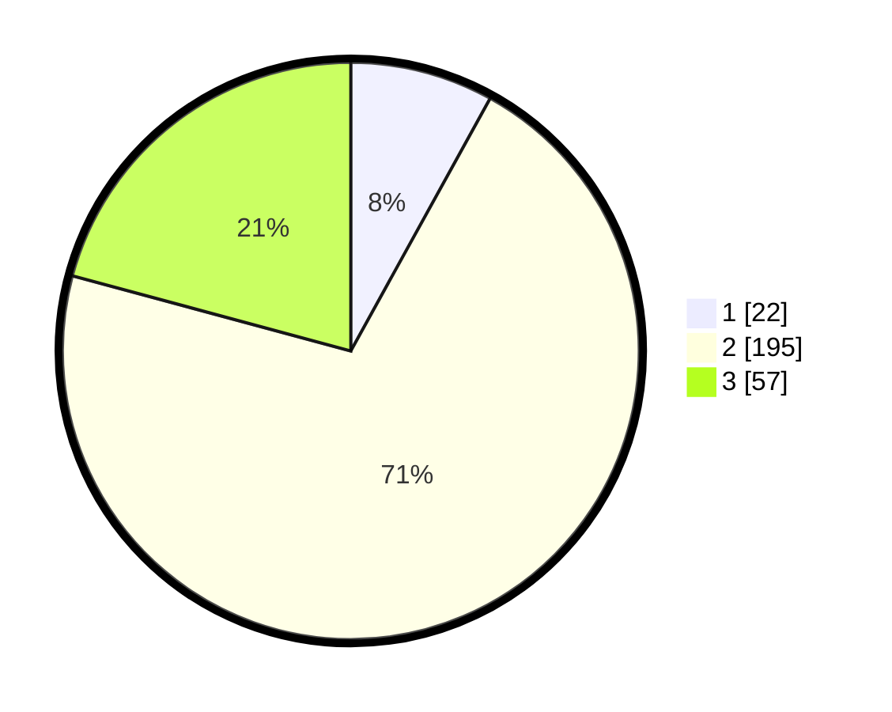

# Hasil

## Grafik

## Tabel

| No. | Nama Paslon    | Suara | Suara (raw) | Persentase |
|:--- |:-------------- | -----:| -----------:| ----------:|
| 1   | ANIES MUHAIMIN | 22    | [22][p-1]   | 8,03       |
| 2   | PRABOWO GIBRAN | 195   | [195][p-2]  | 71,17      |
| 3   | GANJAR MAHFUD  | 57    | [57][p-3]   | 20,80      |

[p-1]: https://github.com/gigit-pemilu/pemilu-2024-91-papua/blob/main/pilpres/hitung-suara/sub/91-papua/sub/11-keerom/sub/02-arso/sub/2011-asyaman/sub/001-tps/sub/paslon-1.txt
[p-2]: https://github.com/gigit-pemilu/pemilu-2024-91-papua/blob/main/pilpres/hitung-suara/sub/91-papua/sub/11-keerom/sub/02-arso/sub/2011-asyaman/sub/001-tps/sub/paslon-2.txt
[p-3]: https://github.com/gigit-pemilu/pemilu-2024-91-papua/blob/main/pilpres/hitung-suara/sub/91-papua/sub/11-keerom/sub/02-arso/sub/2011-asyaman/sub/001-tps/sub/paslon-3.txt

## Foto C Plano

https://sirekap-obj-formc.kpu.go.id/ab00/pemilu/ppwp/91/11/02/20/11/9111022011001-20240215-051826--9167bfda-897b-4602-903f-90df63b377dd.jpg

https://sirekap-obj-formc.kpu.go.id/ab00/pemilu/ppwp/91/11/02/20/11/9111022011001-20240215-051952--fc16c84b-129c-4a82-a4cf-1ba115e151f1.jpg

## Metadata

| Key        | Value               |
| ---------- | ------------------- |
| Time Stamp | 2024-02-24 22:31:28 |

