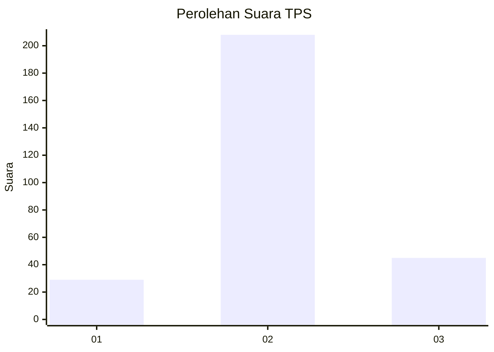
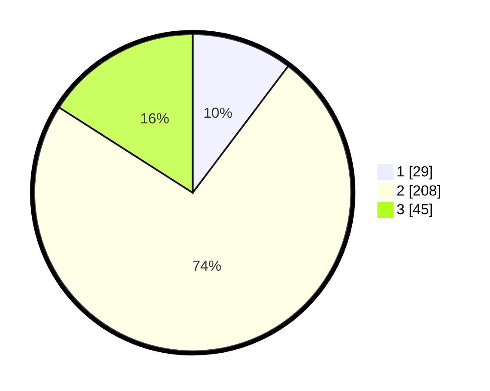

# Hasil

## Grafik

## Tabel

| No. | Nama Paslon    | Suara | Suara (raw) | Persentase |
|:--- |:-------------- | -----:| -----------:| ----------:|
| 1   | ANIES MUHAIMIN | 29    | [29][p-1]   | 10,28      |
| 2   | PRABOWO GIBRAN | 208   | [208][p-2]  | 73,76      |
| 3   | GANJAR MAHFUD  | 45    | [45][p-3]   | 15,96      |

[p-1]: https://github.com/gigit-pemilu/pemilu-2024-91-papua/blob/main/pilpres/hitung-suara/sub/91-papua/sub/11-keerom/sub/02-arso/sub/2011-asyaman/sub/005-tps/sub/paslon-1.txt
[p-2]: https://github.com/gigit-pemilu/pemilu-2024-91-papua/blob/main/pilpres/hitung-suara/sub/91-papua/sub/11-keerom/sub/02-arso/sub/2011-asyaman/sub/005-tps/sub/paslon-2.txt
[p-3]: https://github.com/gigit-pemilu/pemilu-2024-91-papua/blob/main/pilpres/hitung-suara/sub/91-papua/sub/11-keerom/sub/02-arso/sub/2011-asyaman/sub/005-tps/sub/paslon-3.txt

## Foto C Plano

https://sirekap-obj-formc.kpu.go.id/8a11/pemilu/ppwp/91/11/02/20/11/9111022011005-20240214-214716--49567753-21ad-4579-9f74-d6f1625260c8.jpg

https://sirekap-obj-formc.kpu.go.id/8a11/pemilu/ppwp/91/11/02/20/11/9111022011005-20240215-031439--64f872e6-d703-484b-a655-690c93319c82.jpg

https://sirekap-obj-formc.kpu.go.id/8a11/pemilu/ppwp/91/11/02/20/11/9111022011005-20240215-031722--f3865633-3e72-4e1a-85ea-12b2e049de46.jpg

## Metadata

| Key        | Value               |
| ---------- | ------------------- |
| Time Stamp | 2024-02-15 19:30:26 |

