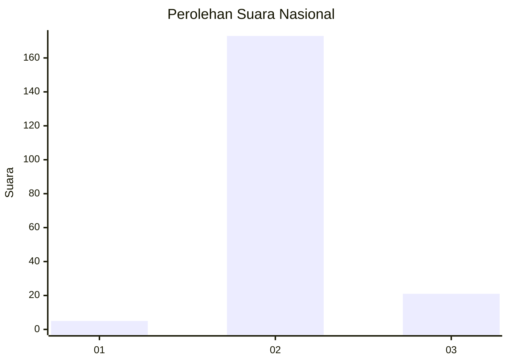
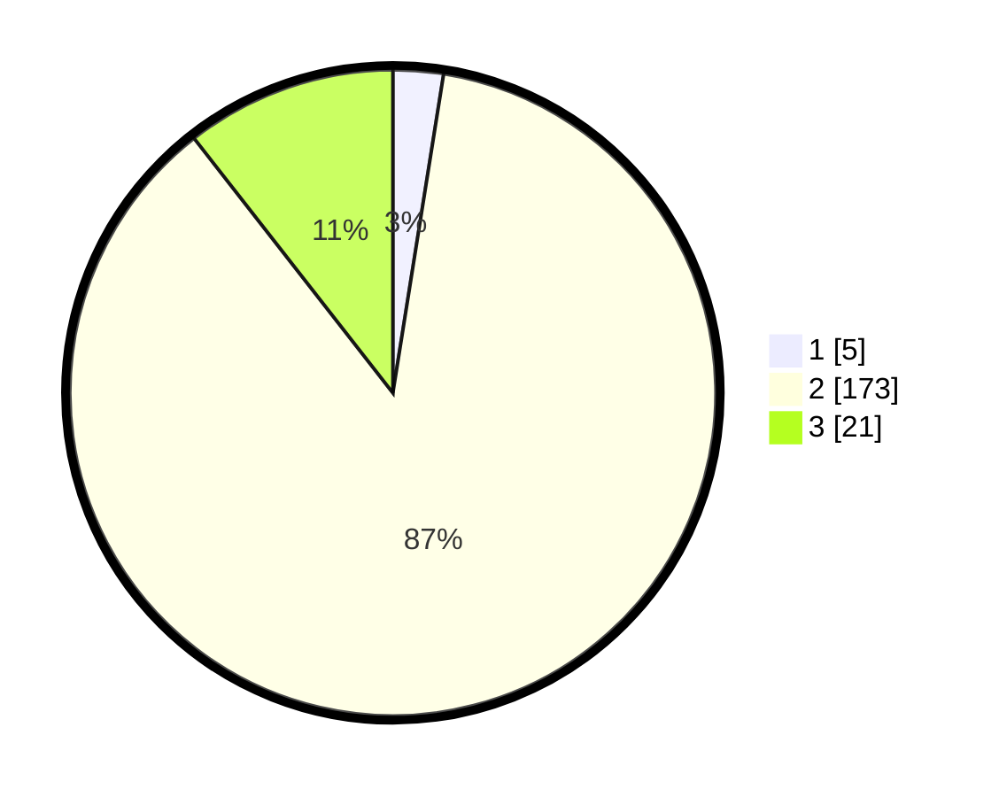

# Hasil

## Grafik

## Tabel

| No. | Nama Paslon    | Suara | Suara (raw) | Persentase |
|:--- |:-------------- | -----:| -----------:| ----------:|
| 1   | ANIES MUHAIMIN | 5     | [5][p-1]    | 2,51       |
| 2   | PRABOWO GIBRAN | 173   | [173][p-2]  | 86,93      |
| 3   | GANJAR MAHFUD  | 21    | [21][p-3]   | 10,55      |

[p-1]: https://github.com/gigit-pemilu/pemilu-2024/blob/main/pilpres/hitung-suara/sub/91-papua/sub/11-keerom/sub/02-arso/sub/2031-bibiosi/sub/002-tps/sub/paslon-1.txt
[p-2]: https://github.com/gigit-pemilu/pemilu-2024/blob/main/pilpres/hitung-suara/sub/91-papua/sub/11-keerom/sub/02-arso/sub/2031-bibiosi/sub/002-tps/sub/paslon-2.txt
[p-3]: https://github.com/gigit-pemilu/pemilu-2024/blob/main/pilpres/hitung-suara/sub/91-papua/sub/11-keerom/sub/02-arso/sub/2031-bibiosi/sub/002-tps/sub/paslon-3.txt

## Foto C Plano

https://sirekap-obj-formc.kpu.go.id/3224/pemilu/ppwp/91/11/02/20/31/9111022031002-20240214-215106--6e027515-08a4-46ab-a078-5f39ab46929d.jpg

https://sirekap-obj-formc.kpu.go.id/3224/pemilu/ppwp/91/11/02/20/31/9111022031002-20240214-215634--bffc1242-ee89-4717-9952-d4ef101edca7.jpg

https://sirekap-obj-formc.kpu.go.id/3224/pemilu/ppwp/91/11/02/20/31/9111022031002-20240214-215745--8e7c7f2c-6015-4f06-aabc-82373bbcb0fe.jpg

## Metadata

| Key        | Value               |
| ---------- | ------------------- |
| Time Stamp | 2024-02-15 22:00:27 |

