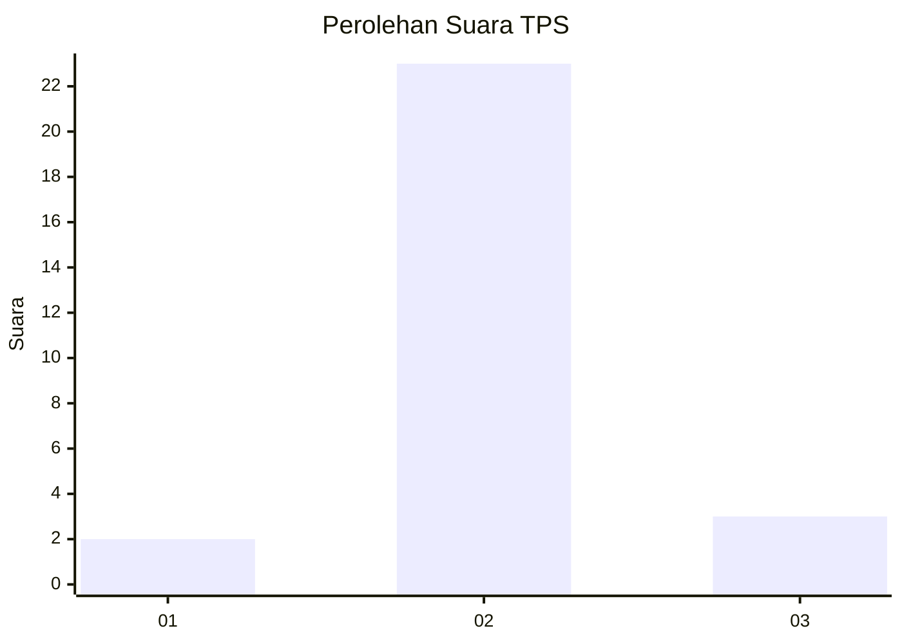
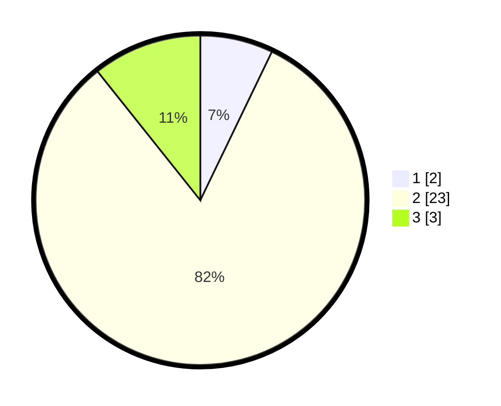

# Hasil

## Grafik

## Tabel

| No. | Nama Paslon    | Suara | Suara (raw) | Persentase |
|:--- |:-------------- | -----:| -----------:| ----------:|
| 1   | ANIES MUHAIMIN | 2     | [2][p-1]    | 7,14       |
| 2   | PRABOWO GIBRAN | 23    | [23][p-2]   | 82,14      |
| 3   | GANJAR MAHFUD  | 3     | [3][p-3]    | 10,71      |

[p-1]: https://github.com/gigit-pemilu/pemilu-2024-91-papua/blob/main/pilpres/hitung-suara/sub/91-papua/sub/11-keerom/sub/02-arso/sub/2031-bibiosi/sub/901-tps/sub/paslon-1.txt
[p-2]: https://github.com/gigit-pemilu/pemilu-2024-91-papua/blob/main/pilpres/hitung-suara/sub/91-papua/sub/11-keerom/sub/02-arso/sub/2031-bibiosi/sub/901-tps/sub/paslon-2.txt
[p-3]: https://github.com/gigit-pemilu/pemilu-2024-91-papua/blob/main/pilpres/hitung-suara/sub/91-papua/sub/11-keerom/sub/02-arso/sub/2031-bibiosi/sub/901-tps/sub/paslon-3.txt

## Foto C Plano

https://sirekap-obj-formc.kpu.go.id/bb1e/pemilu/ppwp/91/11/02/20/31/9111022031901-20240214-132240--af2591f7-062e-4398-a77c-03b094f342d0.jpg

https://sirekap-obj-formc.kpu.go.id/bb1e/pemilu/ppwp/91/11/02/20/31/9111022031901-20240214-132338--fc7a9a74-f326-4c44-8701-2ba8d6f30998.jpg

https://sirekap-obj-formc.kpu.go.id/bb1e/pemilu/ppwp/91/11/02/20/31/9111022031901-20240214-132526--70b6fa36-54e0-49cf-b6b6-29838482baa7.jpg

## Metadata

| Key        | Value               |
| ---------- | ------------------- |
| Time Stamp | 2024-02-14 21:46:01 |

## DATA PEMILIH TETAP

Jumlah pemilih dalam DPT: **29**.
 * L: **0**.
 * P: **29**.

## DATA PENGGUNA HAK PILIH

Jumlah pengguna hak pilih dalam DPT: **29**.
 * L: **0**.
 * P: **29**.

Jumlah pengguna hak pilih dalam DPTb: **0**.
 * L: **0**.
 * P: **0**.

Jumlah pengguna hak pilih dalam DPK: **0**.
 * L: **0**.
 * P: **0**.

Jumlah pengguna hak pilih: **29**.
 * L: **0**.
 * P: **29**.

## JUMLAH SUARA SAH DAN TIDAK SAH

JUMLAH SELURUH SUARA SAH: **28**.

JUMLAH SUARA TIDAK SAH: **1**.

JUMLAH SELURUH SUARA SAH DAN SUARA TIDAK SAH: **29**.

