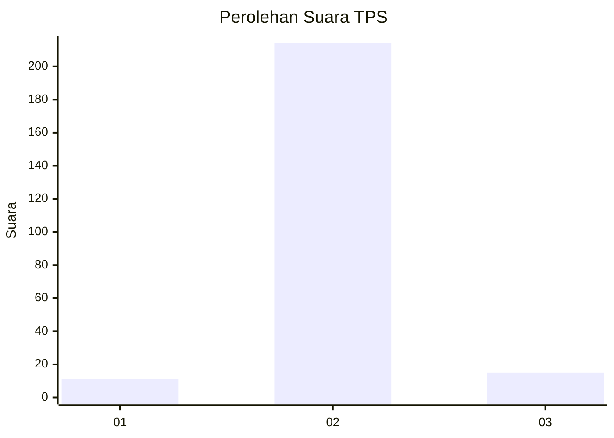
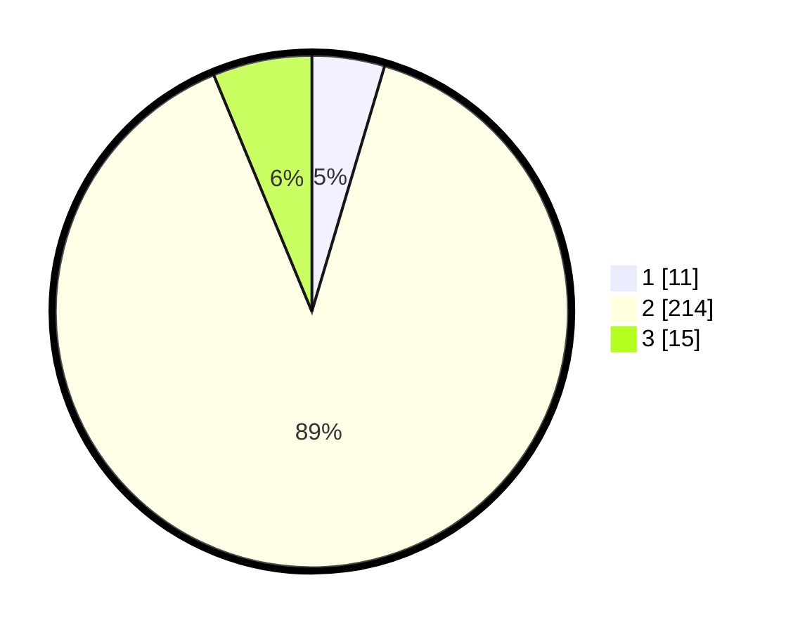

# Hasil

## Grafik

## Tabel

| No. | Nama Paslon    | Suara | Suara (raw) | Persentase |
|:--- |:-------------- | -----:| -----------:| ----------:|
| 1   | ANIES MUHAIMIN | 11    | [11][p-1]   | 4,58       |
| 2   | PRABOWO GIBRAN | 214   | [214][p-2]  | 89,17      |
| 3   | GANJAR MAHFUD  | 15    | [15][p-3]   | 6,25       |

[p-1]: https://github.com/gigit-pemilu/pemilu-2024-91-papua/blob/main/pilpres/hitung-suara/sub/91-papua/sub/11-keerom/sub/05-skanto/sub/2002-jaifuri/sub/003-tps/sub/paslon-1.txt
[p-2]: https://github.com/gigit-pemilu/pemilu-2024-91-papua/blob/main/pilpres/hitung-suara/sub/91-papua/sub/11-keerom/sub/05-skanto/sub/2002-jaifuri/sub/003-tps/sub/paslon-2.txt
[p-3]: https://github.com/gigit-pemilu/pemilu-2024-91-papua/blob/main/pilpres/hitung-suara/sub/91-papua/sub/11-keerom/sub/05-skanto/sub/2002-jaifuri/sub/003-tps/sub/paslon-3.txt

## Foto C Plano

https://sirekap-obj-formc.kpu.go.id/6a9f/pemilu/ppwp/91/11/05/20/02/9111052002003-20240215-072128--723b101c-195f-41aa-a83e-e6312a75c49e.jpg

https://sirekap-obj-formc.kpu.go.id/6a9f/pemilu/ppwp/91/11/05/20/02/9111052002003-20240215-071922--952ad259-1f43-40ed-9ec0-aefc2c793993.jpg

https://sirekap-obj-formc.kpu.go.id/6a9f/pemilu/ppwp/91/11/05/20/02/9111052002003-20240215-072028--8532ca98-2ac8-4f11-b920-87422e88217f.jpg

## Metadata

| Key        | Value               |
| ---------- | ------------------- |
| Time Stamp | 2024-02-15 22:00:27 |

