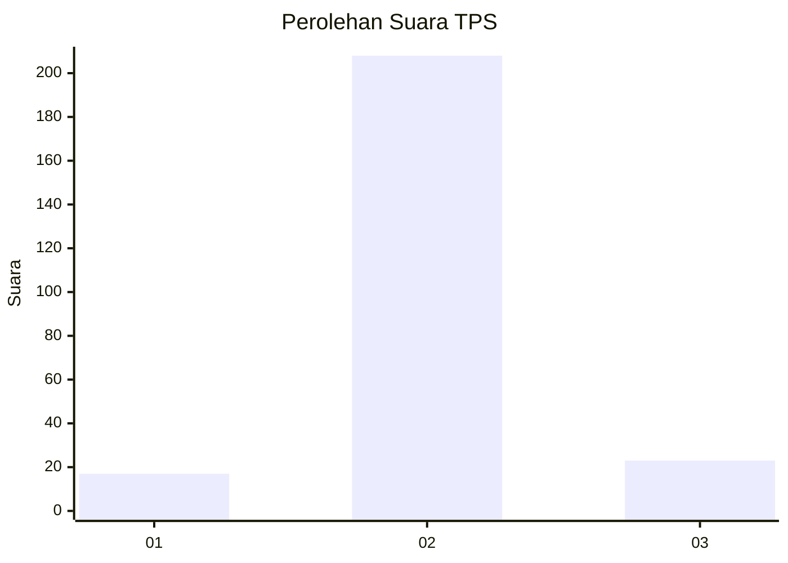
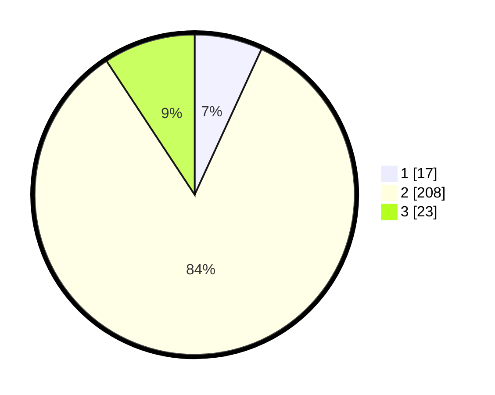

# Hasil

## Grafik

## Tabel

| No. | Nama Paslon    | Suara | Suara (raw) | Persentase |
|:--- |:-------------- | -----:| -----------:| ----------:|
| 1   | ANIES MUHAIMIN | 17    | [17][p-1]   | 6,85       |
| 2   | PRABOWO GIBRAN | 208   | [208][p-2]  | 83,87      |
| 3   | GANJAR MAHFUD  | 23    | [23][p-3]   | 9,27       |

[p-1]: https://github.com/gigit-pemilu/pemilu-2024-91-papua/blob/main/pilpres/hitung-suara/sub/91-papua/sub/11-keerom/sub/05-skanto/sub/2002-jaifuri/sub/004-tps/sub/paslon-1.txt
[p-2]: https://github.com/gigit-pemilu/pemilu-2024-91-papua/blob/main/pilpres/hitung-suara/sub/91-papua/sub/11-keerom/sub/05-skanto/sub/2002-jaifuri/sub/004-tps/sub/paslon-2.txt
[p-3]: https://github.com/gigit-pemilu/pemilu-2024-91-papua/blob/main/pilpres/hitung-suara/sub/91-papua/sub/11-keerom/sub/05-skanto/sub/2002-jaifuri/sub/004-tps/sub/paslon-3.txt

## Foto C Plano

https://sirekap-obj-formc.kpu.go.id/8f90/pemilu/ppwp/91/11/05/20/02/9111052002004-20240215-190722--adfd1329-94e0-4201-ab8e-d0a3d8f64004.jpg

https://sirekap-obj-formc.kpu.go.id/8f90/pemilu/ppwp/91/11/05/20/02/9111052002004-20240215-190738--c719dec9-6d4e-46b5-9de2-4dba2fa96788.jpg

https://sirekap-obj-formc.kpu.go.id/8f90/pemilu/ppwp/91/11/05/20/02/9111052002004-20240215-190756--5d82eece-df47-4447-8609-586c1e1b2bf8.jpg

## Metadata

| Key        | Value               |
| ---------- | ------------------- |
| Time Stamp | 2024-02-15 23:29:50 |

