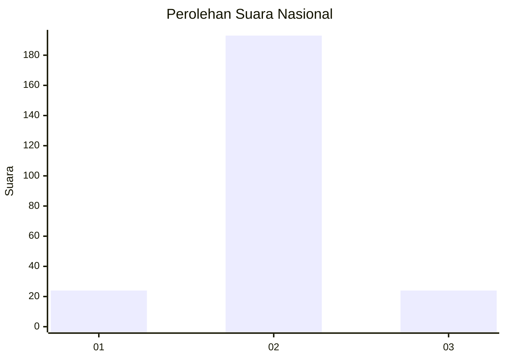
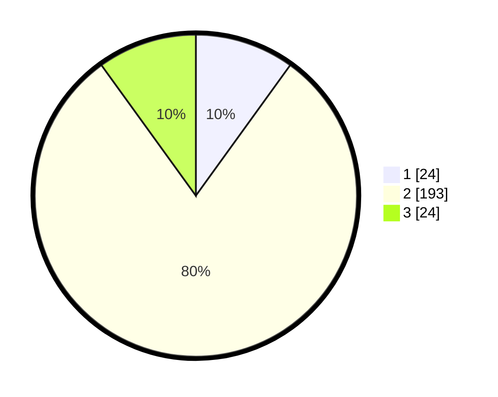

# Hasil

## Grafik

## Tabel

| No. | Nama Paslon    | Suara | Suara (raw) | Persentase |
|:--- |:-------------- | -----:| -----------:| ----------:|
| 1   | ANIES MUHAIMIN | 24    | [24][p-1]   | 9,96       |
| 2   | PRABOWO GIBRAN | 193   | [193][p-2]  | 80,08      |
| 3   | GANJAR MAHFUD  | 24    | [24][p-3]   | 9,96       |

[p-1]: https://github.com/gigit-pemilu/pemilu-2024/blob/main/pilpres/hitung-suara/sub/91-papua/sub/11-keerom/sub/05-skanto/sub/2002-jaifuri/sub/005-tps/sub/paslon-1.txt
[p-2]: https://github.com/gigit-pemilu/pemilu-2024/blob/main/pilpres/hitung-suara/sub/91-papua/sub/11-keerom/sub/05-skanto/sub/2002-jaifuri/sub/005-tps/sub/paslon-2.txt
[p-3]: https://github.com/gigit-pemilu/pemilu-2024/blob/main/pilpres/hitung-suara/sub/91-papua/sub/11-keerom/sub/05-skanto/sub/2002-jaifuri/sub/005-tps/sub/paslon-3.txt

## Foto C Plano

https://sirekap-obj-formc.kpu.go.id/ebe3/pemilu/ppwp/91/11/05/20/02/9111052002005-20240214-190609--e849fd1f-8b9b-4a9a-b37d-2d01a895edc0.jpg

https://sirekap-obj-formc.kpu.go.id/ebe3/pemilu/ppwp/91/11/05/20/02/9111052002005-20240214-190702--1c0b28b6-2a56-4981-b45c-37e5b22c6c86.jpg

https://sirekap-obj-formc.kpu.go.id/ebe3/pemilu/ppwp/91/11/05/20/02/9111052002005-20240214-190751--736e4901-0bf0-40ad-a540-4f2e58d1c0eb.jpg

## Metadata

| Key        | Value               |
| ---------- | ------------------- |
| Time Stamp | 2024-02-15 22:00:27 |

