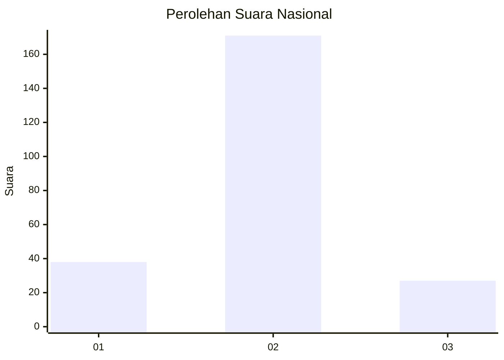
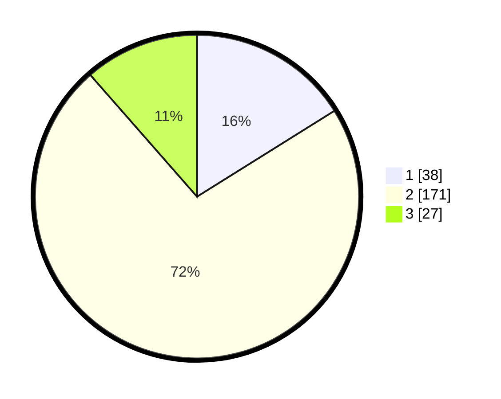

# Hasil

## Grafik

## Tabel

| No. | Nama Paslon    | Suara | Suara (raw) | Persentase |
|:--- |:-------------- | -----:| -----------:| ----------:|
| 1   | ANIES MUHAIMIN | 38    | [38][p-1]   | 16,10      |
| 2   | PRABOWO GIBRAN | 171   | [171][p-2]  | 72,46      |
| 3   | GANJAR MAHFUD  | 27    | [27][p-3]   | 11,44      |

[p-1]: https://github.com/gigit-pemilu/pemilu-2024/blob/main/pilpres/hitung-suara/sub/91-papua/sub/11-keerom/sub/05-skanto/sub/2002-jaifuri/sub/008-tps/sub/paslon-1.txt
[p-2]: https://github.com/gigit-pemilu/pemilu-2024/blob/main/pilpres/hitung-suara/sub/91-papua/sub/11-keerom/sub/05-skanto/sub/2002-jaifuri/sub/008-tps/sub/paslon-2.txt
[p-3]: https://github.com/gigit-pemilu/pemilu-2024/blob/main/pilpres/hitung-suara/sub/91-papua/sub/11-keerom/sub/05-skanto/sub/2002-jaifuri/sub/008-tps/sub/paslon-3.txt

## Foto C Plano

https://sirekap-obj-formc.kpu.go.id/525e/pemilu/ppwp/91/11/05/20/02/9111052002008-20240215-073520--c15f3bd2-d208-41aa-8b94-849990b768fd.jpg

https://sirekap-obj-formc.kpu.go.id/525e/pemilu/ppwp/91/11/05/20/02/9111052002008-20240215-073543--de2b998f-fac6-4585-bfbc-fcf5f3d31e3e.jpg

https://sirekap-obj-formc.kpu.go.id/525e/pemilu/ppwp/91/11/05/20/02/9111052002008-20240215-073605--024ee933-b289-4678-990d-07883181f8c7.jpg

## Metadata

| Key        | Value               |
| ---------- | ------------------- |
| Time Stamp | 2024-02-15 22:00:27 |

