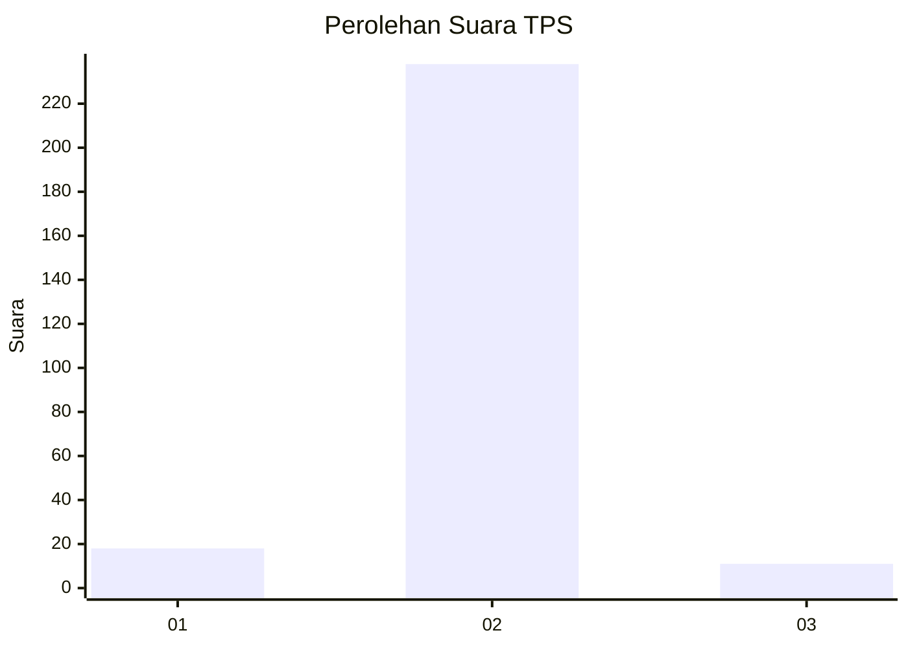
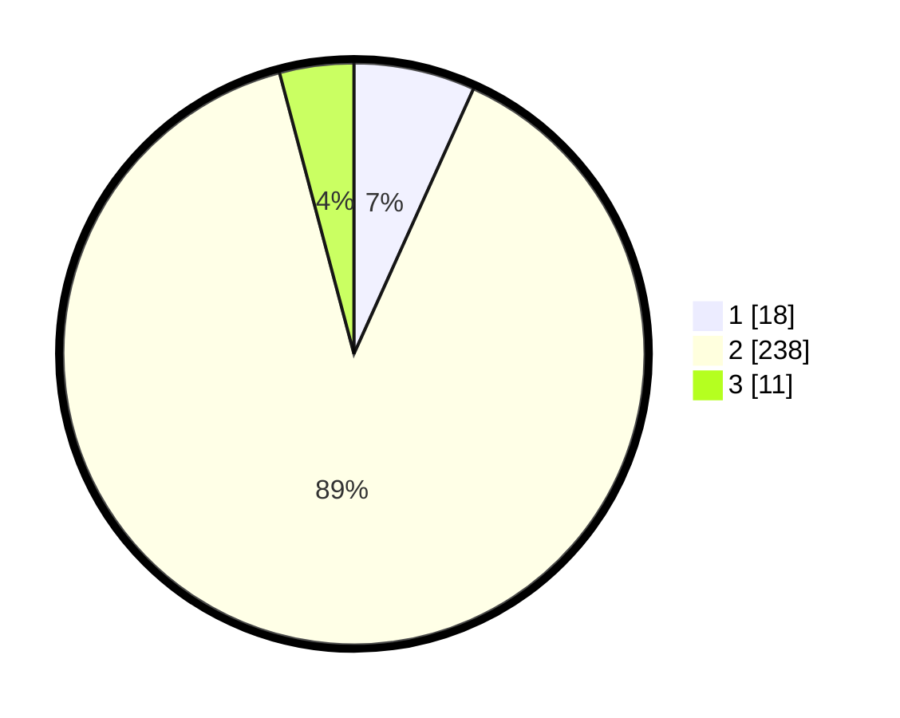

# Hasil

## Grafik

## Tabel

| No. | Nama Paslon    | Suara | Suara (raw) | Persentase |
|:--- |:-------------- | -----:| -----------:| ----------:|
| 1   | ANIES MUHAIMIN | 18    | [18][p-1]   | 6,74       |
| 2   | PRABOWO GIBRAN | 238   | [238][p-2]  | 89,14      |
| 3   | GANJAR MAHFUD  | 11    | [11][p-3]   | 4,12       |

[p-1]: https://github.com/gigit-pemilu/pemilu-2024-91-papua/blob/main/pilpres/hitung-suara/sub/91-papua/sub/11-keerom/sub/05-skanto/sub/2003-arsopura/sub/002-tps/sub/paslon-1.txt
[p-2]: https://github.com/gigit-pemilu/pemilu-2024-91-papua/blob/main/pilpres/hitung-suara/sub/91-papua/sub/11-keerom/sub/05-skanto/sub/2003-arsopura/sub/002-tps/sub/paslon-2.txt
[p-3]: https://github.com/gigit-pemilu/pemilu-2024-91-papua/blob/main/pilpres/hitung-suara/sub/91-papua/sub/11-keerom/sub/05-skanto/sub/2003-arsopura/sub/002-tps/sub/paslon-3.txt

## Foto C Plano

https://sirekap-obj-formc.kpu.go.id/ac13/pemilu/ppwp/91/11/05/20/03/9111052003002-20240217-053043--75691fd2-3b72-40ca-a240-ee01c4c707c3.jpg

https://sirekap-obj-formc.kpu.go.id/ac13/pemilu/ppwp/91/11/05/20/03/9111052003002-20240217-053122--2f071c6b-5d4c-483f-8343-67c1318781eb.jpg

https://sirekap-obj-formc.kpu.go.id/ac13/pemilu/ppwp/91/11/05/20/03/9111052003002-20240217-053157--bd0d277c-9e83-4719-8d97-71bc06f11833.jpg

## Metadata

| Key        | Value               |
| ---------- | ------------------- |
| Time Stamp | 2024-02-24 22:31:28 |

