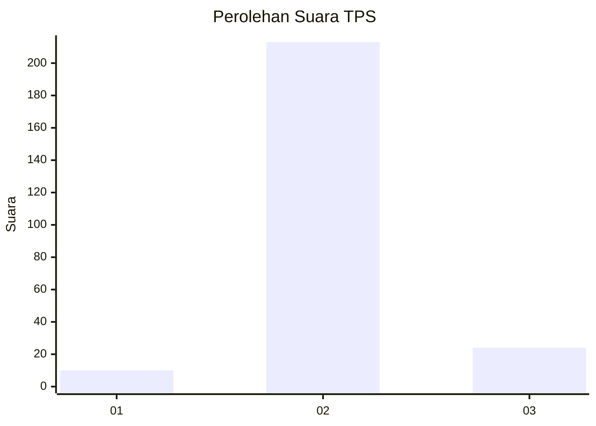
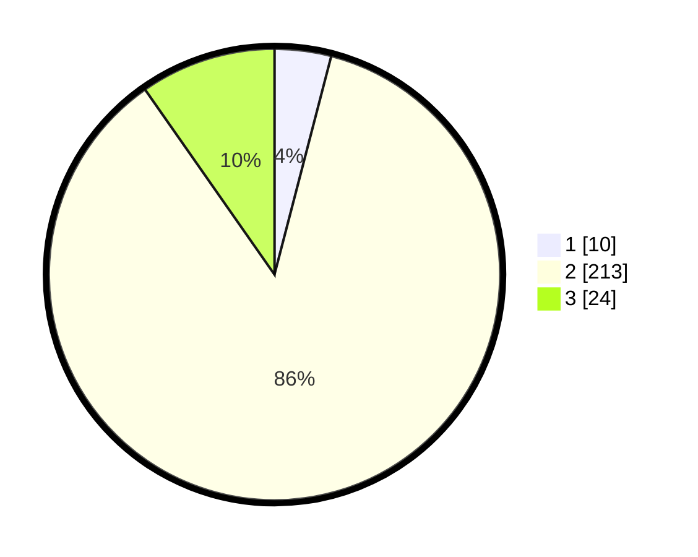

# Hasil

## Grafik

## Tabel

| No. | Nama Paslon    | Suara | Suara (raw) | Persentase |
|:--- |:-------------- | -----:| -----------:| ----------:|
| 1   | ANIES MUHAIMIN | 10    | [10][p-1]   | 4,05       |
| 2   | PRABOWO GIBRAN | 213   | [213][p-2]  | 86,23      |
| 3   | GANJAR MAHFUD  | 24    | [24][p-3]   | 9,72       |

[p-1]: https://github.com/gigit-pemilu/pemilu-2024-91-papua/blob/main/pilpres/hitung-suara/sub/91-papua/sub/11-keerom/sub/05-skanto/sub/2003-arsopura/sub/004-tps/sub/paslon-1.txt
[p-2]: https://github.com/gigit-pemilu/pemilu-2024-91-papua/blob/main/pilpres/hitung-suara/sub/91-papua/sub/11-keerom/sub/05-skanto/sub/2003-arsopura/sub/004-tps/sub/paslon-2.txt
[p-3]: https://github.com/gigit-pemilu/pemilu-2024-91-papua/blob/main/pilpres/hitung-suara/sub/91-papua/sub/11-keerom/sub/05-skanto/sub/2003-arsopura/sub/004-tps/sub/paslon-3.txt

## Foto C Plano

https://sirekap-obj-formc.kpu.go.id/4a61/pemilu/ppwp/91/11/05/20/03/9111052003004-20240223-201143--627263c1-c95b-4890-9cec-767f25d61c14.jpg

https://sirekap-obj-formc.kpu.go.id/4a61/pemilu/ppwp/91/11/05/20/03/9111052003004-20240223-201624--f71d7b4a-f990-478d-ba38-0fad6312dcf6.jpg

https://sirekap-obj-formc.kpu.go.id/4a61/pemilu/ppwp/91/11/05/20/03/9111052003004-20240223-202250--7ecdc7e1-ddc4-4341-a130-9b91f17bfed6.jpg

## Metadata

| Key        | Value               |
| ---------- | ------------------- |
| Time Stamp | 2024-02-24 22:31:28 |

