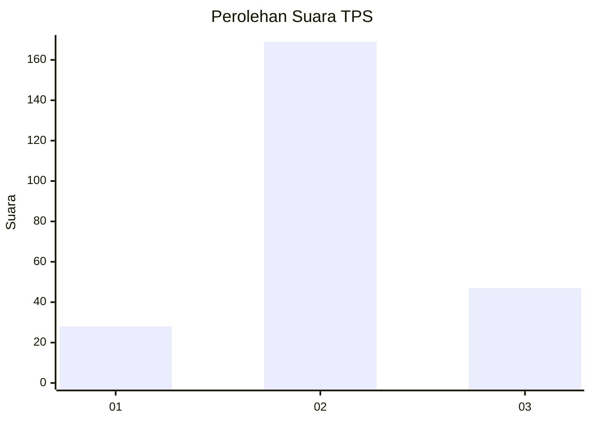
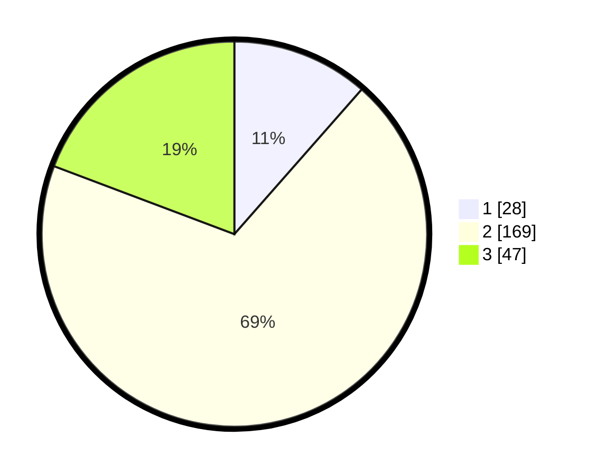

# Hasil

## Grafik

## Tabel

| No. | Nama Paslon    | Suara | Suara (raw) | Persentase |
|:--- |:-------------- | -----:| -----------:| ----------:|
| 1   | ANIES MUHAIMIN | 28    | [28][p-1]   | 11,48      |
| 2   | PRABOWO GIBRAN | 169   | [169][p-2]  | 69,26      |
| 3   | GANJAR MAHFUD  | 47    | [47][p-3]   | 19,26      |

[p-1]: https://github.com/gigit-pemilu/pemilu-2024-91-papua/blob/main/pilpres/hitung-suara/sub/91-papua/sub/11-keerom/sub/05-skanto/sub/2006-intaimelyan/sub/001-tps/sub/paslon-1.txt
[p-2]: https://github.com/gigit-pemilu/pemilu-2024-91-papua/blob/main/pilpres/hitung-suara/sub/91-papua/sub/11-keerom/sub/05-skanto/sub/2006-intaimelyan/sub/001-tps/sub/paslon-2.txt
[p-3]: https://github.com/gigit-pemilu/pemilu-2024-91-papua/blob/main/pilpres/hitung-suara/sub/91-papua/sub/11-keerom/sub/05-skanto/sub/2006-intaimelyan/sub/001-tps/sub/paslon-3.txt

## Foto C Plano

https://sirekap-obj-formc.kpu.go.id/dff1/pemilu/ppwp/91/11/05/20/06/9111052006001-20240214-160132--ab1cb4dc-3e41-4e9e-b5a1-1ebaa84aec36.jpg

https://sirekap-obj-formc.kpu.go.id/dff1/pemilu/ppwp/91/11/05/20/06/9111052006001-20240214-155251--1e5cf833-f789-47c6-b309-bddd64030a61.jpg

https://sirekap-obj-formc.kpu.go.id/dff1/pemilu/ppwp/91/11/05/20/06/9111052006001-20240214-155425--e98b5475-4998-4ccd-8e3e-051396df80ff.jpg

## Metadata

| Key        | Value               |
| ---------- | ------------------- |
| Time Stamp | 2024-02-15 22:30:27 |

