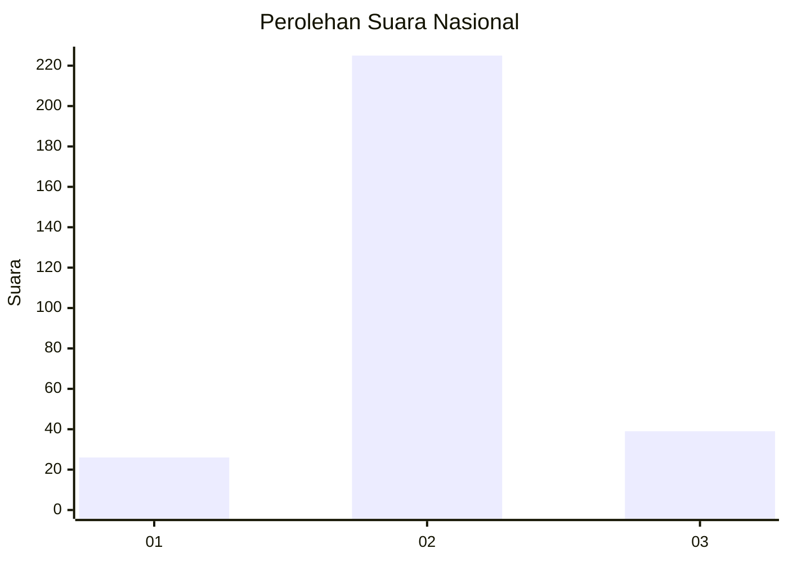
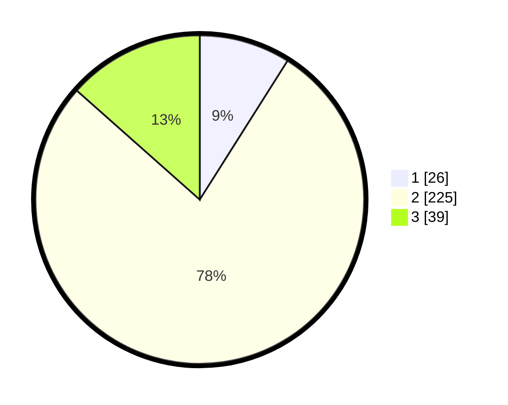

# Hasil

## Grafik

## Tabel

| No. | Nama Paslon    | Suara | Suara (raw) | Persentase |
|:--- |:-------------- | -----:| -----------:| ----------:|
| 1   | ANIES MUHAIMIN | 26    | [26][p-1]   | 8,97       |
| 2   | PRABOWO GIBRAN | 225   | [225][p-2]  | 77,59      |
| 3   | GANJAR MAHFUD  | 39    | [39][p-3]   | 13,45      |

[p-1]: https://github.com/gigit-pemilu/pemilu-2024/blob/main/pilpres/hitung-suara/sub/91-papua/sub/11-keerom/sub/05-skanto/sub/2008-wulukubun/sub/001-tps/sub/paslon-1.txt
[p-2]: https://github.com/gigit-pemilu/pemilu-2024/blob/main/pilpres/hitung-suara/sub/91-papua/sub/11-keerom/sub/05-skanto/sub/2008-wulukubun/sub/001-tps/sub/paslon-2.txt
[p-3]: https://github.com/gigit-pemilu/pemilu-2024/blob/main/pilpres/hitung-suara/sub/91-papua/sub/11-keerom/sub/05-skanto/sub/2008-wulukubun/sub/001-tps/sub/paslon-3.txt

## Foto C Plano

https://sirekap-obj-formc.kpu.go.id/396b/pemilu/ppwp/91/11/05/20/08/9111052008001-20240215-030553--b628dfa3-685d-4255-ba80-4c09484e06c9.jpg

https://sirekap-obj-formc.kpu.go.id/396b/pemilu/ppwp/91/11/05/20/08/9111052008001-20240215-031031--af6ce5de-b744-4797-ae6e-4930ed0f7de0.jpg

https://sirekap-obj-formc.kpu.go.id/396b/pemilu/ppwp/91/11/05/20/08/9111052008001-20240215-031404--e4313321-4ec5-4f62-a288-e711d27c8b93.jpg

## Metadata

| Key        | Value               |
| ---------- | ------------------- |
| Time Stamp | 2024-02-15 22:30:27 |

