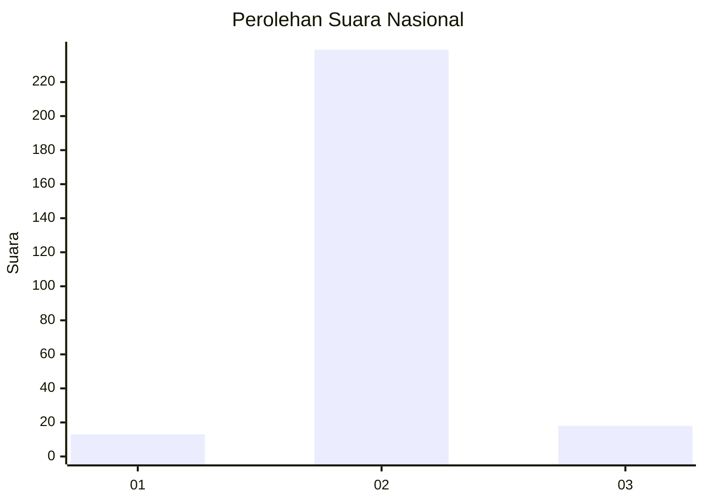
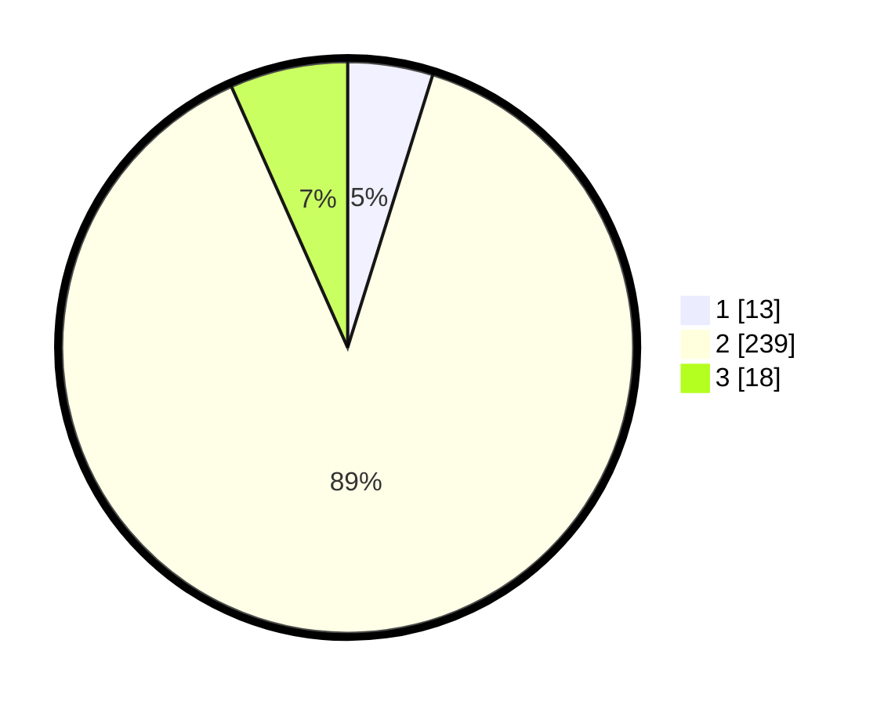

# Hasil

## Grafik

## Tabel

| No. | Nama Paslon    | Suara | Suara (raw) | Persentase |
|:--- |:-------------- | -----:| -----------:| ----------:|
| 1   | ANIES MUHAIMIN | 13    | [13][p-1]   | 4,81       |
| 2   | PRABOWO GIBRAN | 239   | [239][p-2]  | 88,52      |
| 3   | GANJAR MAHFUD  | 18    | [18][p-3]   | 6,67       |

[p-1]: https://github.com/gigit-pemilu/pemilu-2024/blob/main/pilpres/hitung-suara/sub/91-papua/sub/11-keerom/sub/05-skanto/sub/2008-wulukubun/sub/003-tps/sub/paslon-1.txt
[p-2]: https://github.com/gigit-pemilu/pemilu-2024/blob/main/pilpres/hitung-suara/sub/91-papua/sub/11-keerom/sub/05-skanto/sub/2008-wulukubun/sub/003-tps/sub/paslon-2.txt
[p-3]: https://github.com/gigit-pemilu/pemilu-2024/blob/main/pilpres/hitung-suara/sub/91-papua/sub/11-keerom/sub/05-skanto/sub/2008-wulukubun/sub/003-tps/sub/paslon-3.txt

## Foto C Plano

https://sirekap-obj-formc.kpu.go.id/634e/pemilu/ppwp/91/11/05/20/08/9111052008003-20240215-065136--a39aa23e-f61e-40a7-882a-0159f26fbb4c.jpg

https://sirekap-obj-formc.kpu.go.id/634e/pemilu/ppwp/91/11/05/20/08/9111052008003-20240215-061605--ab1bf395-e817-47e2-a60d-fd7a654a1a5f.jpg

https://sirekap-obj-formc.kpu.go.id/634e/pemilu/ppwp/91/11/05/20/08/9111052008003-20240215-063152--b1e923de-09d5-419e-a454-353076bc8550.jpg

## Metadata

| Key        | Value               |
| ---------- | ------------------- |
| Time Stamp | 2024-02-15 22:30:27 |

