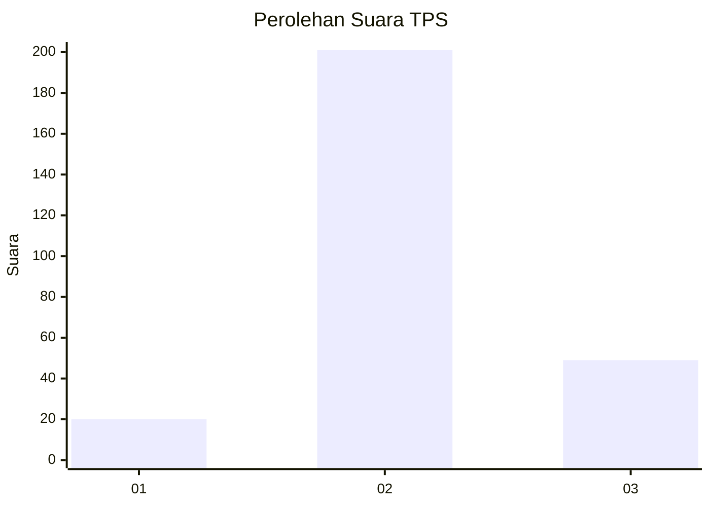

# Hasil

## Grafik

## Tabel

| No. | Nama Paslon    | Suara | Suara (raw) | Persentase |
|:--- |:-------------- | -----:| -----------:| ----------:|
| 1   | ANIES MUHAIMIN | 20    | [20][p-1]   | 7,41       |
| 2   | PRABOWO GIBRAN | 201   | [201][p-2]  | 74,44      |
| 3   | GANJAR MAHFUD  | 49    | [49][p-3]   | 18,15      |

[p-1]: https://github.com/gigit-pemilu/pemilu-2024-91-papua/blob/main/pilpres/hitung-suara/sub/91-papua/sub/11-keerom/sub/05-skanto/sub/2008-wulukubun/sub/004-tps/sub/paslon-1.txt
[p-2]: https://github.com/gigit-pemilu/pemilu-2024-91-papua/blob/main/pilpres/hitung-suara/sub/91-papua/sub/11-keerom/sub/05-skanto/sub/2008-wulukubun/sub/004-tps/sub/paslon-2.txt
[p-3]: https://github.com/gigit-pemilu/pemilu-2024-91-papua/blob/main/pilpres/hitung-suara/sub/91-papua/sub/11-keerom/sub/05-skanto/sub/2008-wulukubun/sub/004-tps/sub/paslon-3.txt

## Foto C Plano

https://sirekap-obj-formc.kpu.go.id/9688/pemilu/ppwp/91/11/05/20/08/9111052008004-20240215-020506--90bef768-34cd-481e-957d-744bcfd3944d.jpg

https://sirekap-obj-formc.kpu.go.id/9688/pemilu/ppwp/91/11/05/20/08/9111052008004-20240215-025233--5a12c689-d00c-4b6d-872f-838fd42977c5.jpg

https://sirekap-obj-formc.kpu.go.id/9688/pemilu/ppwp/91/11/05/20/08/9111052008004-20240215-020548--6ba2d0d6-8c87-45f5-9cf9-bc491f1d8923.jpg

## Metadata

| Key        | Value               |
| ---------- | ------------------- |
| Time Stamp | 2024-02-15 22:00:27 |

