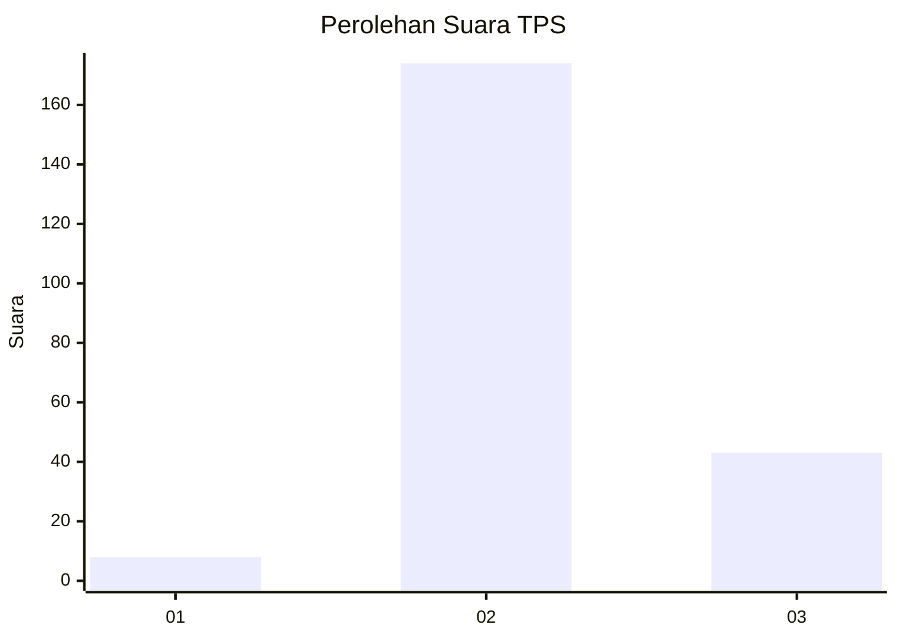
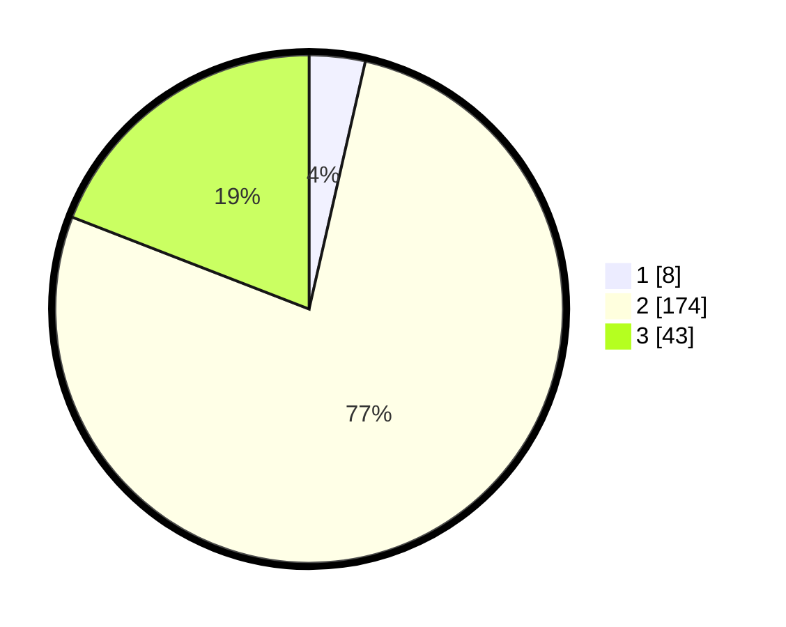

# Hasil

## Grafik

## Tabel

| No. | Nama Paslon    | Suara | Suara (raw) | Persentase |
|:--- |:-------------- | -----:| -----------:| ----------:|
| 1   | ANIES MUHAIMIN | 8     | [8][p-1]    | 3,56       |
| 2   | PRABOWO GIBRAN | 174   | [174][p-2]  | 77,33      |
| 3   | GANJAR MAHFUD  | 43    | [43][p-3]   | 19,11      |

[p-1]: https://github.com/gigit-pemilu/pemilu-2024-91-papua/blob/main/pilpres/hitung-suara/sub/91-papua/sub/11-keerom/sub/08-arso-barat/sub/2005-yammua/sub/003-tps/sub/paslon-1.txt
[p-2]: https://github.com/gigit-pemilu/pemilu-2024-91-papua/blob/main/pilpres/hitung-suara/sub/91-papua/sub/11-keerom/sub/08-arso-barat/sub/2005-yammua/sub/003-tps/sub/paslon-2.txt
[p-3]: https://github.com/gigit-pemilu/pemilu-2024-91-papua/blob/main/pilpres/hitung-suara/sub/91-papua/sub/11-keerom/sub/08-arso-barat/sub/2005-yammua/sub/003-tps/sub/paslon-3.txt

## Foto C Plano

https://sirekap-obj-formc.kpu.go.id/43cb/pemilu/ppwp/91/11/08/20/05/9111082005003-20240215-081404--645de4a1-7df8-481f-a53e-d75d47ff545d.jpg

https://sirekap-obj-formc.kpu.go.id/43cb/pemilu/ppwp/91/11/08/20/05/9111082005003-20240215-081740--5240dd81-d3ef-41e8-8eee-d441ec655ecc.jpg

https://sirekap-obj-formc.kpu.go.id/43cb/pemilu/ppwp/91/11/08/20/05/9111082005003-20240215-082012--49597107-b028-4cf1-91a4-c24e7619910a.jpg

## Metadata

| Key        | Value               |
| ---------- | ------------------- |
| Time Stamp | 2024-02-15 22:30:27 |

