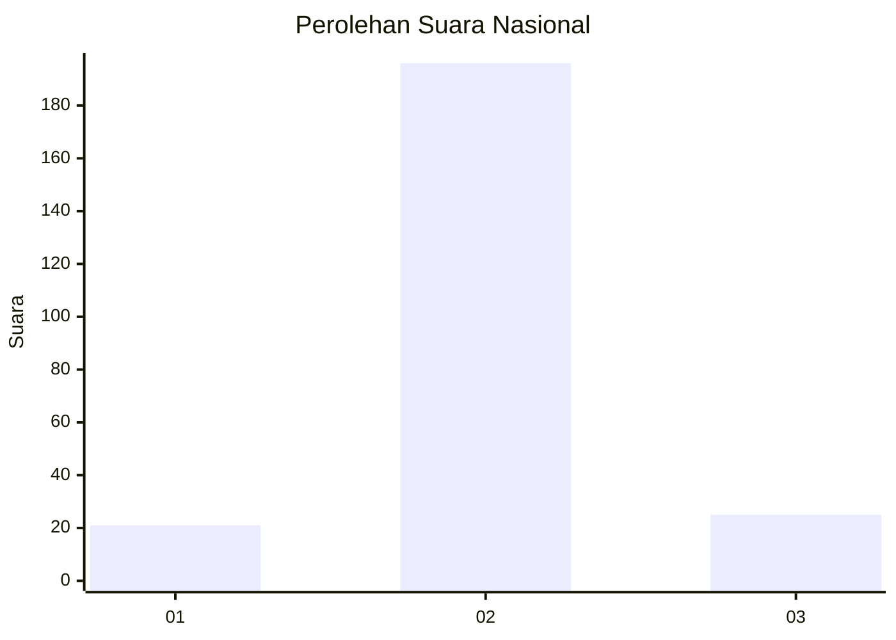
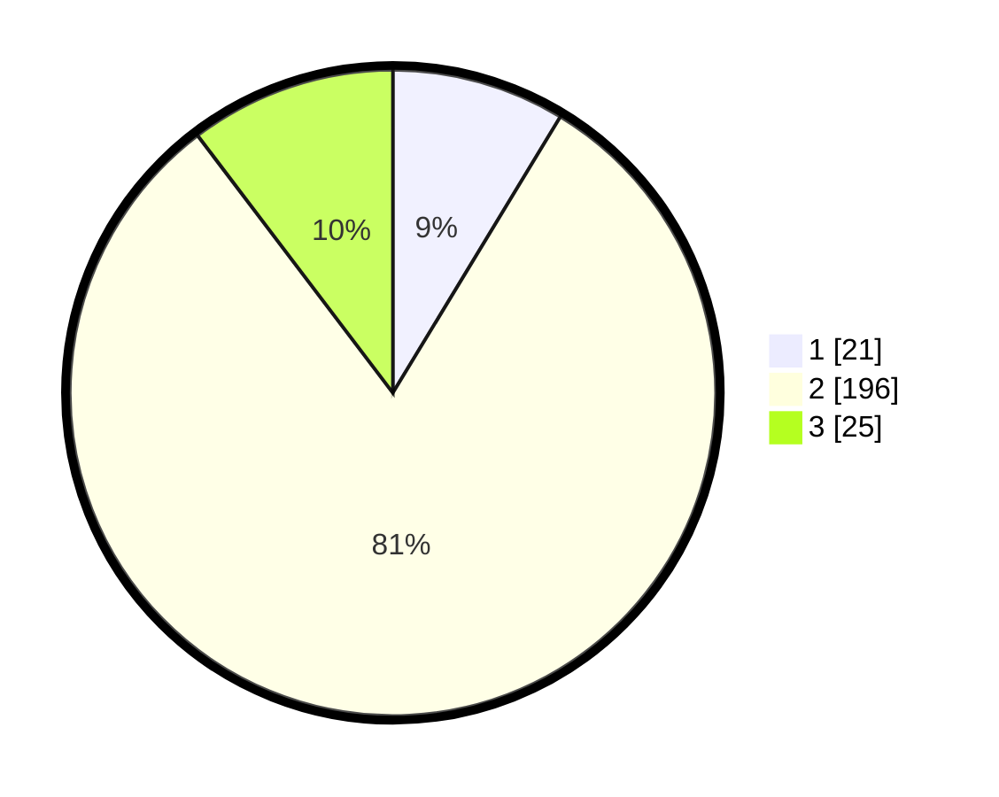

# Hasil

## Grafik

## Tabel

| No. | Nama Paslon    | Suara | Suara (raw) | Persentase |
|:--- |:-------------- | -----:| -----------:| ----------:|
| 1   | ANIES MUHAIMIN | 21    | [21][p-1]   | 8,68       |
| 2   | PRABOWO GIBRAN | 196   | [196][p-2]  | 80,99      |
| 3   | GANJAR MAHFUD  | 25    | [25][p-3]   | 10,33      |

[p-1]: https://github.com/gigit-pemilu/pemilu-2024/blob/main/pilpres/hitung-suara/sub/91-papua/sub/11-keerom/sub/08-arso-barat/sub/2006-ifia-fia/sub/003-tps/sub/paslon-1.txt
[p-2]: https://github.com/gigit-pemilu/pemilu-2024/blob/main/pilpres/hitung-suara/sub/91-papua/sub/11-keerom/sub/08-arso-barat/sub/2006-ifia-fia/sub/003-tps/sub/paslon-2.txt
[p-3]: https://github.com/gigit-pemilu/pemilu-2024/blob/main/pilpres/hitung-suara/sub/91-papua/sub/11-keerom/sub/08-arso-barat/sub/2006-ifia-fia/sub/003-tps/sub/paslon-3.txt

## Foto C Plano

https://sirekap-obj-formc.kpu.go.id/7c72/pemilu/ppwp/91/11/08/20/06/9111082006003-20240215-002822--a5ddb53b-5a1a-4671-88cc-a08738107996.jpg

https://sirekap-obj-formc.kpu.go.id/7c72/pemilu/ppwp/91/11/08/20/06/9111082006003-20240215-003021--a985a42f-ad9f-4145-8d5f-5ff8d43ea84f.jpg

https://sirekap-obj-formc.kpu.go.id/7c72/pemilu/ppwp/91/11/08/20/06/9111082006003-20240215-002844--4c6a0228-4796-4679-a5fb-d64251f06e57.jpg

## Metadata

| Key        | Value               |
| ---------- | ------------------- |
| Time Stamp | 2024-02-15 22:30:27 |

