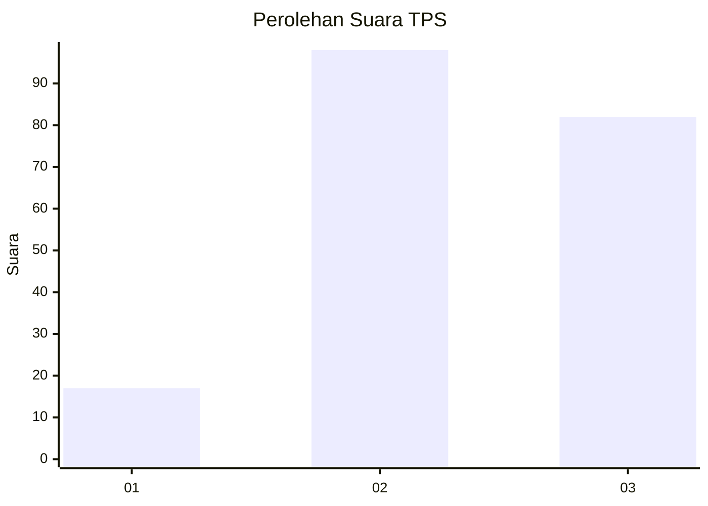
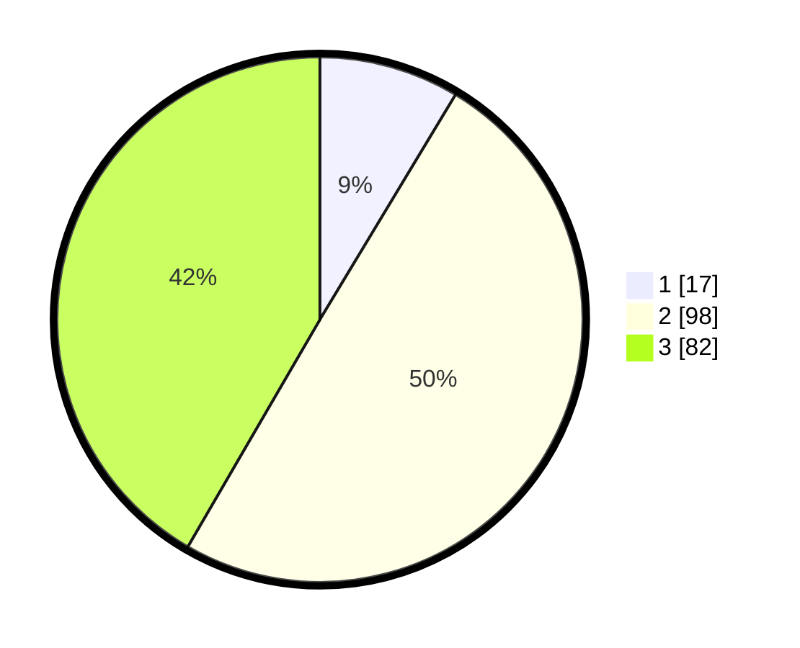

# Hasil

## Grafik

## Tabel

| No. | Nama Paslon    | Suara | Suara (raw) | Persentase |
|:--- |:-------------- | -----:| -----------:| ----------:|
| 1   | ANIES MUHAIMIN | 17    | [17][p-1]   | 8,63       |
| 2   | PRABOWO GIBRAN | 98    | [98][p-2]   | 49,75      |
| 3   | GANJAR MAHFUD  | 82    | [82][p-3]   | 41,62      |

[p-1]: https://github.com/gigit-pemilu/pemilu-2024-91-papua/blob/main/pilpres/hitung-suara/sub/91-papua/sub/15-waropen/sub/01-waropen-bawah/sub/2003-waren-i/sub/001-tps/sub/paslon-1.txt
[p-2]: https://github.com/gigit-pemilu/pemilu-2024-91-papua/blob/main/pilpres/hitung-suara/sub/91-papua/sub/15-waropen/sub/01-waropen-bawah/sub/2003-waren-i/sub/001-tps/sub/paslon-2.txt
[p-3]: https://github.com/gigit-pemilu/pemilu-2024-91-papua/blob/main/pilpres/hitung-suara/sub/91-papua/sub/15-waropen/sub/01-waropen-bawah/sub/2003-waren-i/sub/001-tps/sub/paslon-3.txt

## Foto C Plano

https://sirekap-obj-formc.kpu.go.id/f7ec/pemilu/ppwp/91/15/01/20/03/9115012003001-20240215-053042--5680f504-cfbb-4c1e-8ddc-5d57060fab1a.jpg

https://sirekap-obj-formc.kpu.go.id/f7ec/pemilu/ppwp/91/15/01/20/03/9115012003001-20240216-210010--f900328c-09e1-4462-b7a8-af92e3567c0a.jpg

https://sirekap-obj-formc.kpu.go.id/f7ec/pemilu/ppwp/91/15/01/20/03/9115012003001-20240215-053833--edd556f0-ce53-4412-a456-0a51a879061c.jpg

## Metadata

| Key        | Value               |
| ---------- | ------------------- |
| Time Stamp | 2024-02-25 13:00:00 |

