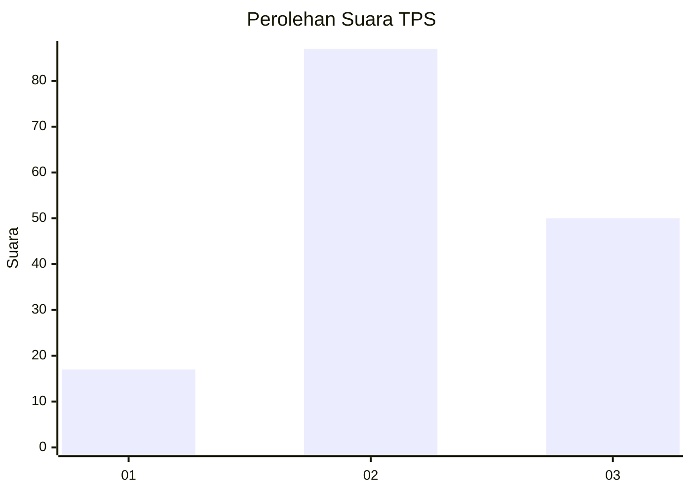
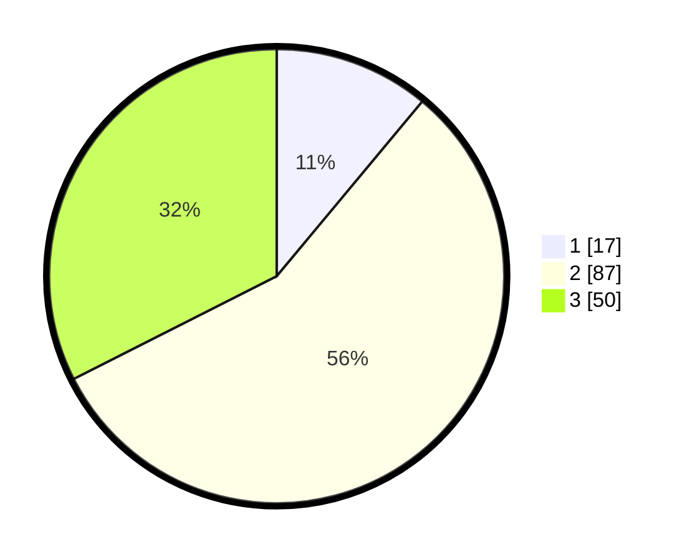

# Hasil

## Grafik

## Tabel

| No. | Nama Paslon    | Suara | Suara (raw) | Persentase |
|:--- |:-------------- | -----:| -----------:| ----------:|
| 1   | ANIES MUHAIMIN | 17    | [17][p-1]   | 11,04      |
| 2   | PRABOWO GIBRAN | 87    | [87][p-2]   | 56,49      |
| 3   | GANJAR MAHFUD  | 50    | [50][p-3]   | 32,47      |

[p-1]: https://github.com/gigit-pemilu/pemilu-2024-91-papua/blob/main/pilpres/hitung-suara/sub/91-papua/sub/15-waropen/sub/01-waropen-bawah/sub/2003-waren-i/sub/002-tps/sub/paslon-1.txt
[p-2]: https://github.com/gigit-pemilu/pemilu-2024-91-papua/blob/main/pilpres/hitung-suara/sub/91-papua/sub/15-waropen/sub/01-waropen-bawah/sub/2003-waren-i/sub/002-tps/sub/paslon-2.txt
[p-3]: https://github.com/gigit-pemilu/pemilu-2024-91-papua/blob/main/pilpres/hitung-suara/sub/91-papua/sub/15-waropen/sub/01-waropen-bawah/sub/2003-waren-i/sub/002-tps/sub/paslon-3.txt

## Foto C Plano

https://sirekap-obj-formc.kpu.go.id/eb96/pemilu/ppwp/91/15/01/20/03/9115012003002-20240215-180714--b9f240a3-e267-47d3-8f9d-7271ac6ec84a.jpg

https://sirekap-obj-formc.kpu.go.id/eb96/pemilu/ppwp/91/15/01/20/03/9115012003002-20240215-174328--b00cfc5f-cf4d-4a52-be10-e61ecc2a94b3.jpg

## Metadata

| Key        | Value               |
| ---------- | ------------------- |
| Time Stamp | 2024-02-15 22:00:27 |

