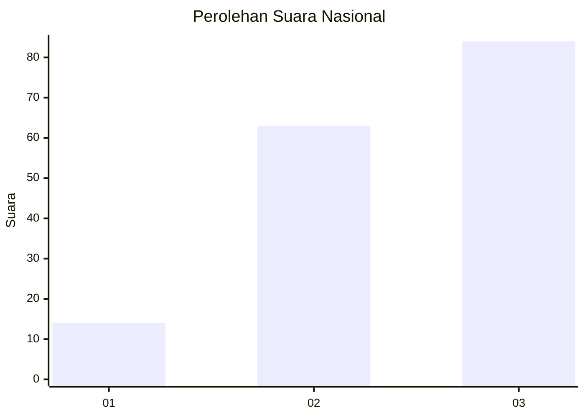
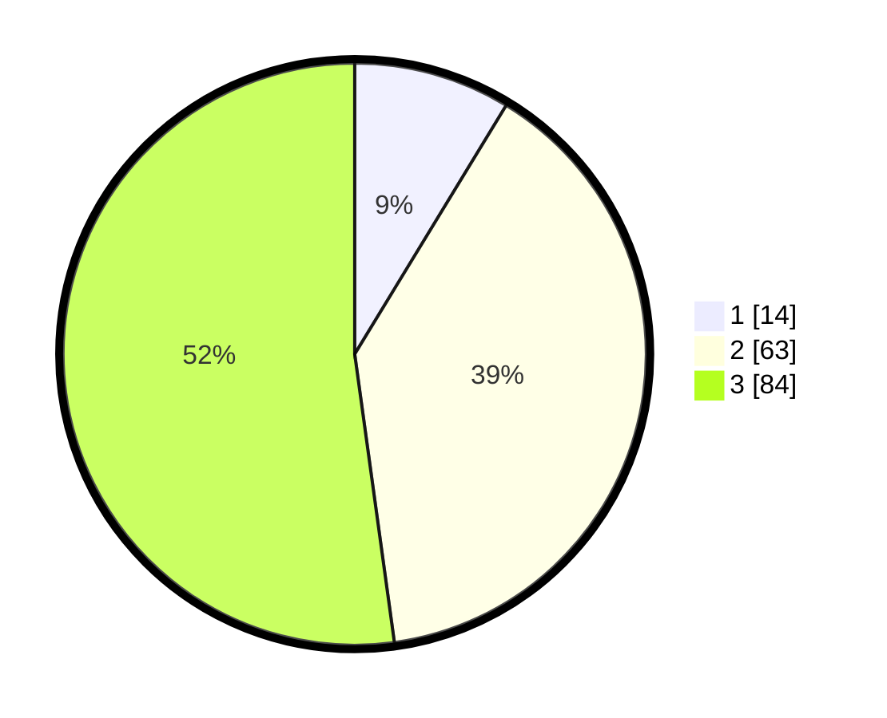

# Hasil

## Grafik

## Tabel

| No. | Nama Paslon    | Suara | Suara (raw) | Persentase |
|:--- |:-------------- | -----:| -----------:| ----------:|
| 1   | ANIES MUHAIMIN | 14    | [14][p-1]   | 8,70       |
| 2   | PRABOWO GIBRAN | 63    | [63][p-2]   | 39,13      |
| 3   | GANJAR MAHFUD  | 84    | [84][p-3]   | 52,17      |

[p-1]: https://github.com/gigit-pemilu/pemilu-2024/blob/main/pilpres/hitung-suara/sub/91-papua/sub/15-waropen/sub/01-waropen-bawah/sub/2020-sarafambai/sub/002-tps/sub/paslon-1.txt
[p-2]: https://github.com/gigit-pemilu/pemilu-2024/blob/main/pilpres/hitung-suara/sub/91-papua/sub/15-waropen/sub/01-waropen-bawah/sub/2020-sarafambai/sub/002-tps/sub/paslon-2.txt
[p-3]: https://github.com/gigit-pemilu/pemilu-2024/blob/main/pilpres/hitung-suara/sub/91-papua/sub/15-waropen/sub/01-waropen-bawah/sub/2020-sarafambai/sub/002-tps/sub/paslon-3.txt

## Foto C Plano

https://sirekap-obj-formc.kpu.go.id/d6ae/pemilu/ppwp/91/15/01/20/20/9115012020002-20240215-093843--37b62e23-a461-41c2-ae67-580bc85f3e7d.jpg

https://sirekap-obj-formc.kpu.go.id/d6ae/pemilu/ppwp/91/15/01/20/20/9115012020002-20240215-094358--99475255-3f94-4957-a407-201ed3ee1e57.jpg

https://sirekap-obj-formc.kpu.go.id/d6ae/pemilu/ppwp/91/15/01/20/20/9115012020002-20240215-094625--af0f3943-4f99-4305-831c-01666727ddc7.jpg

## Metadata

| Key        | Value               |
| ---------- | ------------------- |
| Time Stamp | 2024-02-25 13:00:00 |

