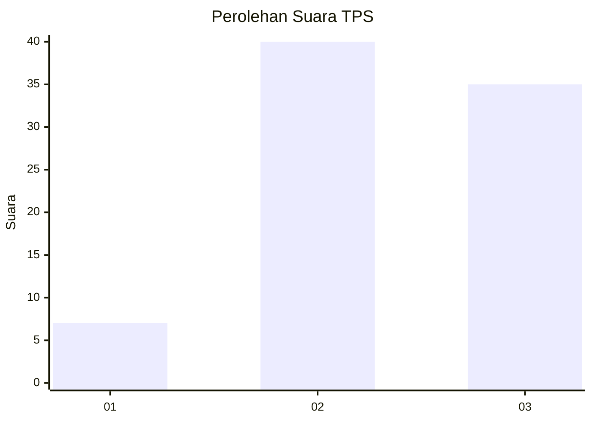
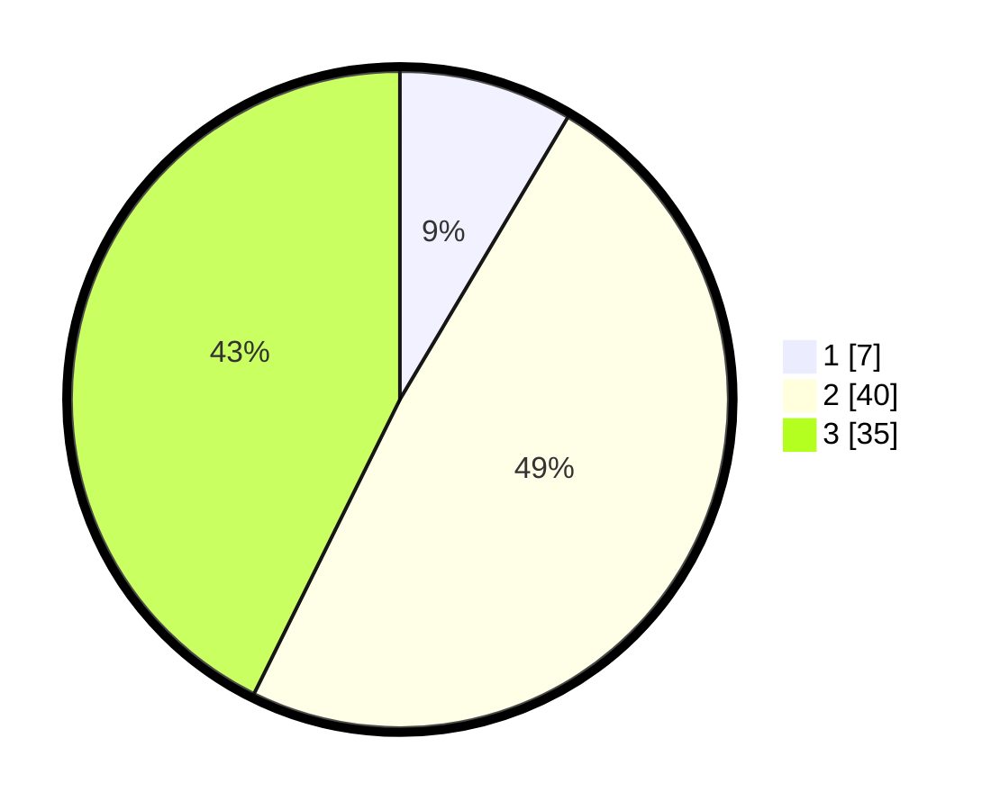

# Hasil

## Grafik

## Tabel

| No. | Nama Paslon    | Suara | Suara (raw) | Persentase |
|:--- |:-------------- | -----:| -----------:| ----------:|
| 1   | ANIES MUHAIMIN | 7     | [7][p-1]    | 8,54       |
| 2   | PRABOWO GIBRAN | 40    | [40][p-2]   | 48,78      |
| 3   | GANJAR MAHFUD  | 35    | [35][p-3]   | 42,68      |

[p-1]: https://github.com/gigit-pemilu/pemilu-2024-91-papua/blob/main/pilpres/hitung-suara/sub/91-papua/sub/15-waropen/sub/03-masirei/sub/2006-saurisirami/sub/001-tps/sub/paslon-1.txt
[p-2]: https://github.com/gigit-pemilu/pemilu-2024-91-papua/blob/main/pilpres/hitung-suara/sub/91-papua/sub/15-waropen/sub/03-masirei/sub/2006-saurisirami/sub/001-tps/sub/paslon-2.txt
[p-3]: https://github.com/gigit-pemilu/pemilu-2024-91-papua/blob/main/pilpres/hitung-suara/sub/91-papua/sub/15-waropen/sub/03-masirei/sub/2006-saurisirami/sub/001-tps/sub/paslon-3.txt

## Foto C Plano

https://sirekap-obj-formc.kpu.go.id/056e/pemilu/ppwp/91/15/03/20/06/9115032006001-20240216-173758--56894da0-98e2-4180-ad29-8db30bba34f2.jpg

https://sirekap-obj-formc.kpu.go.id/056e/pemilu/ppwp/91/15/03/20/06/9115032006001-20240218-152320--68b81e10-6dd5-483f-a3b6-a1a71cab10ce.jpg

https://sirekap-obj-formc.kpu.go.id/056e/pemilu/ppwp/91/15/03/20/06/9115032006001-20240216-174452--fa5dd7d2-8d7d-41f6-b6bc-89fce70a9cc0.jpg

## Metadata

| Key        | Value               |
| ---------- | ------------------- |
| Time Stamp | 2024-02-19 06:16:00 |

## DATA PEMILIH TETAP

Jumlah pemilih dalam DPT: **104**.
 * L: **52**.
 * P: **52**.

## DATA PENGGUNA HAK PILIH

Jumlah pengguna hak pilih dalam DPT: **86**.
 * L: **44**.
 * P: **42**.

Jumlah pengguna hak pilih dalam DPTb: **0**.
 * L: **0**.
 * P: **0**.

Jumlah pengguna hak pilih dalam DPK: **0**.
 * L: **0**.
 * P: **0**.

Jumlah pengguna hak pilih: **86**.
 * L: **44**.
 * P: **42**.

## JUMLAH SUARA SAH DAN TIDAK SAH

JUMLAH SELURUH SUARA SAH: **82**.

JUMLAH SUARA TIDAK SAH: **4**.

JUMLAH SELURUH SUARA SAH DAN SUARA TIDAK SAH: **86**.

