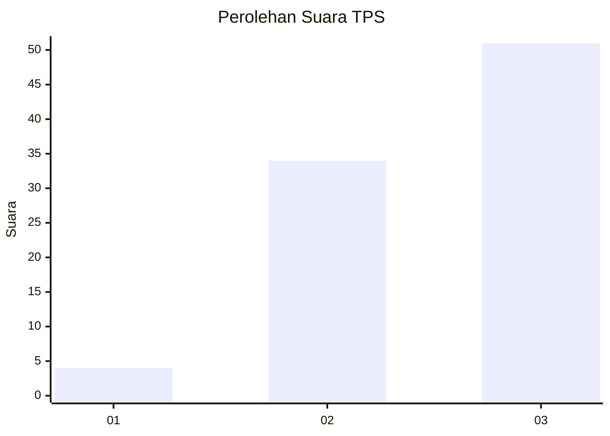
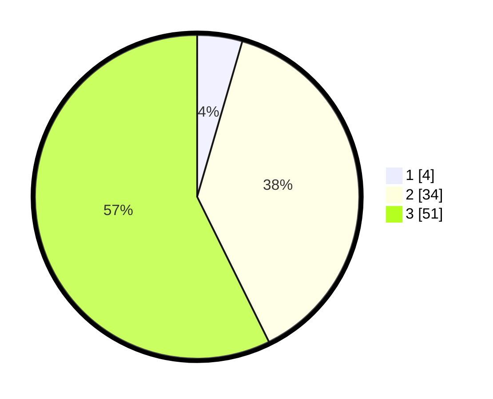

# Hasil

## Grafik

## Tabel

| No. | Nama Paslon    | Suara | Suara (raw) | Persentase |
|:--- |:-------------- | -----:| -----------:| ----------:|
| 1   | ANIES MUHAIMIN | 4     | [4][p-1]    | 4,49       |
| 2   | PRABOWO GIBRAN | 34    | [34][p-2]   | 38,20      |
| 3   | GANJAR MAHFUD  | 51    | [51][p-3]   | 57,30      |

[p-1]: https://github.com/gigit-pemilu/pemilu-2024-91-papua/blob/main/pilpres/hitung-suara/sub/91-papua/sub/15-waropen/sub/03-masirei/sub/2009-sinonde/sub/001-tps/sub/paslon-1.txt
[p-2]: https://github.com/gigit-pemilu/pemilu-2024-91-papua/blob/main/pilpres/hitung-suara/sub/91-papua/sub/15-waropen/sub/03-masirei/sub/2009-sinonde/sub/001-tps/sub/paslon-2.txt
[p-3]: https://github.com/gigit-pemilu/pemilu-2024-91-papua/blob/main/pilpres/hitung-suara/sub/91-papua/sub/15-waropen/sub/03-masirei/sub/2009-sinonde/sub/001-tps/sub/paslon-3.txt

## Foto C Plano

https://sirekap-obj-formc.kpu.go.id/28db/pemilu/ppwp/91/15/03/20/09/9115032009001-20240218-115814--6fc80405-08cd-42ac-bae7-eb35f82a539a.jpg

https://sirekap-obj-formc.kpu.go.id/28db/pemilu/ppwp/91/15/03/20/09/9115032009001-20240218-115846--aa76162b-52f9-4753-b401-9268a58ffba4.jpg

https://sirekap-obj-formc.kpu.go.id/28db/pemilu/ppwp/91/15/03/20/09/9115032009001-20240218-115559--2f69b2d7-d65a-4d90-8a41-996ccf9fe6f9.jpg

## Metadata

| Key        | Value               |
| ---------- | ------------------- |
| Time Stamp | 2024-02-19 06:16:00 |

## DATA PEMILIH TETAP

Jumlah pemilih dalam DPT: **132**.
 * L: **75**.
 * P: **57**.

## DATA PENGGUNA HAK PILIH

Jumlah pengguna hak pilih dalam DPT: **80**.
 * L: **46**.
 * P: **34**.

Jumlah pengguna hak pilih dalam DPTb: **10**.
 * L: **5**.
 * P: **5**.

Jumlah pengguna hak pilih dalam DPK: **0**.
 * L: **0**.
 * P: **0**.

Jumlah pengguna hak pilih: **90**.
 * L: **51**.
 * P: **39**.

## JUMLAH SUARA SAH DAN TIDAK SAH

JUMLAH SELURUH SUARA SAH: **89**.

JUMLAH SUARA TIDAK SAH: **1**.

JUMLAH SELURUH SUARA SAH DAN SUARA TIDAK SAH: **90**.

