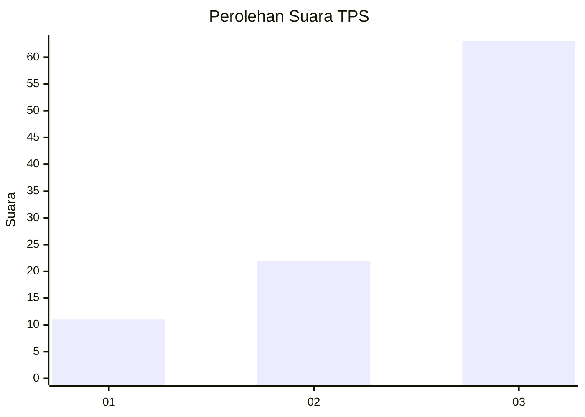
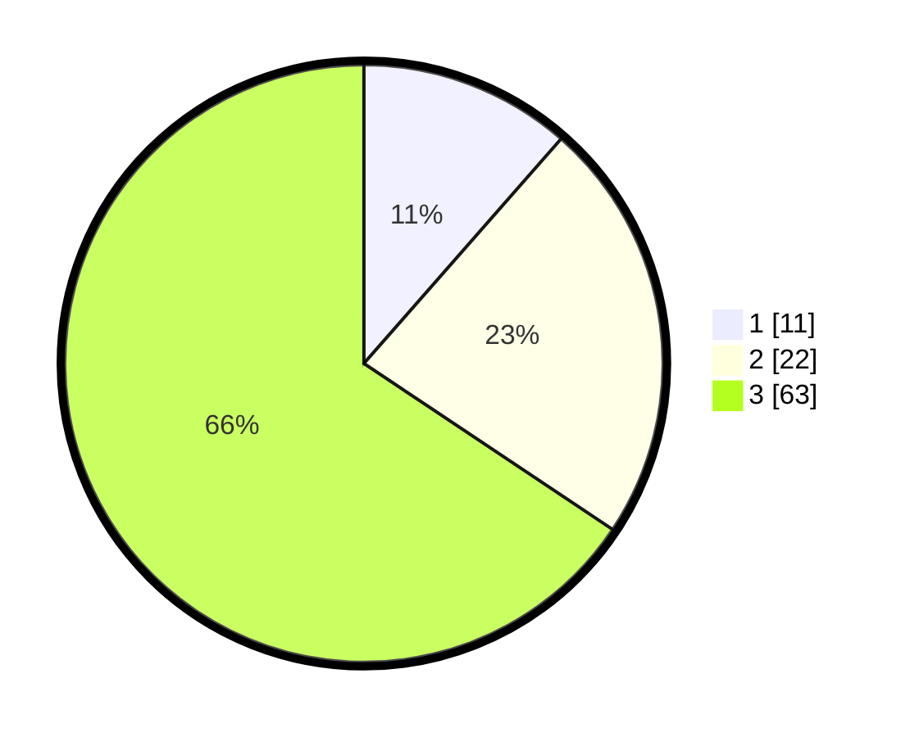

# Hasil

## Grafik

## Tabel

| No. | Nama Paslon    | Suara | Suara (raw) | Persentase |
|:--- |:-------------- | -----:| -----------:| ----------:|
| 1   | ANIES MUHAIMIN | 11    | [11][p-1]   | 11,46      |
| 2   | PRABOWO GIBRAN | 22    | [22][p-2]   | 22,92      |
| 3   | GANJAR MAHFUD  | 63    | [63][p-3]   | 65,63      |

[p-1]: https://github.com/gigit-pemilu/pemilu-2024-91-papua/blob/main/pilpres/hitung-suara/sub/91-papua/sub/15-waropen/sub/03-masirei/sub/2013-kali-baru/sub/001-tps/sub/paslon-1.txt
[p-2]: https://github.com/gigit-pemilu/pemilu-2024-91-papua/blob/main/pilpres/hitung-suara/sub/91-papua/sub/15-waropen/sub/03-masirei/sub/2013-kali-baru/sub/001-tps/sub/paslon-2.txt
[p-3]: https://github.com/gigit-pemilu/pemilu-2024-91-papua/blob/main/pilpres/hitung-suara/sub/91-papua/sub/15-waropen/sub/03-masirei/sub/2013-kali-baru/sub/001-tps/sub/paslon-3.txt

## Foto C Plano

https://sirekap-obj-formc.kpu.go.id/221f/pemilu/ppwp/91/15/03/20/13/9115032013001-20240218-135553--74a847c0-d809-423e-9140-ff77b8a91d45.jpg

https://sirekap-obj-formc.kpu.go.id/221f/pemilu/ppwp/91/15/03/20/13/9115032013001-20240217-093535--9e110d51-94cc-432e-997f-c1593e1c63a0.jpg

https://sirekap-obj-formc.kpu.go.id/221f/pemilu/ppwp/91/15/03/20/13/9115032013001-20240217-093836--7121a2e3-1541-45e7-8377-1a8569fe2341.jpg

## Metadata

| Key        | Value               |
| ---------- | ------------------- |
| Time Stamp | 2024-02-19 06:16:00 |

## DATA PEMILIH TETAP

Jumlah pemilih dalam DPT: **135**.
 * L: **58**.
 * P: **77**.

## DATA PENGGUNA HAK PILIH

Jumlah pengguna hak pilih dalam DPT: **95**.
 * L: **44**.
 * P: **51**.

Jumlah pengguna hak pilih dalam DPTb: **1**.
 * L: **1**.
 * P: **0**.

Jumlah pengguna hak pilih dalam DPK: **0**.
 * L: **0**.
 * P: **0**.

Jumlah pengguna hak pilih: **96**.
 * L: **45**.
 * P: **51**.

## JUMLAH SUARA SAH DAN TIDAK SAH

JUMLAH SELURUH SUARA SAH: **96**.

JUMLAH SUARA TIDAK SAH: **0**.

JUMLAH SELURUH SUARA SAH DAN SUARA TIDAK SAH: **96**.

