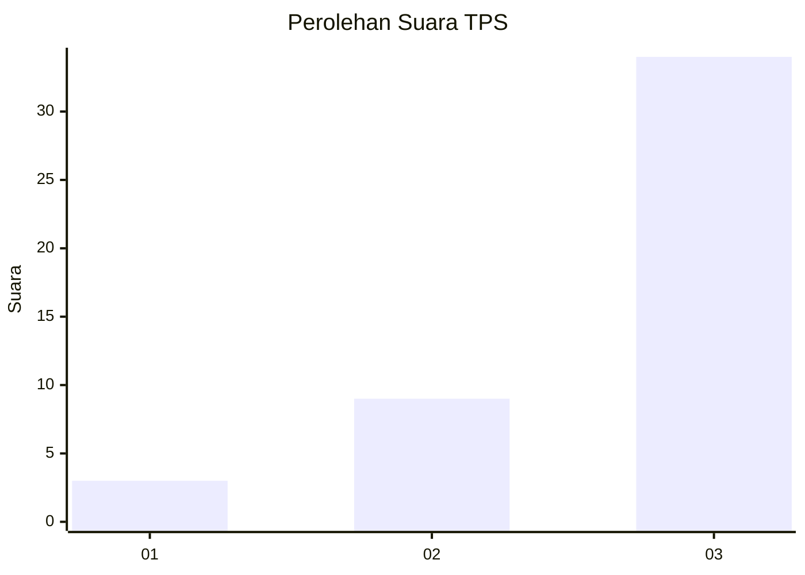
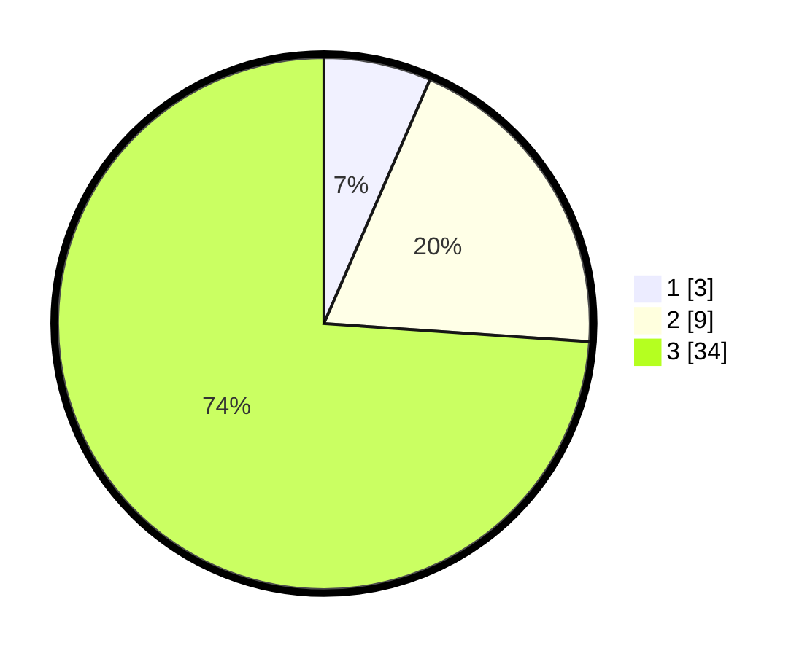

# Hasil

## Grafik

## Tabel

| No. | Nama Paslon    | Suara | Suara (raw) | Persentase |
|:--- |:-------------- | -----:| -----------:| ----------:|
| 1   | ANIES MUHAIMIN | 3     | [3][p-1]    | 6,52       |
| 2   | PRABOWO GIBRAN | 9     | [9][p-2]    | 19,57      |
| 3   | GANJAR MAHFUD  | 34    | [34][p-3]   | 73,91      |

[p-1]: https://github.com/gigit-pemilu/pemilu-2024-91-papua/blob/main/pilpres/hitung-suara/sub/91-papua/sub/15-waropen/sub/03-masirei/sub/2014-sirami/sub/001-tps/sub/paslon-1.txt
[p-2]: https://github.com/gigit-pemilu/pemilu-2024-91-papua/blob/main/pilpres/hitung-suara/sub/91-papua/sub/15-waropen/sub/03-masirei/sub/2014-sirami/sub/001-tps/sub/paslon-2.txt
[p-3]: https://github.com/gigit-pemilu/pemilu-2024-91-papua/blob/main/pilpres/hitung-suara/sub/91-papua/sub/15-waropen/sub/03-masirei/sub/2014-sirami/sub/001-tps/sub/paslon-3.txt

## Foto C Plano

https://sirekap-obj-formc.kpu.go.id/0f9a/pemilu/ppwp/91/15/03/20/14/9115032014001-20240218-162622--a36d6835-dfa0-408d-91df-1b32c08c1ff2.jpg

https://sirekap-obj-formc.kpu.go.id/0f9a/pemilu/ppwp/91/15/03/20/14/9115032014001-20240219-104531--95dc40a4-faab-469f-8e07-917e26872b9b.jpg

https://sirekap-obj-formc.kpu.go.id/0f9a/pemilu/ppwp/91/15/03/20/14/9115032014001-20240218-162843--512e822e-b99e-41bc-a951-1bff4709ed84.jpg

## Metadata

| Key        | Value               |
| ---------- | ------------------- |
| Time Stamp | 2024-02-19 11:00:00 |

## DATA PEMILIH TETAP

Jumlah pemilih dalam DPT: **80**.
 * L: **44**.
 * P: **36**.

## DATA PENGGUNA HAK PILIH

Jumlah pengguna hak pilih dalam DPT: **48**.
 * L: **25**.
 * P: **23**.

Jumlah pengguna hak pilih dalam DPTb: **0**.
 * L: **0**.
 * P: **0**.

Jumlah pengguna hak pilih dalam DPK: **0**.
 * L: **0**.
 * P: **0**.

Jumlah pengguna hak pilih: **48**.
 * L: **25**.
 * P: **23**.

## JUMLAH SUARA SAH DAN TIDAK SAH

JUMLAH SELURUH SUARA SAH: **46**.

JUMLAH SUARA TIDAK SAH: **2**.

JUMLAH SELURUH SUARA SAH DAN SUARA TIDAK SAH: **48**.

