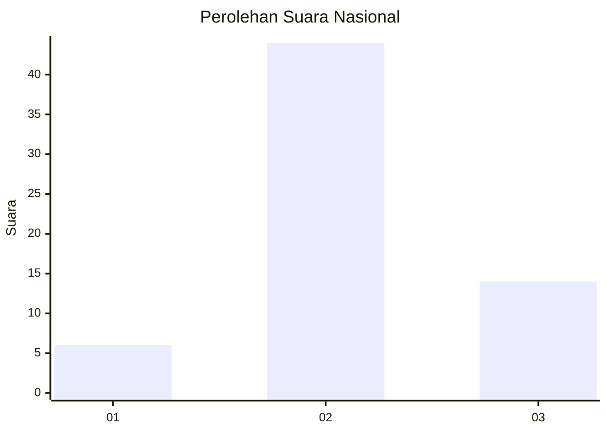
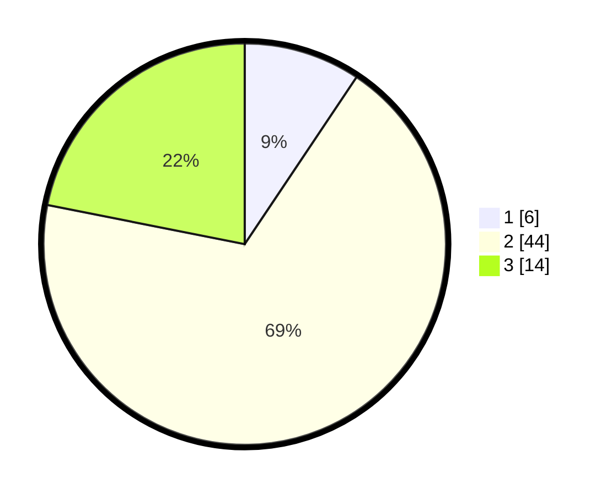

# Hasil

## Grafik

## Tabel

| No. | Nama Paslon    | Suara | Suara (raw) | Persentase |
|:--- |:-------------- | -----:| -----------:| ----------:|
| 1   | ANIES MUHAIMIN | 6     | [6][p-1]    | 9,38       |
| 2   | PRABOWO GIBRAN | 44    | [44][p-2]   | 68,75      |
| 3   | GANJAR MAHFUD  | 14    | [14][p-3]   | 21,88      |

[p-1]: https://github.com/gigit-pemilu/pemilu-2024/blob/main/pilpres/hitung-suara/sub/91-papua/sub/15-waropen/sub/03-masirei/sub/2016-kowogi/sub/001-tps/sub/paslon-1.txt
[p-2]: https://github.com/gigit-pemilu/pemilu-2024/blob/main/pilpres/hitung-suara/sub/91-papua/sub/15-waropen/sub/03-masirei/sub/2016-kowogi/sub/001-tps/sub/paslon-2.txt
[p-3]: https://github.com/gigit-pemilu/pemilu-2024/blob/main/pilpres/hitung-suara/sub/91-papua/sub/15-waropen/sub/03-masirei/sub/2016-kowogi/sub/001-tps/sub/paslon-3.txt

## Foto C Plano

https://sirekap-obj-formc.kpu.go.id/08cf/pemilu/ppwp/91/15/03/20/16/9115032016001-20240218-151920--f8a01e34-ecdd-4bb3-be00-72a8175b6f5f.jpg

https://sirekap-obj-formc.kpu.go.id/08cf/pemilu/ppwp/91/15/03/20/16/9115032016001-20240218-151940--818bbe42-0af2-4bb0-a0b5-950d2a5835ba.jpg

https://sirekap-obj-formc.kpu.go.id/08cf/pemilu/ppwp/91/15/03/20/16/9115032016001-20240218-152005--f407929f-f144-4d6f-b931-46a7507702ac.jpg

## Metadata

| Key        | Value               |
| ---------- | ------------------- |
| Time Stamp | 2024-02-19 06:16:00 |

## DATA PEMILIH TETAP

Jumlah pemilih dalam DPT: **80**.
 * L: **44**.
 * P: **36**.

## DATA PENGGUNA HAK PILIH

Jumlah pengguna hak pilih dalam DPT: **63**.
 * L: **35**.
 * P: **28**.

Jumlah pengguna hak pilih dalam DPTb: **2**.
 * L: **2**.
 * P: **0**.

Jumlah pengguna hak pilih dalam DPK: **0**.
 * L: **0**.
 * P: **0**.

Jumlah pengguna hak pilih: **65**.
 * L: **37**.
 * P: **28**.

## JUMLAH SUARA SAH DAN TIDAK SAH

JUMLAH SELURUH SUARA SAH: **64**.

JUMLAH SUARA TIDAK SAH: **1**.

JUMLAH SELURUH SUARA SAH DAN SUARA TIDAK SAH: **65**.

