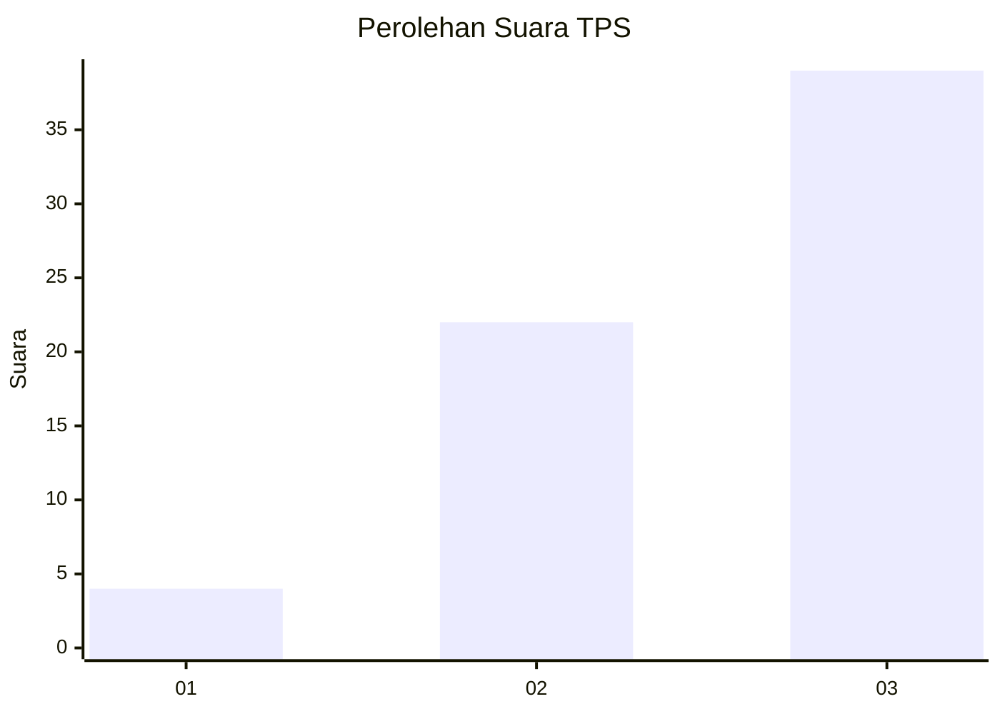
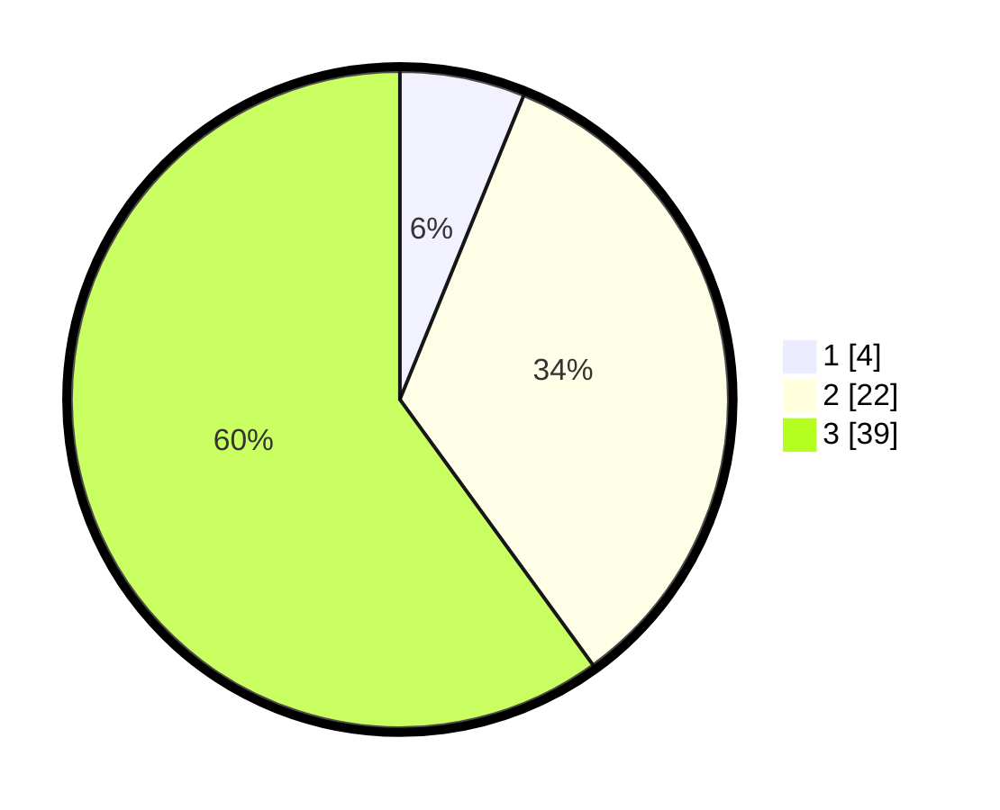

# Hasil

## Grafik

## Tabel

| No. | Nama Paslon    | Suara | Suara (raw) | Persentase |
|:--- |:-------------- | -----:| -----------:| ----------:|
| 1   | ANIES MUHAIMIN | 4     | [4][p-1]    | 6,15       |
| 2   | PRABOWO GIBRAN | 22    | [22][p-2]   | 33,85      |
| 3   | GANJAR MAHFUD  | 39    | [39][p-3]   | 60,00      |

[p-1]: https://github.com/gigit-pemilu/pemilu-2024-91-papua/blob/main/pilpres/hitung-suara/sub/91-papua/sub/15-waropen/sub/07-risei-sayati/sub/2002-fafado/sub/001-tps/sub/paslon-1.txt
[p-2]: https://github.com/gigit-pemilu/pemilu-2024-91-papua/blob/main/pilpres/hitung-suara/sub/91-papua/sub/15-waropen/sub/07-risei-sayati/sub/2002-fafado/sub/001-tps/sub/paslon-2.txt
[p-3]: https://github.com/gigit-pemilu/pemilu-2024-91-papua/blob/main/pilpres/hitung-suara/sub/91-papua/sub/15-waropen/sub/07-risei-sayati/sub/2002-fafado/sub/001-tps/sub/paslon-3.txt

## Foto C Plano

https://sirekap-obj-formc.kpu.go.id/6e4f/pemilu/ppwp/91/15/07/20/02/9115072002001-20240215-164528--4c1c5595-b27c-44a5-ba28-b262409a1e8a.jpg

https://sirekap-obj-formc.kpu.go.id/6e4f/pemilu/ppwp/91/15/07/20/02/9115072002001-20240215-164656--07d57dba-e788-4123-9a2a-5d05289d6f95.jpg

https://sirekap-obj-formc.kpu.go.id/6e4f/pemilu/ppwp/91/15/07/20/02/9115072002001-20240215-164819--90fadb65-8a0c-41bc-acc2-4a77947c0c5d.jpg

## Metadata

| Key        | Value               |
| ---------- | ------------------- |
| Time Stamp | 2024-02-15 21:30:27 |

## DATA PEMILIH TETAP

Jumlah pemilih dalam DPT: **121**.
 * L: **58**.
 * P: **63**.

## DATA PENGGUNA HAK PILIH

Jumlah pengguna hak pilih dalam DPT: **65**.
 * L: **31**.
 * P: **34**.

Jumlah pengguna hak pilih dalam DPTb: **0**.
 * L: **0**.
 * P: **0**.

Jumlah pengguna hak pilih dalam DPK: **0**.
 * L: **0**.
 * P: **0**.

Jumlah pengguna hak pilih: **65**.
 * L: **31**.
 * P: **34**.

## JUMLAH SUARA SAH DAN TIDAK SAH

JUMLAH SELURUH SUARA SAH: **65**.

JUMLAH SUARA TIDAK SAH: **0**.

JUMLAH SELURUH SUARA SAH DAN SUARA TIDAK SAH: **65**.

