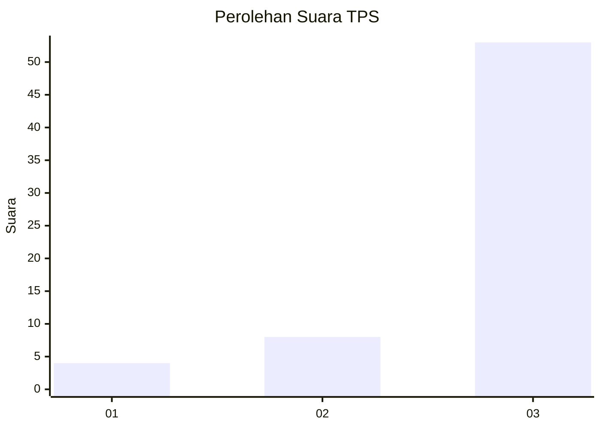
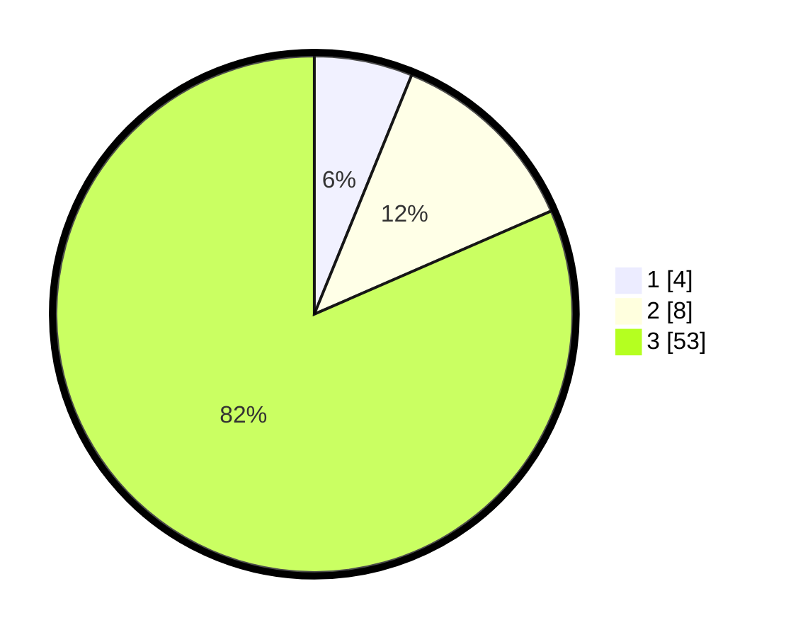

# Hasil

## Grafik

## Tabel

| No. | Nama Paslon    | Suara | Suara (raw) | Persentase |
|:--- |:-------------- | -----:| -----------:| ----------:|
| 1   | ANIES MUHAIMIN | 4     | [4][p-1]    | 6,15       |
| 2   | PRABOWO GIBRAN | 8     | [8][p-2]    | 12,31      |
| 3   | GANJAR MAHFUD  | 53    | [53][p-3]   | 81,54      |

[p-1]: https://github.com/gigit-pemilu/pemilu-2024-91-papua/blob/main/pilpres/hitung-suara/sub/91-papua/sub/15-waropen/sub/07-risei-sayati/sub/2003-wobari/sub/001-tps/sub/paslon-1.txt
[p-2]: https://github.com/gigit-pemilu/pemilu-2024-91-papua/blob/main/pilpres/hitung-suara/sub/91-papua/sub/15-waropen/sub/07-risei-sayati/sub/2003-wobari/sub/001-tps/sub/paslon-2.txt
[p-3]: https://github.com/gigit-pemilu/pemilu-2024-91-papua/blob/main/pilpres/hitung-suara/sub/91-papua/sub/15-waropen/sub/07-risei-sayati/sub/2003-wobari/sub/001-tps/sub/paslon-3.txt

## Foto C Plano

https://sirekap-obj-formc.kpu.go.id/3a0e/pemilu/ppwp/91/15/07/20/03/9115072003001-20240216-154817--5cf98b31-a530-49e2-a992-f436e7eb7f4d.jpg

https://sirekap-obj-formc.kpu.go.id/3a0e/pemilu/ppwp/91/15/07/20/03/9115072003001-20240216-160044--c3db7d1a-3ef2-4250-9147-ee61acc740a9.jpg

https://sirekap-obj-formc.kpu.go.id/3a0e/pemilu/ppwp/91/15/07/20/03/9115072003001-20240216-161131--5795d8f3-43cc-4f83-87e9-a36f9c3db49b.jpg

## Metadata

| Key        | Value               |
| ---------- | ------------------- |
| Time Stamp | 2024-02-20 17:00:00 |

## DATA PEMILIH TETAP

Jumlah pemilih dalam DPT: **119**.
 * L: **47**.
 * P: **72**.

## DATA PENGGUNA HAK PILIH

Jumlah pengguna hak pilih dalam DPT: **60**.
 * L: **27**.
 * P: **33**.

Jumlah pengguna hak pilih dalam DPTb: **0**.
 * L: **0**.
 * P: **0**.

Jumlah pengguna hak pilih dalam DPK: **5**.
 * L: **3**.
 * P: **2**.

Jumlah pengguna hak pilih: **65**.
 * L: **30**.
 * P: **35**.

## JUMLAH SUARA SAH DAN TIDAK SAH

JUMLAH SELURUH SUARA SAH: **65**.

JUMLAH SUARA TIDAK SAH: **0**.

JUMLAH SELURUH SUARA SAH DAN SUARA TIDAK SAH: **65**.

