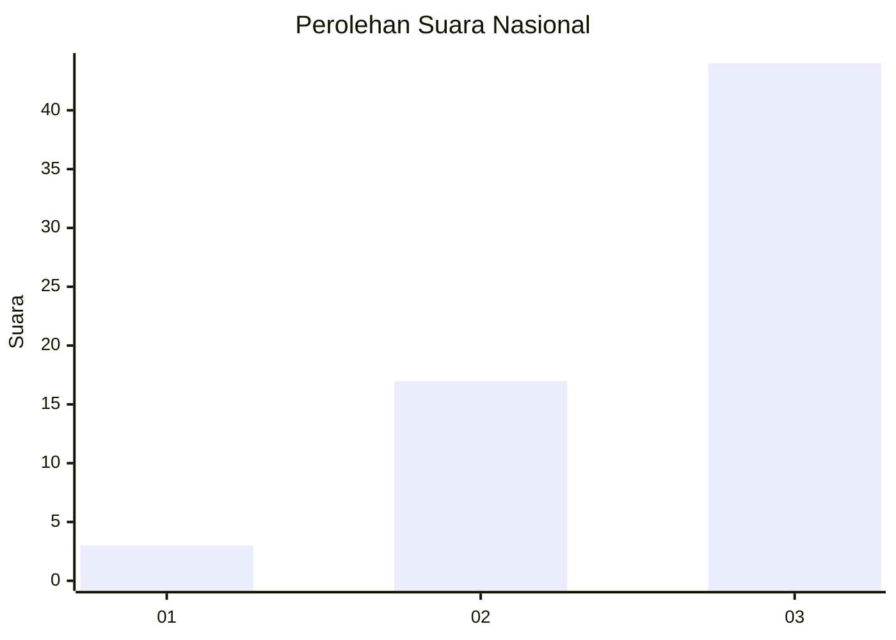
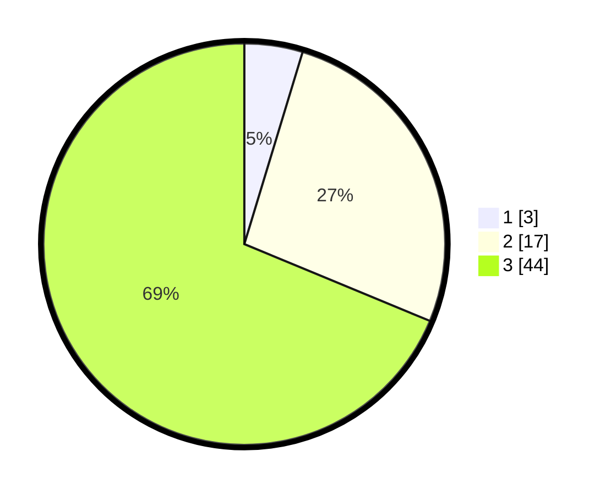

# Hasil

## Grafik

## Tabel

| No. | Nama Paslon    | Suara | Suara (raw) | Persentase |
|:--- |:-------------- | -----:| -----------:| ----------:|
| 1   | ANIES MUHAIMIN | 3     | [3][p-1]    | 4,69       |
| 2   | PRABOWO GIBRAN | 17    | [17][p-2]   | 26,56      |
| 3   | GANJAR MAHFUD  | 44    | [44][p-3]   | 68,75      |

[p-1]: https://github.com/gigit-pemilu/pemilu-2024/blob/main/pilpres/hitung-suara/sub/91-papua/sub/15-waropen/sub/07-risei-sayati/sub/2013-aimasi/sub/001-tps/sub/paslon-1.txt
[p-2]: https://github.com/gigit-pemilu/pemilu-2024/blob/main/pilpres/hitung-suara/sub/91-papua/sub/15-waropen/sub/07-risei-sayati/sub/2013-aimasi/sub/001-tps/sub/paslon-2.txt
[p-3]: https://github.com/gigit-pemilu/pemilu-2024/blob/main/pilpres/hitung-suara/sub/91-papua/sub/15-waropen/sub/07-risei-sayati/sub/2013-aimasi/sub/001-tps/sub/paslon-3.txt

## Foto C Plano

https://sirekap-obj-formc.kpu.go.id/51e4/pemilu/ppwp/91/15/07/20/13/9115072013001-20240217-121527--4fbf0723-f512-403b-814c-3b2b75de17b7.jpg

https://sirekap-obj-formc.kpu.go.id/51e4/pemilu/ppwp/91/15/07/20/13/9115072013001-20240217-121934--88fdcc6c-0d8e-4326-96a3-f88de2cd3edd.jpg

https://sirekap-obj-formc.kpu.go.id/51e4/pemilu/ppwp/91/15/07/20/13/9115072013001-20240217-122316--f458c73b-f0a0-420b-92e8-a681a2e1d0e6.jpg

## Metadata

| Key        | Value               |
| ---------- | ------------------- |
| Time Stamp | 2024-02-19 06:16:00 |

## DATA PEMILIH TETAP

Jumlah pemilih dalam DPT: **121**.
 * L: **77**.
 * P: **44**.

## DATA PENGGUNA HAK PILIH

Jumlah pengguna hak pilih dalam DPT: **58**.
 * L: **33**.
 * P: **25**.

Jumlah pengguna hak pilih dalam DPTb: **0**.
 * L: **0**.
 * P: **0**.

Jumlah pengguna hak pilih dalam DPK: **7**.
 * L: **5**.
 * P: **2**.

Jumlah pengguna hak pilih: **65**.
 * L: **38**.
 * P: **27**.

## JUMLAH SUARA SAH DAN TIDAK SAH

JUMLAH SELURUH SUARA SAH: **64**.

JUMLAH SUARA TIDAK SAH: **1**.

JUMLAH SELURUH SUARA SAH DAN SUARA TIDAK SAH: **65**.

