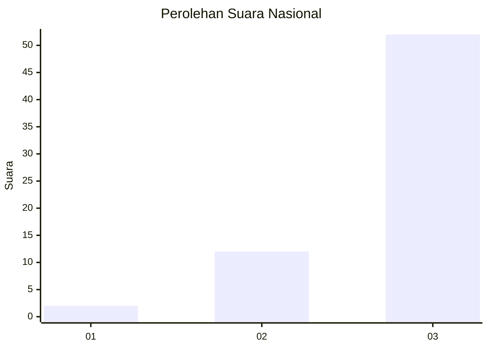
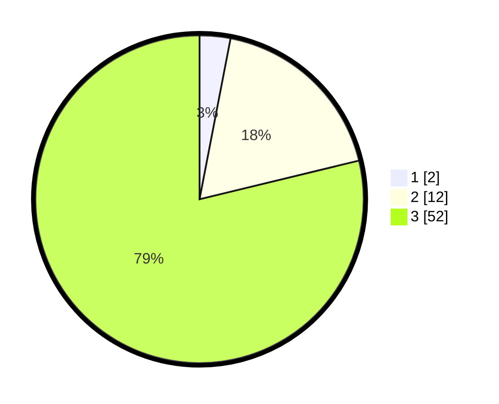

# Hasil

## Grafik

## Tabel

| No. | Nama Paslon    | Suara | Suara (raw) | Persentase |
|:--- |:-------------- | -----:| -----------:| ----------:|
| 1   | ANIES MUHAIMIN | 2     | [2][p-1]    | 3,03       |
| 2   | PRABOWO GIBRAN | 12    | [12][p-2]   | 18,18      |
| 3   | GANJAR MAHFUD  | 52    | [52][p-3]   | 78,79      |

[p-1]: https://github.com/gigit-pemilu/pemilu-2024/blob/main/pilpres/hitung-suara/sub/91-papua/sub/15-waropen/sub/07-risei-sayati/sub/2014-mui/sub/001-tps/sub/paslon-1.txt
[p-2]: https://github.com/gigit-pemilu/pemilu-2024/blob/main/pilpres/hitung-suara/sub/91-papua/sub/15-waropen/sub/07-risei-sayati/sub/2014-mui/sub/001-tps/sub/paslon-2.txt
[p-3]: https://github.com/gigit-pemilu/pemilu-2024/blob/main/pilpres/hitung-suara/sub/91-papua/sub/15-waropen/sub/07-risei-sayati/sub/2014-mui/sub/001-tps/sub/paslon-3.txt

## Foto C Plano

https://sirekap-obj-formc.kpu.go.id/cf7b/pemilu/ppwp/91/15/07/20/14/9115072014001-20240216-111715--860825b6-6d1f-4361-94f3-818a0b02e9bf.jpg

https://sirekap-obj-formc.kpu.go.id/cf7b/pemilu/ppwp/91/15/07/20/14/9115072014001-20240216-100314--31107969-2c6b-4ded-b5fc-0f82cc136364.jpg

https://sirekap-obj-formc.kpu.go.id/cf7b/pemilu/ppwp/91/15/07/20/14/9115072014001-20240216-100604--14187df8-eb4f-401c-9543-87b5e0f34410.jpg

## Metadata

| Key        | Value               |
| ---------- | ------------------- |
| Time Stamp | 2024-02-16 16:25:10 |

## DATA PEMILIH TETAP

Jumlah pemilih dalam DPT: **87**.
 * L: **45**.
 * P: **42**.

## DATA PENGGUNA HAK PILIH

Jumlah pengguna hak pilih dalam DPT: **66**.
 * L: **33**.
 * P: **33**.

Jumlah pengguna hak pilih dalam DPTb: **2**.
 * L: **2**.
 * P: **0**.

Jumlah pengguna hak pilih dalam DPK: **0**.
 * L: **0**.
 * P: **0**.

Jumlah pengguna hak pilih: **68**.
 * L: **35**.
 * P: **33**.

## JUMLAH SUARA SAH DAN TIDAK SAH

JUMLAH SELURUH SUARA SAH: **66**.

JUMLAH SUARA TIDAK SAH: **2**.

JUMLAH SELURUH SUARA SAH DAN SUARA TIDAK SAH: **68**.

