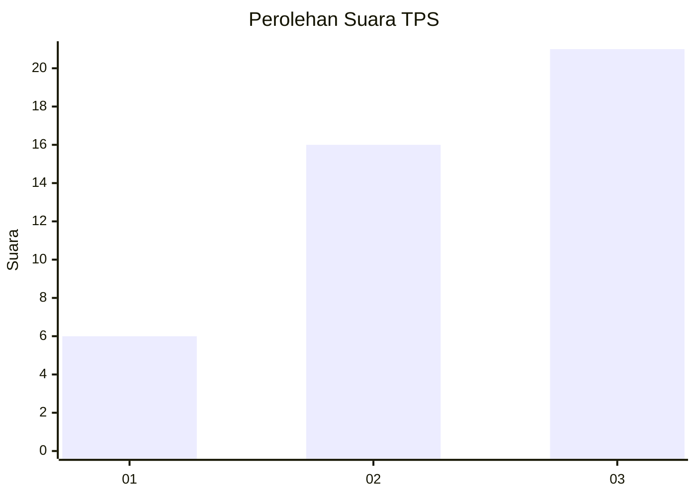
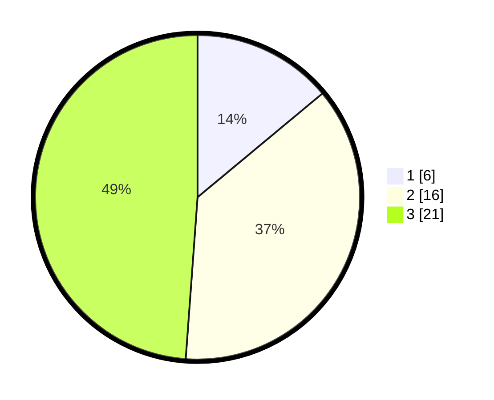

# Hasil

## Grafik

## Tabel

| No. | Nama Paslon    | Suara | Suara (raw) | Persentase |
|:--- |:-------------- | -----:| -----------:| ----------:|
| 1   | ANIES MUHAIMIN | 6     | [6][p-1]    | 13,95      |
| 2   | PRABOWO GIBRAN | 16    | [16][p-2]   | 37,21      |
| 3   | GANJAR MAHFUD  | 21    | [21][p-3]   | 48,84      |

[p-1]: https://github.com/gigit-pemilu/pemilu-2024-91-papua/blob/main/pilpres/hitung-suara/sub/91-papua/sub/15-waropen/sub/07-risei-sayati/sub/2015-waghare/sub/001-tps/sub/paslon-1.txt
[p-2]: https://github.com/gigit-pemilu/pemilu-2024-91-papua/blob/main/pilpres/hitung-suara/sub/91-papua/sub/15-waropen/sub/07-risei-sayati/sub/2015-waghare/sub/001-tps/sub/paslon-2.txt
[p-3]: https://github.com/gigit-pemilu/pemilu-2024-91-papua/blob/main/pilpres/hitung-suara/sub/91-papua/sub/15-waropen/sub/07-risei-sayati/sub/2015-waghare/sub/001-tps/sub/paslon-3.txt

## Foto C Plano

https://sirekap-obj-formc.kpu.go.id/bdcb/pemilu/ppwp/91/15/07/20/15/9115072015001-20240216-134417--ab590c06-ec7b-4c43-9b4b-83d5626545e8.jpg

https://sirekap-obj-formc.kpu.go.id/bdcb/pemilu/ppwp/91/15/07/20/15/9115072015001-20240216-134730--c6efbe0d-3a82-4c42-add6-e5952c2967ad.jpg

https://sirekap-obj-formc.kpu.go.id/bdcb/pemilu/ppwp/91/15/07/20/15/9115072015001-20240216-135016--9ad53f35-5c59-49b3-a88d-c13f94f751fe.jpg

## Metadata

| Key        | Value               |
| ---------- | ------------------- |
| Time Stamp | 2024-02-24 22:31:28 |

