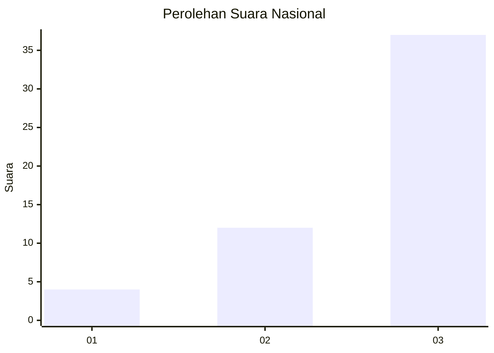
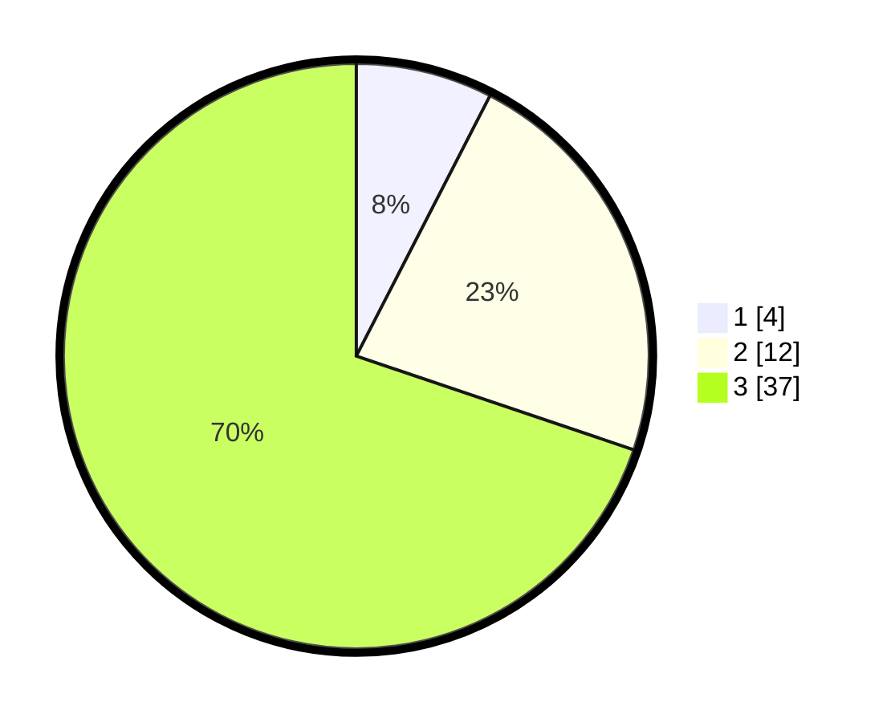

# Hasil

## Grafik

## Tabel

| No. | Nama Paslon    | Suara | Suara (raw) | Persentase |
|:--- |:-------------- | -----:| -----------:| ----------:|
| 1   | ANIES MUHAIMIN | 4     | [4][p-1]    | 7,55       |
| 2   | PRABOWO GIBRAN | 12    | [12][p-2]   | 22,64      |
| 3   | GANJAR MAHFUD  | 37    | [37][p-3]   | 69,81      |

[p-1]: https://github.com/gigit-pemilu/pemilu-2024/blob/main/pilpres/hitung-suara/sub/91-papua/sub/15-waropen/sub/07-risei-sayati/sub/2016-ghaiwando/sub/001-tps/sub/paslon-1.txt
[p-2]: https://github.com/gigit-pemilu/pemilu-2024/blob/main/pilpres/hitung-suara/sub/91-papua/sub/15-waropen/sub/07-risei-sayati/sub/2016-ghaiwando/sub/001-tps/sub/paslon-2.txt
[p-3]: https://github.com/gigit-pemilu/pemilu-2024/blob/main/pilpres/hitung-suara/sub/91-papua/sub/15-waropen/sub/07-risei-sayati/sub/2016-ghaiwando/sub/001-tps/sub/paslon-3.txt

## Foto C Plano

https://sirekap-obj-formc.kpu.go.id/aa64/pemilu/ppwp/91/15/07/20/16/9115072016001-20240218-162533--88131ff5-c1b7-43ef-836a-339c813982da.jpg

https://sirekap-obj-formc.kpu.go.id/aa64/pemilu/ppwp/91/15/07/20/16/9115072016001-20240218-164618--742f5423-f93d-4896-8494-ee4ed149bf16.jpg

https://sirekap-obj-formc.kpu.go.id/aa64/pemilu/ppwp/91/15/07/20/16/9115072016001-20240216-145035--aed3cbaa-7ce3-4c24-b031-ff103e9baf11.jpg

## Metadata

| Key        | Value               |
| ---------- | ------------------- |
| Time Stamp | 2024-02-19 06:16:00 |

## DATA PEMILIH TETAP

Jumlah pemilih dalam DPT: **76**.
 * L: **40**.
 * P: **36**.

## DATA PENGGUNA HAK PILIH

Jumlah pengguna hak pilih dalam DPT: **53**.
 * L: **29**.
 * P: **24**.

Jumlah pengguna hak pilih dalam DPTb: **0**.
 * L: **0**.
 * P: **0**.

Jumlah pengguna hak pilih dalam DPK: **0**.
 * L: **0**.
 * P: **0**.

Jumlah pengguna hak pilih: **53**.
 * L: **29**.
 * P: **24**.

## JUMLAH SUARA SAH DAN TIDAK SAH

JUMLAH SELURUH SUARA SAH: **53**.

JUMLAH SUARA TIDAK SAH: **0**.

JUMLAH SELURUH SUARA SAH DAN SUARA TIDAK SAH: **53**.

