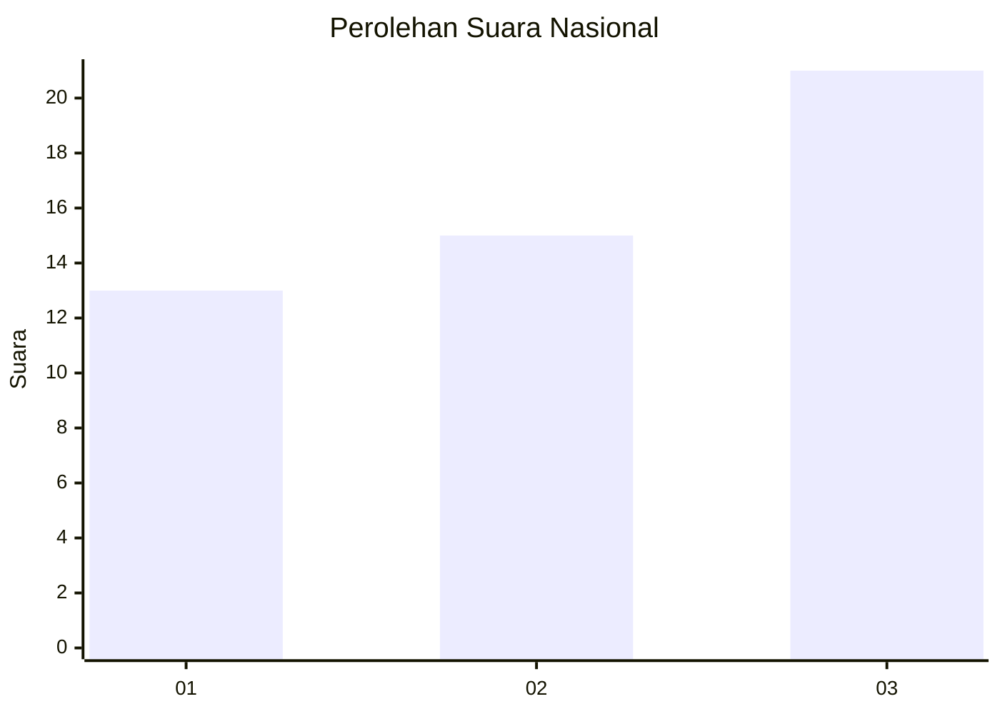
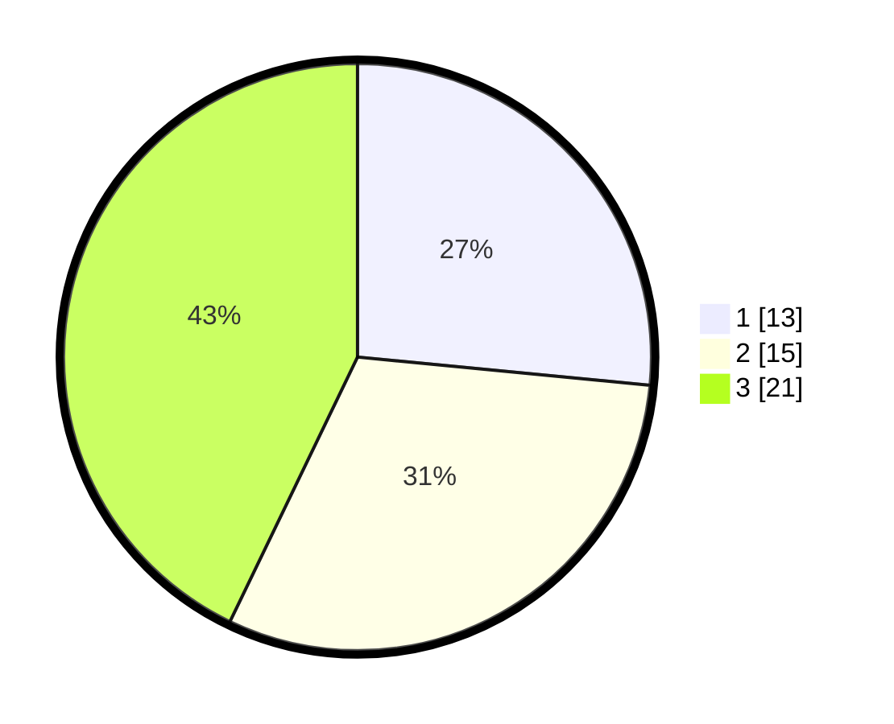

# Hasil

## Grafik

## Tabel

| No. | Nama Paslon    | Suara | Suara (raw) | Persentase |
|:--- |:-------------- | -----:| -----------:| ----------:|
| 1   | ANIES MUHAIMIN | 13    | [13][p-1]   | 26,53      |
| 2   | PRABOWO GIBRAN | 15    | [15][p-2]   | 30,61      |
| 3   | GANJAR MAHFUD  | 21    | [21][p-3]   | 42,86      |

[p-1]: https://github.com/gigit-pemilu/pemilu-2024/blob/main/pilpres/hitung-suara/sub/91-papua/sub/15-waropen/sub/07-risei-sayati/sub/2017-womorisi/sub/001-tps/sub/paslon-1.txt
[p-2]: https://github.com/gigit-pemilu/pemilu-2024/blob/main/pilpres/hitung-suara/sub/91-papua/sub/15-waropen/sub/07-risei-sayati/sub/2017-womorisi/sub/001-tps/sub/paslon-2.txt
[p-3]: https://github.com/gigit-pemilu/pemilu-2024/blob/main/pilpres/hitung-suara/sub/91-papua/sub/15-waropen/sub/07-risei-sayati/sub/2017-womorisi/sub/001-tps/sub/paslon-3.txt

## Foto C Plano

https://sirekap-obj-formc.kpu.go.id/b96d/pemilu/ppwp/91/15/07/20/17/9115072017001-20240216-172157--6ad34f76-6241-42c4-8cb2-e85b1e5cc196.jpg

https://sirekap-obj-formc.kpu.go.id/b96d/pemilu/ppwp/91/15/07/20/17/9115072017001-20240217-084936--046c858e-902f-48fb-9733-4c76e5d43215.jpg

https://sirekap-obj-formc.kpu.go.id/b96d/pemilu/ppwp/91/15/07/20/17/9115072017001-20240220-173210--009e487f-153d-4e06-baa9-0f631bdd4063.jpg

## Metadata

| Key        | Value               |
| ---------- | ------------------- |
| Time Stamp | 2024-02-20 18:00:00 |

## DATA PEMILIH TETAP

Jumlah pemilih dalam DPT: **90**.
 * L: **47**.
 * P: **43**.

## DATA PENGGUNA HAK PILIH

Jumlah pengguna hak pilih dalam DPT: **47**.
 * L: **21**.
 * P: **26**.

Jumlah pengguna hak pilih dalam DPTb: **0**.
 * L: **0**.
 * P: **0**.

Jumlah pengguna hak pilih dalam DPK: **0**.
 * L: **0**.
 * P: **0**.

Jumlah pengguna hak pilih: **47**.
 * L: **21**.
 * P: **26**.

## JUMLAH SUARA SAH DAN TIDAK SAH

JUMLAH SELURUH SUARA SAH: **46**.

JUMLAH SUARA TIDAK SAH: **1**.

JUMLAH SELURUH SUARA SAH DAN SUARA TIDAK SAH: **47**.

