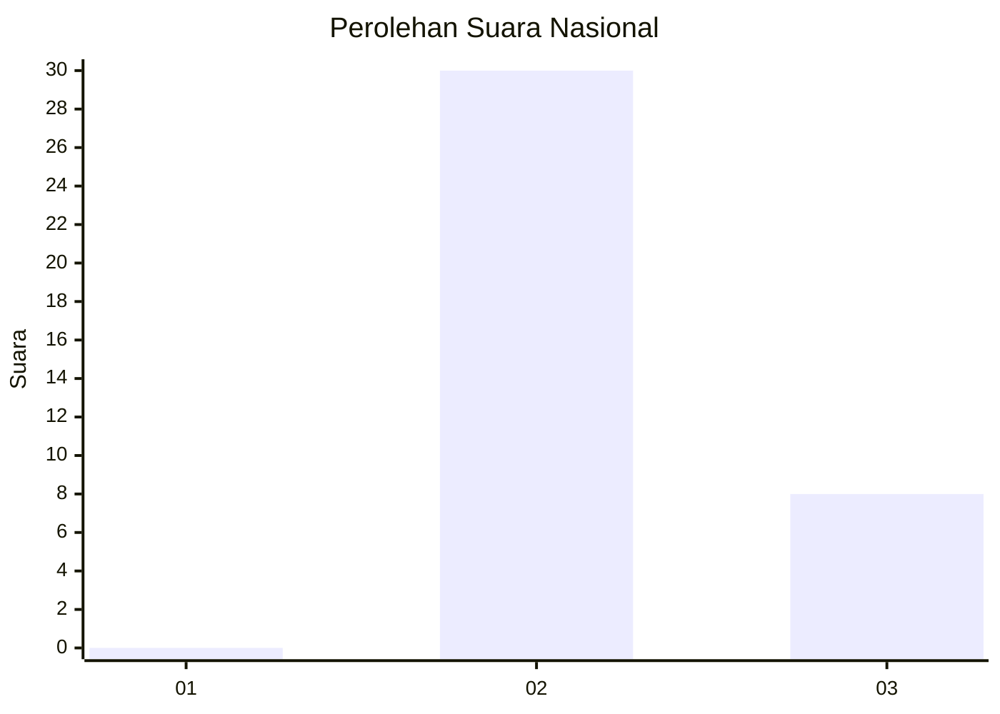
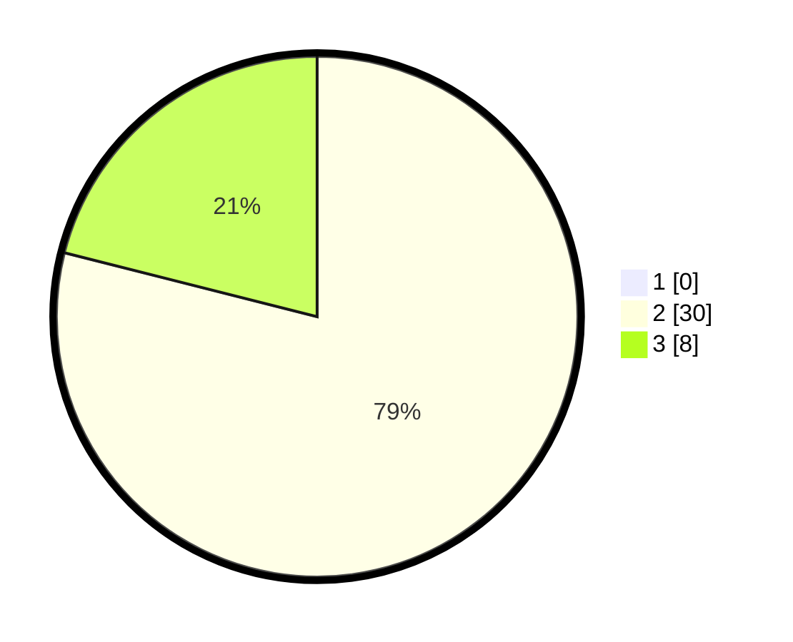

# Hasil

## Grafik

## Tabel

| No. | Nama Paslon    | Suara | Suara (raw) | Persentase |
|:--- |:-------------- | -----:| -----------:| ----------:|
| 1   | ANIES MUHAIMIN | 0     | [0][p-1]    | 0,00       |
| 2   | PRABOWO GIBRAN | 30    | [30][p-2]   | 78,95      |
| 3   | GANJAR MAHFUD  | 8     | [8][p-3]    | 21,05      |

[p-1]: https://github.com/gigit-pemilu/pemilu-2024/blob/main/pilpres/hitung-suara/sub/91-papua/sub/15-waropen/sub/07-risei-sayati/sub/2018-orambin/sub/001-tps/sub/paslon-1.txt
[p-2]: https://github.com/gigit-pemilu/pemilu-2024/blob/main/pilpres/hitung-suara/sub/91-papua/sub/15-waropen/sub/07-risei-sayati/sub/2018-orambin/sub/001-tps/sub/paslon-2.txt
[p-3]: https://github.com/gigit-pemilu/pemilu-2024/blob/main/pilpres/hitung-suara/sub/91-papua/sub/15-waropen/sub/07-risei-sayati/sub/2018-orambin/sub/001-tps/sub/paslon-3.txt

## Foto C Plano

https://sirekap-obj-formc.kpu.go.id/e60e/pemilu/ppwp/91/15/07/20/18/9115072018001-20240216-000501--5909c8fd-719f-4db3-b19c-13c3bbf8404d.jpg

https://sirekap-obj-formc.kpu.go.id/e60e/pemilu/ppwp/91/15/07/20/18/9115072018001-20240214-194402--b3833242-71ba-4529-85e0-5d448393a6cd.jpg

https://sirekap-obj-formc.kpu.go.id/e60e/pemilu/ppwp/91/15/07/20/18/9115072018001-20240214-213706--f39fc064-fd39-4999-9af2-9cd936f9dc7e.jpg

## Metadata

| Key        | Value               |
| ---------- | ------------------- |
| Time Stamp | 2024-02-16 00:30:27 |

## DATA PEMILIH TETAP

Jumlah pemilih dalam DPT: **67**.
 * L: **40**.
 * P: **27**.

## DATA PENGGUNA HAK PILIH

Jumlah pengguna hak pilih dalam DPT: **37**.
 * L: **22**.
 * P: **15**.

Jumlah pengguna hak pilih dalam DPTb: **0**.
 * L: **0**.
 * P: **0**.

Jumlah pengguna hak pilih dalam DPK: **0**.
 * L: **0**.
 * P: **0**.

Jumlah pengguna hak pilih: **37**.
 * L: **22**.
 * P: **15**.

## JUMLAH SUARA SAH DAN TIDAK SAH

JUMLAH SELURUH SUARA SAH: **38**.

JUMLAH SUARA TIDAK SAH: **800**.

JUMLAH SELURUH SUARA SAH DAN SUARA TIDAK SAH: **38**.

