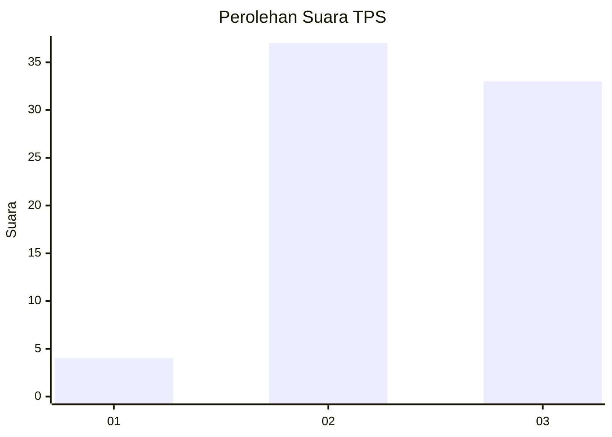
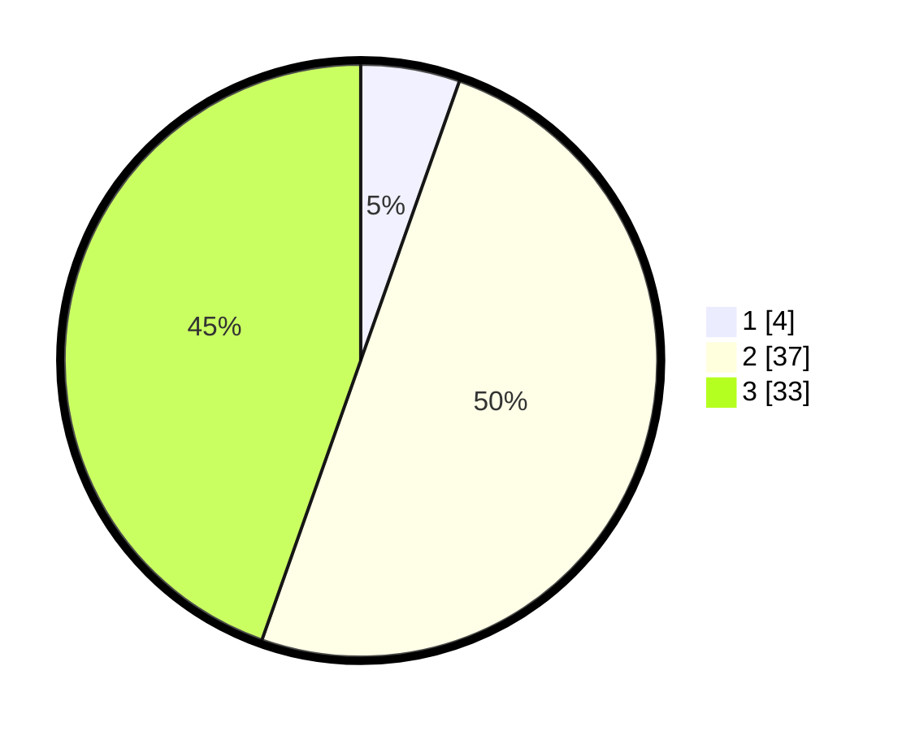

# Hasil

## Grafik

## Tabel

| No. | Nama Paslon    | Suara | Suara (raw) | Persentase |
|:--- |:-------------- | -----:| -----------:| ----------:|
| 1   | ANIES MUHAIMIN | 4     | [4][p-1]    | 5,41       |
| 2   | PRABOWO GIBRAN | 37    | [37][p-2]   | 50,00      |
| 3   | GANJAR MAHFUD  | 33    | [33][p-3]   | 44,59      |

[p-1]: https://github.com/gigit-pemilu/pemilu-2024-91-papua/blob/main/pilpres/hitung-suara/sub/91-papua/sub/15-waropen/sub/07-risei-sayati/sub/2020-ghaiwaru/sub/001-tps/sub/paslon-1.txt
[p-2]: https://github.com/gigit-pemilu/pemilu-2024-91-papua/blob/main/pilpres/hitung-suara/sub/91-papua/sub/15-waropen/sub/07-risei-sayati/sub/2020-ghaiwaru/sub/001-tps/sub/paslon-2.txt
[p-3]: https://github.com/gigit-pemilu/pemilu-2024-91-papua/blob/main/pilpres/hitung-suara/sub/91-papua/sub/15-waropen/sub/07-risei-sayati/sub/2020-ghaiwaru/sub/001-tps/sub/paslon-3.txt

## Foto C Plano

https://sirekap-obj-formc.kpu.go.id/e52a/pemilu/ppwp/91/15/07/20/20/9115072020001-20240216-154938--ab54455e-8e8c-436c-81bb-96787998a637.jpg

https://sirekap-obj-formc.kpu.go.id/e52a/pemilu/ppwp/91/15/07/20/20/9115072020001-20240216-160914--606233e4-30a8-4c20-a9a8-d26208c53938.jpg

https://sirekap-obj-formc.kpu.go.id/e52a/pemilu/ppwp/91/15/07/20/20/9115072020001-20240216-161340--1a84f390-fa68-492c-8d32-4b0fe3aac54b.jpg

## Metadata

| Key        | Value               |
| ---------- | ------------------- |
| Time Stamp | 2024-02-25 13:00:00 |

