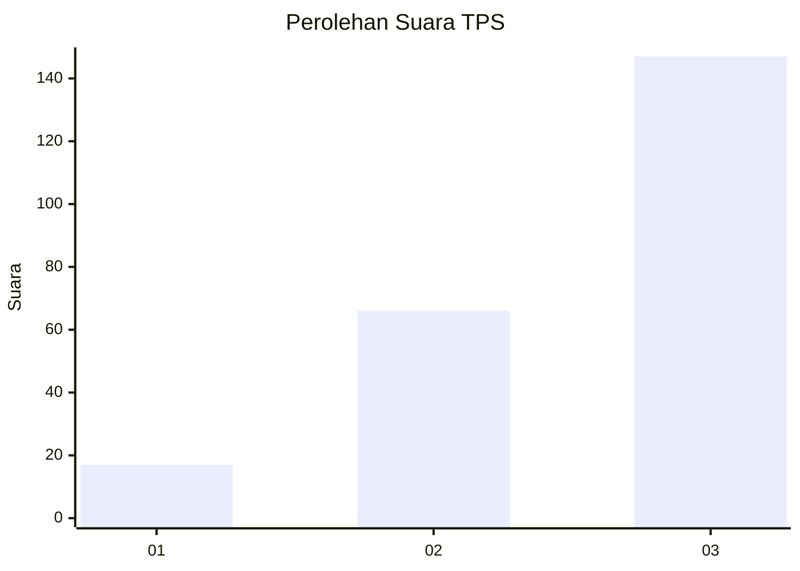
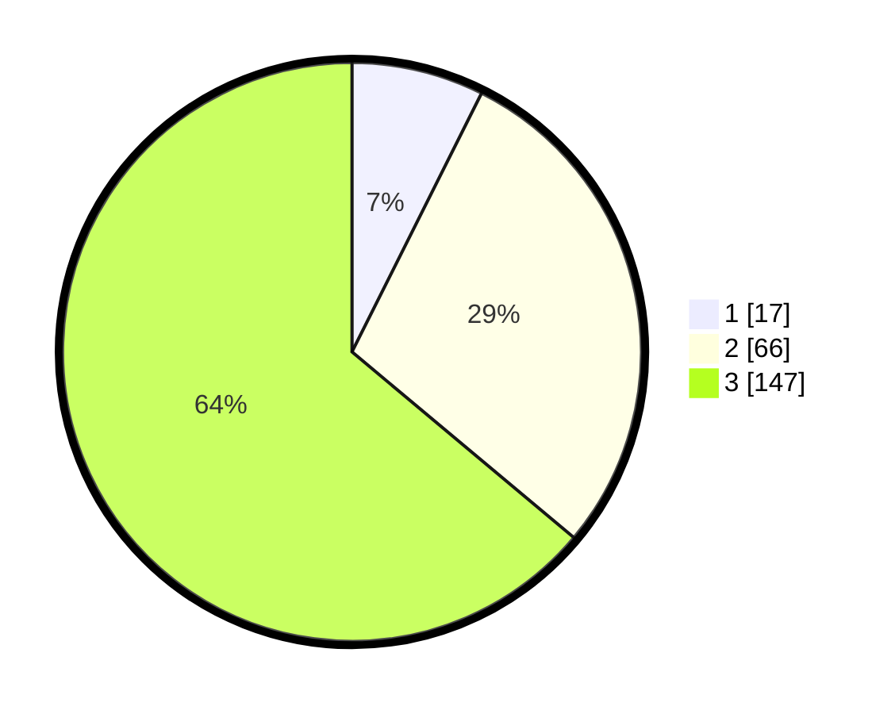

# Hasil

## Grafik

## Tabel

| No. | Nama Paslon    | Suara | Suara (raw) | Persentase |
|:--- |:-------------- | -----:| -----------:| ----------:|
| 1   | ANIES MUHAIMIN | 17    | [17][p-1]   | 7,39       |
| 2   | PRABOWO GIBRAN | 66    | [66][p-2]   | 28,70      |
| 3   | GANJAR MAHFUD  | 147   | [147][p-3]  | 63,91      |

[p-1]: https://github.com/gigit-pemilu/pemilu-2024-91-papua/blob/main/pilpres/hitung-suara/sub/91-papua/sub/15-waropen/sub/08-urei-faisei/sub/2002-urfas-ii/sub/002-tps/sub/paslon-1.txt
[p-2]: https://github.com/gigit-pemilu/pemilu-2024-91-papua/blob/main/pilpres/hitung-suara/sub/91-papua/sub/15-waropen/sub/08-urei-faisei/sub/2002-urfas-ii/sub/002-tps/sub/paslon-2.txt
[p-3]: https://github.com/gigit-pemilu/pemilu-2024-91-papua/blob/main/pilpres/hitung-suara/sub/91-papua/sub/15-waropen/sub/08-urei-faisei/sub/2002-urfas-ii/sub/002-tps/sub/paslon-3.txt

## Foto C Plano

https://sirekap-obj-formc.kpu.go.id/0cae/pemilu/ppwp/91/15/08/20/02/9115082002002-20240216-085849--35f38604-17b4-4daa-830e-8adc27641ea4.jpg

https://sirekap-obj-formc.kpu.go.id/0cae/pemilu/ppwp/91/15/08/20/02/9115082002002-20240216-090254--bf9548c0-0fe7-44ac-bf7e-c98982db0017.jpg

https://sirekap-obj-formc.kpu.go.id/0cae/pemilu/ppwp/91/15/08/20/02/9115082002002-20240216-090456--5b3e8729-a0ae-4552-b468-0fb52ed1ec3a.jpg

## Metadata

| Key        | Value               |
| ---------- | ------------------- |
| Time Stamp | 2024-02-25 13:00:00 |

