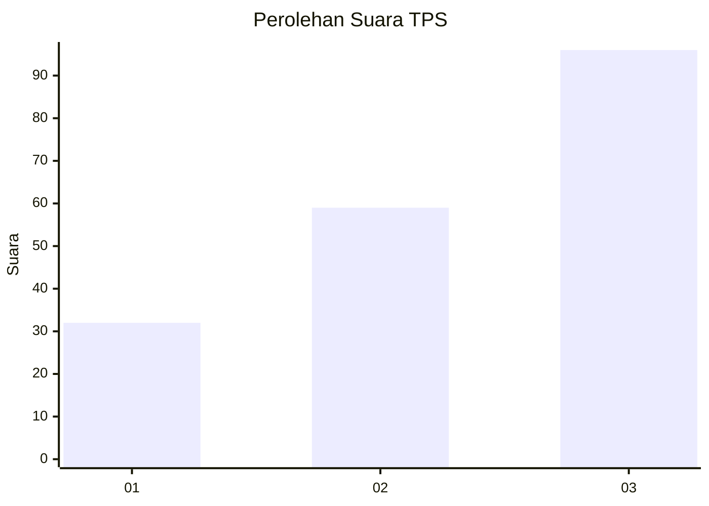
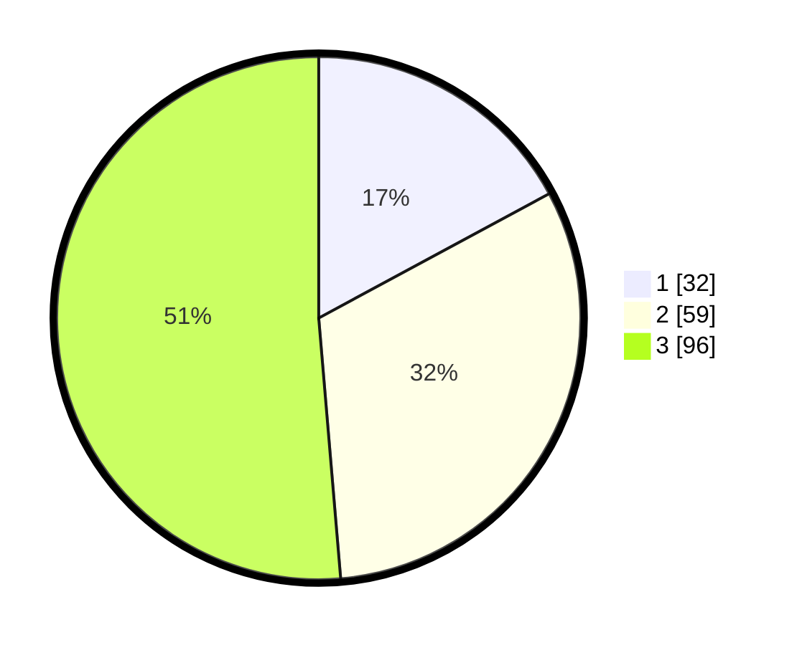

# Hasil

## Grafik

## Tabel

| No. | Nama Paslon    | Suara | Suara (raw) | Persentase |
|:--- |:-------------- | -----:| -----------:| ----------:|
| 1   | ANIES MUHAIMIN | 32    | [32][p-1]   | 17,11      |
| 2   | PRABOWO GIBRAN | 59    | [59][p-2]   | 31,55      |
| 3   | GANJAR MAHFUD  | 96    | [96][p-3]   | 51,34      |

[p-1]: https://github.com/gigit-pemilu/pemilu-2024-91-papua/blob/main/pilpres/hitung-suara/sub/91-papua/sub/15-waropen/sub/08-urei-faisei/sub/2003-nubuai/sub/002-tps/sub/paslon-1.txt
[p-2]: https://github.com/gigit-pemilu/pemilu-2024-91-papua/blob/main/pilpres/hitung-suara/sub/91-papua/sub/15-waropen/sub/08-urei-faisei/sub/2003-nubuai/sub/002-tps/sub/paslon-2.txt
[p-3]: https://github.com/gigit-pemilu/pemilu-2024-91-papua/blob/main/pilpres/hitung-suara/sub/91-papua/sub/15-waropen/sub/08-urei-faisei/sub/2003-nubuai/sub/002-tps/sub/paslon-3.txt

## Foto C Plano

https://sirekap-obj-formc.kpu.go.id/a62e/pemilu/ppwp/91/15/08/20/03/9115082003002-20240217-131730--baf2290f-1f2d-40b5-b8af-887089da8167.jpg

https://sirekap-obj-formc.kpu.go.id/a62e/pemilu/ppwp/91/15/08/20/03/9115082003002-20240217-132151--569caa48-f312-432b-a77f-f954794302d7.jpg

https://sirekap-obj-formc.kpu.go.id/a62e/pemilu/ppwp/91/15/08/20/03/9115082003002-20240217-132427--aa17a416-effa-4a03-b37d-38cb11742ab4.jpg

## Metadata

| Key        | Value               |
| ---------- | ------------------- |
| Time Stamp | 2024-02-24 22:31:28 |

