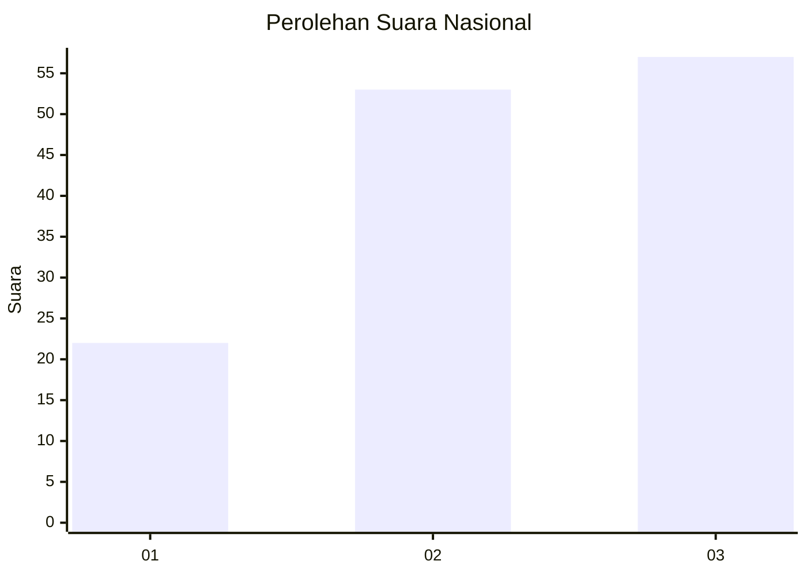
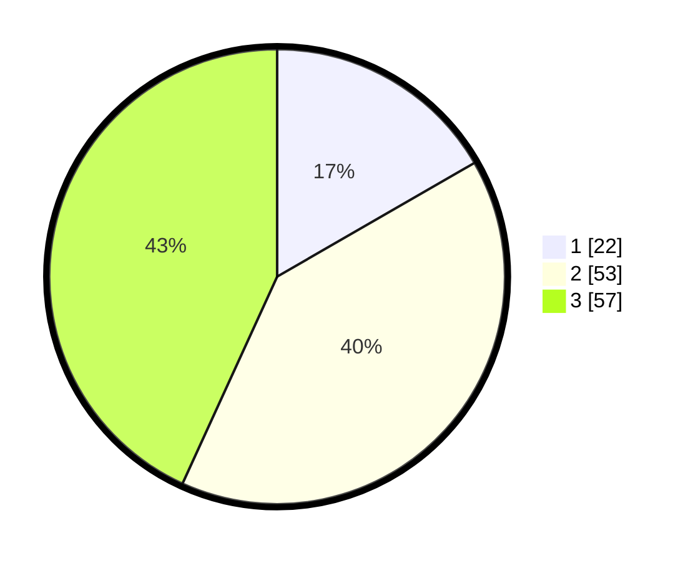

# Hasil

## Grafik

## Tabel

| No. | Nama Paslon    | Suara | Suara (raw) | Persentase |
|:--- |:-------------- | -----:| -----------:| ----------:|
| 1   | ANIES MUHAIMIN | 22    | [22][p-1]   | 16,67      |
| 2   | PRABOWO GIBRAN | 53    | [53][p-2]   | 40,15      |
| 3   | GANJAR MAHFUD  | 57    | [57][p-3]   | 43,18      |

[p-1]: https://github.com/gigit-pemilu/pemilu-2024/blob/main/pilpres/hitung-suara/sub/91-papua/sub/15-waropen/sub/08-urei-faisei/sub/2005-apainabo/sub/001-tps/sub/paslon-1.txt
[p-2]: https://github.com/gigit-pemilu/pemilu-2024/blob/main/pilpres/hitung-suara/sub/91-papua/sub/15-waropen/sub/08-urei-faisei/sub/2005-apainabo/sub/001-tps/sub/paslon-2.txt
[p-3]: https://github.com/gigit-pemilu/pemilu-2024/blob/main/pilpres/hitung-suara/sub/91-papua/sub/15-waropen/sub/08-urei-faisei/sub/2005-apainabo/sub/001-tps/sub/paslon-3.txt

## Foto C Plano

https://sirekap-obj-formc.kpu.go.id/ea05/pemilu/ppwp/91/15/08/20/05/9115082005001-20240216-012404--1b14fab3-d2d9-431c-bc9e-5c6423dba6b2.jpg

https://sirekap-obj-formc.kpu.go.id/ea05/pemilu/ppwp/91/15/08/20/05/9115082005001-20240216-012540--2c0dd66e-30a9-459f-a6d7-4da1276c1bde.jpg

https://sirekap-obj-formc.kpu.go.id/ea05/pemilu/ppwp/91/15/08/20/05/9115082005001-20240216-044948--135834fe-3de8-4ab2-abab-b6f09983ca40.jpg

## Metadata

| Key        | Value               |
| ---------- | ------------------- |
| Time Stamp | 2024-02-16 05:30:26 |

## DATA PEMILIH TETAP

Jumlah pemilih dalam DPT: **228**.
 * L: **115**.
 * P: **113**.

## DATA PENGGUNA HAK PILIH

Jumlah pengguna hak pilih dalam DPT: **163**.
 * L: **86**.
 * P: **77**.

Jumlah pengguna hak pilih dalam DPTb: **0**.
 * L: **0**.
 * P: **0**.

Jumlah pengguna hak pilih dalam DPK: **8**.
 * L: **2**.
 * P: **6**.

Jumlah pengguna hak pilih: **171**.
 * L: **88**.
 * P: **83**.

## JUMLAH SUARA SAH DAN TIDAK SAH

JUMLAH SELURUH SUARA SAH: **171**.

JUMLAH SUARA TIDAK SAH: **0**.

JUMLAH SELURUH SUARA SAH DAN SUARA TIDAK SAH: **171**.

