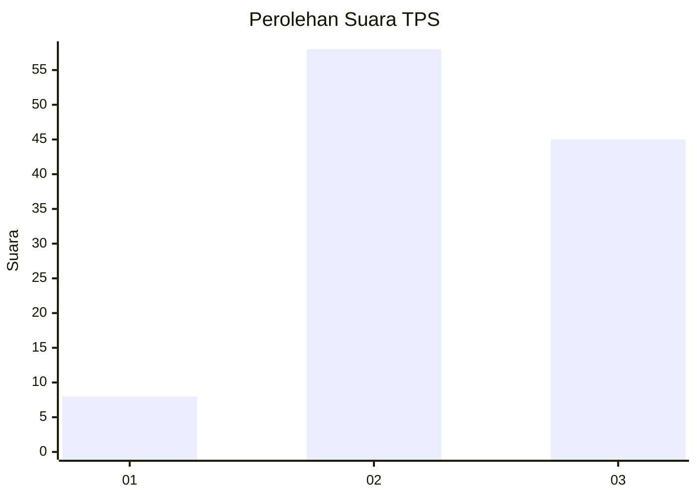
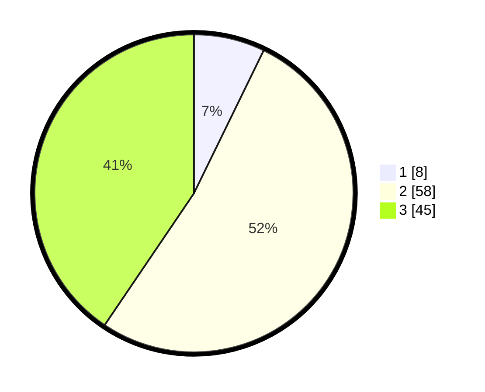

# Hasil

## Grafik

## Tabel

| No. | Nama Paslon    | Suara | Suara (raw) | Persentase |
|:--- |:-------------- | -----:| -----------:| ----------:|
| 1   | ANIES MUHAIMIN | 8     | [8][p-1]    | 7,21       |
| 2   | PRABOWO GIBRAN | 58    | [58][p-2]   | 52,25      |
| 3   | GANJAR MAHFUD  | 45    | [45][p-3]   | 40,54      |

[p-1]: https://github.com/gigit-pemilu/pemilu-2024-91-papua/blob/main/pilpres/hitung-suara/sub/91-papua/sub/15-waropen/sub/08-urei-faisei/sub/2010-ghoyui/sub/001-tps/sub/paslon-1.txt
[p-2]: https://github.com/gigit-pemilu/pemilu-2024-91-papua/blob/main/pilpres/hitung-suara/sub/91-papua/sub/15-waropen/sub/08-urei-faisei/sub/2010-ghoyui/sub/001-tps/sub/paslon-2.txt
[p-3]: https://github.com/gigit-pemilu/pemilu-2024-91-papua/blob/main/pilpres/hitung-suara/sub/91-papua/sub/15-waropen/sub/08-urei-faisei/sub/2010-ghoyui/sub/001-tps/sub/paslon-3.txt

## Foto C Plano

https://sirekap-obj-formc.kpu.go.id/2a0c/pemilu/ppwp/91/15/08/20/10/9115082010001-20240215-193936--a6d28dec-9b1e-4d24-89c1-0dea1f938d14.jpg

https://sirekap-obj-formc.kpu.go.id/2a0c/pemilu/ppwp/91/15/08/20/10/9115082010001-20240215-145047--ada50476-53e3-4d13-b891-266daa402b80.jpg

https://sirekap-obj-formc.kpu.go.id/2a0c/pemilu/ppwp/91/15/08/20/10/9115082010001-20240215-141058--ecc69107-896b-4d3a-bf74-b3eef1b84733.jpg

## Metadata

| Key        | Value               |
| ---------- | ------------------- |
| Time Stamp | 2024-02-16 08:00:28 |

