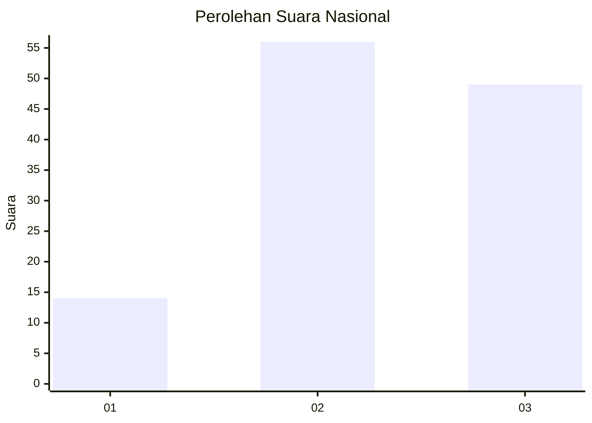
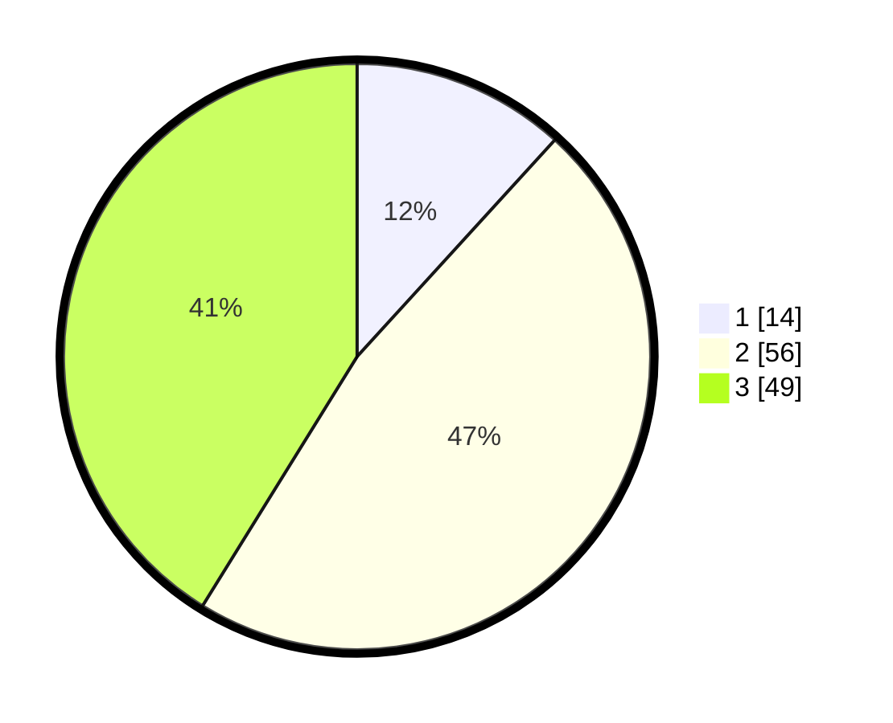

# Hasil

## Grafik

## Tabel

| No. | Nama Paslon    | Suara | Suara (raw) | Persentase |
|:--- |:-------------- | -----:| -----------:| ----------:|
| 1   | ANIES MUHAIMIN | 14    | [14][p-1]   | 11,76      |
| 2   | PRABOWO GIBRAN | 56    | [56][p-2]   | 47,06      |
| 3   | GANJAR MAHFUD  | 49    | [49][p-3]   | 41,18      |

[p-1]: https://github.com/gigit-pemilu/pemilu-2024/blob/main/pilpres/hitung-suara/sub/91-papua/sub/15-waropen/sub/08-urei-faisei/sub/2010-ghoyui/sub/002-tps/sub/paslon-1.txt
[p-2]: https://github.com/gigit-pemilu/pemilu-2024/blob/main/pilpres/hitung-suara/sub/91-papua/sub/15-waropen/sub/08-urei-faisei/sub/2010-ghoyui/sub/002-tps/sub/paslon-2.txt
[p-3]: https://github.com/gigit-pemilu/pemilu-2024/blob/main/pilpres/hitung-suara/sub/91-papua/sub/15-waropen/sub/08-urei-faisei/sub/2010-ghoyui/sub/002-tps/sub/paslon-3.txt

## Foto C Plano

https://sirekap-obj-formc.kpu.go.id/5772/pemilu/ppwp/91/15/08/20/10/9115082010002-20240215-080717--df4fda9a-51ac-45e3-a65d-24ed8cc7b901.jpg

https://sirekap-obj-formc.kpu.go.id/5772/pemilu/ppwp/91/15/08/20/10/9115082010002-20240215-081421--bce6277f-2464-4724-9c32-b90cfcc5214d.jpg

https://sirekap-obj-formc.kpu.go.id/5772/pemilu/ppwp/91/15/08/20/10/9115082010002-20240215-082344--f4d4c57d-a256-4269-9eb1-04ee82ecb574.jpg

## Metadata

| Key        | Value               |
| ---------- | ------------------- |
| Time Stamp | 2024-02-16 04:00:27 |

